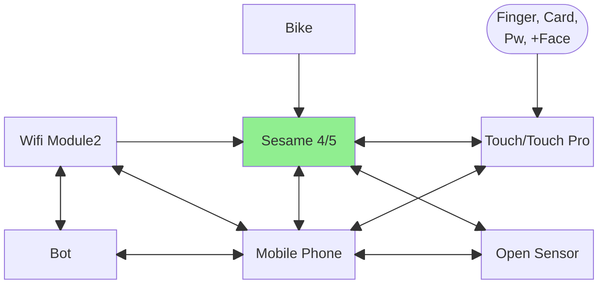
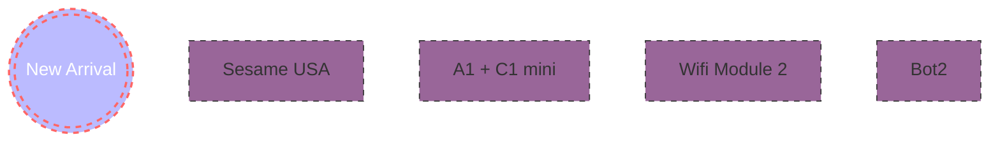

| [中文版](./README.md) | [日本語版 ](./README.ja.md) | English Version |

# Sesame Overview

- SesameSDK is a simple, powerful, and free Bluetooth/IoT library for iOS & Android applications. The official Sesame app is also built using this SesameSDK, and all features of the Sesame app can be implemented through this SesameSDK. SesameSDK allows you to:

- Register Sesame devices (Sesame 5, Sesame 5 Pro, Sesame Bike2, Sesame BLE Connector1, Sesame open sensor, Sesame Touch 1 Pro, Sesame Touch 1, WIFI Module2)
- Lock and unlock
- Get history records 
- Update SesameOS3
- Various settings for SesameOS3 devices
- Get battery level
- Project SesameOs3 mainly solves the Bluetooth connection for hardware devices like Sesame 5, Sesame 5 Pro, Sesame Bike2, Sesame BLE Connector1, Sesame open sensor, Sesame Touch 1 Pro, Sesame Touch 1, WIFI Module2, etc. It helps users operate hardware intelligently through iOS applications.

  
## Sesame Smart Lock Diagram 




# 1. Project Dependencies

- [Sesame 5]: This instance object applies to Sesame5 and Sesame5 Pro products
- [Sesame Bike 2]: This instance object applies to Sesame Bike 2 product
- [Sesame WiFi Module 2]: This instance object applies to Sesame WiFi Module 2 product
- [Sesame Touch Pro]: This instance object applies to Sesame BLE Connector1, Sesame Touch 1 Pro, and Sesame Touch 1 products
- [Sesame Open Sensor 1]: This instance object applies to Sesame Open Sensor 1 product
- [Class Objects]


# 2. SesameSDK Installation Requirements
* Supports Apple devices with iOS 12 and above
1. Switch Scheme to **SesameSDK**, select Any iOS Device
2. Use `command` + `shift` + `k` to clear product folder
3. Use `command` + `b` to build SDK
4. After completion, go to Xcode -> SDK project -> `Products` folder, find SesameSDK.framework, right-click and select Open in Finder to get `SesameSDK.framework`.

* SesameWatchKitSDK
1. Switch Scheme to **SesameWatchKitSDK**, select Any watch OS Device
2. Use `command` + `shift` + `k` to clean the product folder
3. Use `command` + `b` to build the SDK
4. After completion, go to Xcode -> SDK project -> `Products` folder, find SesameWatchKitSDK.framework, right-click and select "Show in Finder" to get `SesameWatchKitSDK.framework`.

# 3. SesameSDK Integration Methods

# 4. SesameBLE Communication Encryption Levels

[Go to SesameBLE Communication Encryption Levels](./SesameOS3/communicate.md)

# 5. Sesame Communication Control Commands

[Go to Sesame Communication Control Commands](./SesameOS3/sesame_ble_cmd.md)

# 6. Sesame API Interface Documentation

[Go to Sesame API Interface Documentation](./SesameOS3/sesame_api_service.md)

# 7. More Detailed App Interpretation

CHBluetoothCenter Class Description
This is the Core Data local storage management center of the APP, using `shared` to create a singleton for caching data to improve performance. Before storing `CHDeviceKey` into Core Data, it needs to be converted to `CHDeviceMO` (MO = manage object). `CHDeviceMO` represents the Sesame device in the local database.

## Properties

* `backgroundContext` - A Core Data `NSManagedObjectContext` that allows data operations in background threads.
* `persistentContainer`
* `cacheDevices` - Array for storing `CHDeviceMO`

## Initialization

- iOS device acquisition in background queue

## Methods

```Swift
//---初始化---
func initDevices()
// 從 Core Data 中提取所有的 CHDeviceMO 並將它們儲存到 cacheDevices

private init()
//設置 Core Data 的存儲、獲取數據模型、轉換名稱、設置存儲的位置等。
//---

func appendDevice(_ CHDeviceKey: CHDeviceKey)
//把`CHDeviceKey`轉成`CHDeviceMO`，並添加到 Core Data 和快取中。

func getDevice(deviceID: UUID?) -> CHDeviceMO?
//根據設備 UUID 在緩存中搜尋特定 CHDeviceMO 對象

func deleteDevice(_ device: CHDeviceMO)
// 刪除指定`DeviceMO`

func saveifNeed()
//如果有任何未保存的變更，則保存到 Core Data

func lastCachedevices() -> [CHDeviceMO]
//從 Core Data 中抓到所有`DeviceMO`

func logout()
//刪除所有` CHDeviceMO` 對象並清空緩存
```
# 8. CHDevice Protocol

All Sesame devices need to implement these properties and methods

## Properties

- `delegate`: A `CHDeviceStatusDelegate` proxy for monitoring device status changes
- `rssi`: Received Signal Strength Indicator (RSSI) = Distance between Sesame and phone
- `deviceId`: Unique identifier (UUID) for Sesame
- `isRegistered`: Whether the Sesame is registered
- `txPowerLevel`: Bluetooth power level of Sesame
- `productModel`: Sesame product model
- `deviceStatus`: Value of `CHDeviceStatus`, indicating current device status
- `deviceShadowStatus`: AWS IoT shadow status (Optional)
- `mechStatus`: Sesame mechanical status (Optional)

## Methods

```Swift
- getKey() -> CHDeviceKey? //如果裝置已註冊，則會返回鑰匙；否則，會返回 nil

- connect(result: @escaping (CHResult<CHEmpty>))// 建立藍芽連線到裝置

- dropKey(result: @escaping (CHResult<CHEmpty>)): // 刪除鑰匙

- disconnect(result: @escaping (CHResult<CHEmpty>))// 斷開與Sesame藍芽連線

- getVersionTag(result: @escaping (CHResult<String>)) // 取得固件版本號

- updateFirmware(result: @escaping CHResult<CBPeripheral?>) // 更新Sesame固件

- getTimeSignature() -> String //???

- reset(result: @escaping CHResult<CHEmpty>) //(循序圖)
- register(result: @escaping CHResult<CHEmpty>) //(循序圖)

- createGuestKey(result: @escaping CHResult<String>) // (循序圖)

- getGuestKeys(result: @escaping CHResult<[CHGuestKey]>) // (循序圖)

- removeGuestKey(_ guestKeyId: String, result: @escaping CHResult<CHEmpty>) // 移除(revoke?)訪客鑰匙

- updateGuestKey(_ guestKeyId: String, name: String, result: @escaping CHResult<CHEmpty>)

```


## Methods

```Swift
getFirZip() -> URL: 取得Sesame的固件壓縮檔的 URL
errorFromResultCode(_ resultCode: SesameResultCode) -> Error: 將 SesameResultCode 轉換為 Error。
```

## Switch-type Products

Sesame3/4/5/5 Pro, Bot1, Bike1/2

```Swift
public protocol CHSesameLock: CHDevice {
    var mechStatus: CHSesameProtocolMechStatus? { get set }
    func getHistoryTag() -> Data?
    func setHistoryTag(\_ tag: Data, result: @escaping (CHResult<CHEmpty>))
}
```

## Connector-type Products

Wifi2, Sesame Touch/Touch Pro, Open Sensor, Ble Connector

```Swift
public protocol CHSesameConnector {
    var sesame2Keys: [String: String] { get }
    func insertSesame(_ device: CHDevice, result: @escaping CHResult<CHEmpty>)
    func removeSesame(tag: String, result: @escaping CHResult<CHEmpty>)
}
```


## Key Data Structures
https://github.com/CANDY-HOUSE/SesameSDK_iOS_with_DemoApp/tree/master/doc/重點數據結構


# 9. APP Framework/Module Selection

- Bluetooth: CoreBluetooth
https://developer.apple.com/documentation/corebluetooth

- Local Storage: CoreData
https://developer.apple.com/documentation/coredata

- Server Side: AWS SDK for iOS Swift Package Manager
- Using library: AWSMobileClientXCF
https://aws-amplify.github.io/aws-sdk-ios/docs/reference/AWSMobileClient/index.html

- Siri & Shortcut: Intents
Official Documentation: https://developer.apple.com/documentation/appintents
Reference Article: https://medium.com/simform-engineering/how-to-integrate-siri-shortcuts-and-design-custom-intents-tutorial-e53285b550cf

- Mobile Notifications
https://developer.apple.com/documentation/usernotifications