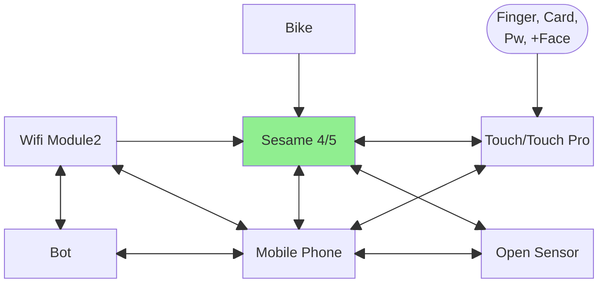
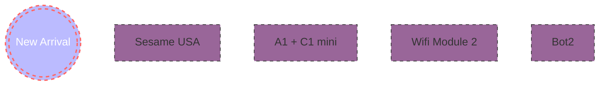

| [中文版](./README.md) | 日本語版 |[ English Version](./README.en.md) |

# Sesameの概要

- SesameSDKは、iOS & Androidアプリケーション向けのシンプルで強力な無料のBluetooth/IoT（Internet of Things）ライブラリです。Sesame公式アプリケーションもこのSesameSDKを使用して構築されており、芝麻アプリケーションのすべての機能はこのSesameSDKで実現できます。SesameSDKでは以下が可能です：

- Sesameデバイスの登録（Sesame 5、Sesame 5 Pro、Sesame Bike2、Sesame BLE Connector1、Sesame open sensor、Sesame Touch 1 Pro、Sesame Touch 1、WIFI Module2）
- ロックとアンロック
- 履歴の取得
- SesameOS3のアップデート
- SesameOS3デバイスの各種設定
- バッテリー残量の取得
- プロジェクトSesameOs3は主にSesame 5、Sesame 5 Pro、Sesame Bike2、Sesame BLE Connector1、Sesame open sensor、Sesame Touch 1 Pro、Sesame Touch 1、WIFI Module2などのハードウェアデバイスをBluetooth経由で接続します。ユーザーがiOSアプリケーションソフトウェアを通じてハードウェアをスマートに操作できるようサポートします。

## Sesameスマートロックの図解




# 1. プロジェクトの依存関係

- [Sesame 5]：このインスタンスオブジェクトはSesame5、Sesame5 Pro製品に適用されます
- [Sesame Bike 2]：このインスタンスオブジェクトはSesame Bike 2製品に適用されます
- [Sesame WiFi Module 2]：このインスタンスオブジェクトはSesame WiFi Module 2製品に適用されます
- [Sesame Touch Pro]：このインスタンスオブジェクトはSesame BLE Connector1、Sesame Touch 1 Pro、Sesame Touch 1製品に適用されます
- [Sesame Open Sensor 1]：このインスタンスオブジェクトはSesame Open Sensor 1製品に適用されます
- [クラスオブジェクト]

# 2. SesameSDKのインストール要件
* iOS 12以上のAppleデバイスをサポート
1. SchemeをSesameSDKに切り替え、Any iOS Deviceを選択
2. `command` + `shift` + `k`でproductフォルダをクリア
3. `command` + `b`でSDKをビルド
4. 完了後、Xcode -> SDKプロジェクト -> `Products`フォルダ内のSesameSDK.frameworkを右クリックしてFinderで開き、`SesameSDK.framework`を取得

* SesameWatchKitSDK
1. SchemeをSesameWatchKitSDKに切り替え、Any watch OS Deviceを選択
2. `command` + `shift` + `k`でproductフォルダをクリア
3. `command` + `b`でSDKをビルド
4. 完了後、Xcode -> SDKプロジェクト -> `Products`フォルダ内のSesameWatchKitSDK.frameworkを右クリックしてFinderで開き、`SesameWatchKitSDK.framework`を取得

# 3. SesameSDKの統合方法

# 4. SesameBLE通信暗号化レベル
[SesameBLE通信暗号化レベルへ](./SesameOS3/communicate.md)

# 5. Sesame通信制御コマンド
[Sesame通信制御コマンドへ](./SesameOS3/sesame_ble_cmd.md)

# 6. Sesame APIインターフェースドキュメント
[Sesame APIインターフェースドキュメントへ](./SesameOS3/sesame_api_service.md)

# 7. アプリの詳細な解説

CHBluetoothCenterクラスの説明
このアプリのCore Dataローカルストレージ管理センターで、`shared`でシングルトンを作成し、パフォーマンス向上のためにデータをキャッシュします。`CHDeviceKey`をCore Dataに保存する前に`CHDeviceMO`(MO = manage object)に変換する必要があります。`CHDeviceMO`はローカルデータベース内のSesameデバイスを表します。

## プロパティ

* `backgroundContext` Core Dataの`NSManagedObjectContext`で、バックグラウンドスレッドでのデータ操作を可能にします
* `persistentContainer`
* `cacheDevices` `CHDeviceMO`を保存するための配列

## 初期化

- iOSのバックグラウンドでデバイスを取得

## メソッド

```Swift
//---初始化---
func initDevices()
// 從 Core Data 中提取所有的 CHDeviceMO 並將它們儲存到 cacheDevices

private init()
//設置 Core Data 的存儲、獲取數據模型、轉換名稱、設置存儲的位置等。
//---

func appendDevice(_ CHDeviceKey: CHDeviceKey)
//把`CHDeviceKey`轉成`CHDeviceMO`，並添加到 Core Data 和快取中。

func getDevice(deviceID: UUID?) -> CHDeviceMO?
//根據設備 UUID 在緩存中搜尋特定 CHDeviceMO 對象

func deleteDevice(_ device: CHDeviceMO)
// 刪除指定`DeviceMO`

func saveifNeed()
//如果有任何未保存的變更，則保存到 Core Data

func lastCachedevices() -> [CHDeviceMO]
//從 Core Data 中抓到所有`DeviceMO`

func logout()
//刪除所有` CHDeviceMO` 對象並清空緩存
```
# 8. CHDeviceプロトコル

すべてのSesameデバイスが実装する必要があるプロパティとメソッド

## プロパティ

- `delegate`: `CHDeviceStatusDelegate`のデリゲートで、デバイスの状態変化を監視します
- `rssi`: Bluetooth信号強度インジケータ（RSSI）= Sesameとスマートフォンの距離
- `deviceId`: Sesameの固有識別子（UUID）
- `isRegistered`: そのSesameが登録済みかどうか
- `txPowerLevel`: SesameのBluetoothパワーレベル
- `productModel`: Sesame製品モデル
- `deviceStatus`: `CHDeviceStatus`の値で、デバイスの現在の状態を示します
- `deviceShadowStatus`: AWS IoTシャドウ状態（オプション）
- `mechStatus`: Sesameの機械状態（オプション）

## メソッド

```Swift
- getKey() -> CHDeviceKey? //如果裝置已註冊，則會返回鑰匙；否則，會返回 nil

- connect(result: @escaping (CHResult<CHEmpty>))// 建立藍芽連線到裝置

- dropKey(result: @escaping (CHResult<CHEmpty>)): // 刪除鑰匙

- disconnect(result: @escaping (CHResult<CHEmpty>))// 斷開與Sesame藍芽連線

- getVersionTag(result: @escaping (CHResult<String>)) // 取得固件版本號

- updateFirmware(result: @escaping CHResult<CBPeripheral?>) // 更新Sesame固件

- getTimeSignature() -> String //???

- reset(result: @escaping CHResult<CHEmpty>) //(循序圖)
- register(result: @escaping CHResult<CHEmpty>) //(循序圖)

- createGuestKey(result: @escaping CHResult<String>) // (循序圖)

- getGuestKeys(result: @escaping CHResult<[CHGuestKey]>) // (循序圖)

- removeGuestKey(_ guestKeyId: String, result: @escaping CHResult<CHEmpty>) // 移除(revoke?)訪客鑰匙

- updateGuestKey(_ guestKeyId: String, name: String, result: @escaping CHResult<CHEmpty>)

```


## メソッド

```Swift
getFirZip() -> URL: 取得Sesame的固件壓縮檔的 URL
errorFromResultCode(_ resultCode: SesameResultCode) -> Error: 將 SesameResultCode 轉換為 Error。
```

## 開閉型製品

Sesame3/4/5/5 Pro, Bot1, Bike1/2

```Swift
public protocol CHSesameLock: CHDevice {
    var mechStatus: CHSesameProtocolMechStatus? { get set }
    func getHistoryTag() -> Data?
    func setHistoryTag(\_ tag: Data, result: @escaping (CHResult<CHEmpty>))
}
```

## 接続型製品

Wifi2, Sesame Touch/Touch Pro, Open Sensor, Ble Connector

```Swift
public protocol CHSesameConnector {
    var sesame2Keys: [String: String] { get }
    func insertSesame(_ device: CHDevice, result: @escaping CHResult<CHEmpty>)
    func removeSesame(tag: String, result: @escaping CHResult<CHEmpty>)
}
```


## 重要なデータ構造
https://github.com/CANDY-HOUSE/SesameSDK_iOS_with_DemoApp/tree/master/doc/重點數據結構


# 9、APPフレームワーク/モジュール選択

- Bluetooth: CoreBluetooth

https://developer.apple.com/documentation/corebluetooth

- ローカルストレージ: CoreData

https://developer.apple.com/documentation/coredata

- サーバーサイド: AWS SDK for iOS Swift Package Manager

- 使用ライブラリ: AWSMobileClientXCF
  https://aws-amplify.github.io/aws-sdk-ios/docs/reference/AWSMobileClient/index.html

- Siri & ショートカット: Intents

公式ドキュメント https://developer.apple.com/documentation/appintents
参考記事 https://medium.com/simform-engineering/how-to-integrate-siri-shortcuts-and-design-custom-intents-tutorial-e53285b550cf

- モバイル通知

https://developer.apple.com/documentation/usernotifications