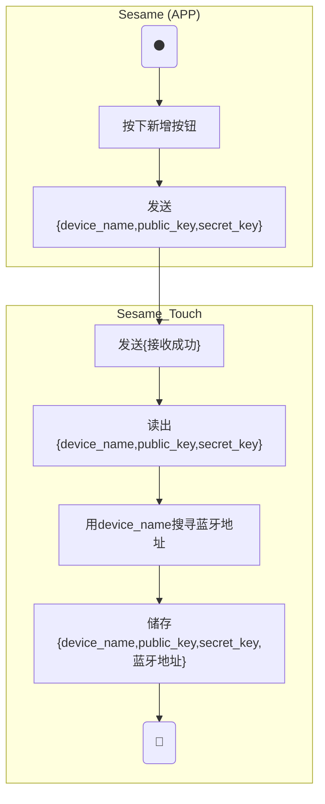
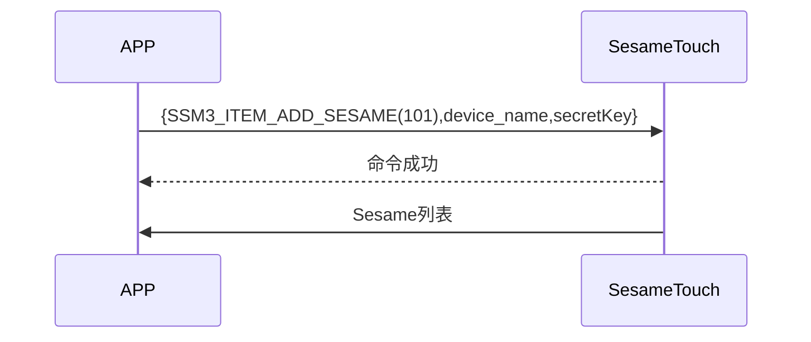

# 101 Add Sesame (新增)

手機發送新增指令及 Token，sesame5 回覆指令成功，ssm_touch 主動推送 Sesame 列表給手機。(Sesame 列表詳見 `102_pub_ssm_key`)

## 活動圖 (新增 Sesame4)

Sesame4 的藍牙地址不能用發送資訊解析出來，所以要透過掃描周圍的藍牙裝置，找出 Sesame4 的藍牙地址。




## 活動圖 (新增 Sesame5)

Sesame5 的藍牙地址可以用發送資訊解析出來，所以不用掃描周圍的藍牙裝置。

sessionKey = AES_CMAC(key:device_name, input:"candy")

address = sessionKey[0~5]

address[5] |= 0xC0


## 循序圖



## 手機送出資料

| Byte |  32 ~ 17  |   16 ~ 1    |     0     |
| ---- | :-------: | :---------: | :-------: |
| Data | secretKey | device_name | item code |

item code : SSM3_ITEM_ADD_SESAME (101)

## ssm_touch 回傳內容

| Byte |      2       |     1     |    0     |
| ---- | :----------: | :-------: | :------: |
| Data |     res      | item_code |   type   |
| 說明 | 命令處裡狀態 | 指令編號  | 推送類型 |

type : SSM2_OP_CODE_RESPONSE (0x07)

item code : SSM3_ITEM_ADD_SESAME (101)

res : CMD_RESULT_SUCCESS (0x00)

## iOS、Android、ESP32 範例

<CustomBashOSPlatformAddSesame ios='true' android='true'  esp32='true'/>

<!-- 

### Android 範例

```jsx | pure
    override fun insertSesame(sesame: CHDevices, result: CHResult<CHEmpty>) {
        if (checkBle(result)) return
        if (sesame !is CHSesameLock) {// 不是锁不处理
            L.d("hcia", "[SSM BTN]isLocker?")
            result.invoke(Result.failure(CHError.BleInvalidAction.value))
            return
        }
        L.d("hcia", "送出鑰匙sesame.getKey():" + sesame.getKey())

        if (sesame is CHSesameOS3) {///ss5/5pro,bike2
            val ssm = sesame as CHDeviceUtil
            val noDashUUID = ssm.sesame2KeyData!!.deviceUUID.replace("-", "")
            val noDashUUIDDATA = noDashUUID.hexStringToByteArray()
            val ssmSecKa = ssm.sesame2KeyData!!.secretKey.hexStringToByteArray()
            sendCommand(SesameOS3Payload(SesameItemCode.ADD_SESAME.value, noDashUUIDDATA + ssmSecKa)) { ssm2ResponsePayload ->
//                L.d("hcia", "ADD_SESAME cmdResultCode:" + ssm2ResponsePayload.cmdResultCode)
                result.invoke(Result.success(CHResultState.CHResultStateBLE(CHEmpty())))
            }
        } else {/// ss3/4,bot1,bike1
            val ssm = sesame as CHDeviceUtil
            val noDashUUID = ssm.sesame2KeyData!!.deviceUUID.replace("-", "")
            val b64k = noDashUUID.hexStringToByteArray().base64Encode().replace("=", "")
            val ssmIRData = b64k.toByteArray()
            val ssmPKData = ssm.sesame2KeyData!!.sesame2PublicKey.hexStringToByteArray()
            val ssmSecKa = ssm.sesame2KeyData!!.secretKey.hexStringToByteArray()
            val allKey = ssmIRData + ssmPKData + ssmSecKa
            sendCommand(SesameOS3Payload(SesameItemCode.ADD_SESAME.value, allKey)) {
                result.invoke(Result.success(CHResultState.CHResultStateBLE(CHEmpty())))
            }
        }
    }
```

### iOS 範例

```jsx | pure
    func insertSesame(_ device: CHDevice, matterProductModel: MatterProductModel, result: @escaping CHResult<CHEmpty>) {
        if (self.checkBle(result)) { return }
        let noDashUUID = device.deviceId.uuidString.replacingOccurrences(of: "-", with: "", options: [], range: nil)
        let noDashUUIDData = noDashUUID.hexStringtoData()
        let ssmSecKa = device.getKey()!.secretKey.hexStringtoData()
        let matter = UInt8(device.productModel.rawValue).data + matterProductModel.rawValue.data
        sendCommand(.init(.addSesame,noDashUUIDData + ssmSecKa + matter)) { (response) in
            result(.success(CHResultStateNetworks(input: CHEmpty())))
        }
    }
```

### ESP 範例

```jsx | pure
        log_info_array_ex("[main][SSM3_ITEM_ADD_SESAME]", p_param->data, p_param->length)
        talk_to_mob(p_param->conidx, SSM2_SEG_PARSING_TYPE_CIPHERTEXT, ble_tx_buf, 3);
        ssm_add_key(p_param->data, p_param->length);
        publish_ssm_keys(p_param->conidx);
``` 

-->
