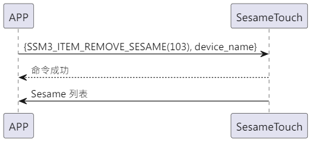

# 103 セサミを削除 (删除设备)

携帯電話から削除の指示とデバイス名を送信し、sesame5 の指示が成功したことを返信し、ssm_touch が主体的にセサミのリストを携帯電話にプッシュします。(セサミのリストの詳細は `102_pub_ssm_key` を参照)

## シーケンス図

<p align="left" >
  
</p>

## 携帯電話からのデータ送信

| Byte   |   16 ~ 1    |     0     |
| ------ | :---------: | :-------: |
| データ | device_name | item code |

item code : SSM3_ITEM_REMOVE_SESAME (103)

## ssm_touch からの返信内容

| Byte   |        2         |     1     |       0        |
| ------ | :--------------: | :-------: | :------------: |
| データ |       res        | item_code |      type      |
| 説明   | コマンド処理状態 | 指令番号  | プッシュの種類 |

type : SSM2_OP_CODE_RESPONSE (0x07)

item code : SSM3_ITEM_REMOVE_SESAME (103)

res : CMD_RESULT_SUCCESS (0x00)

## iOS、Android、ESP32 の例

<CustomBashOSPlatformRemoveSesame ios='true' android='true'  esp32='true'/>

<!-- ## Android 例

```jsx | pure
  override fun removeSesame(tag: String, result: CHResult<CHEmpty>) {
      if (checkBle(result)) return
      if (ssm2KeysMap.get(tag)!!.get(0).toInt() == 0x04) {// ss4
          val noDashUUID = tag.replace("-", "")
          val b64k = noDashUUID.hexStringToByteArray().base64Encode().replace("=", "")
          val ssmIRData = b64k.toByteArray()
          sendCommand(SesameOS3Payload(SesameItemCode.REMOVE_SESAME.value, ssmIRData)) { ssm2ResponsePayload ->
              result.invoke(Result.success(CHResultState.CHResultStateBLE(CHEmpty())))
          }
      } else {//ss5
          val noDashUUID = tag.replace("-", "")
          sendCommand(SesameOS3Payload(SesameItemCode.REMOVE_SESAME.value, noDashUUID.hexStringToByteArray())) { ssm2ResponsePayload ->
              result.invoke(Result.success(CHResultState.CHResultStateBLE(CHEmpty())))
          }
      }
  }
```

## iOS 例

```jsx | pure
    func removeSesame(tag: String, result: @escaping CHResult<CHEmpty>) {
        if (self.checkBle(result)) { return }
        L.d("[hub3][removeSesame]",tag)
        let noDashUUID = tag.replacingOccurrences(of: "-", with: "", options: [], range: nil)
        sendCommand(.init(.removeSesame,noDashUUID.hexStringtoData())) { (response) in
            result(.success(CHResultStateNetworks(input: CHEmpty())))
        }
    }
```

## ESP 例

```jsx | pure
        log_info_array_ex("[main][SSM3_ITEM_REMOVE_SESAME]", p_param->data, p_param->length)
        appm_stop_init();
        co_timer_set(&dis_timer, 1, TIMER_ONE_SHOT, delay_disconnect_all_ssm, NULL);

        talk_to_mob(p_param->conidx, SSM2_SEG_PARSING_TYPE_CIPHERTEXT, ble_tx_buf, 3);
        ssm_remove_key(p_param->data, p_param->length);
        publish_ssm_keys(p_param->conidx);
``` -->
