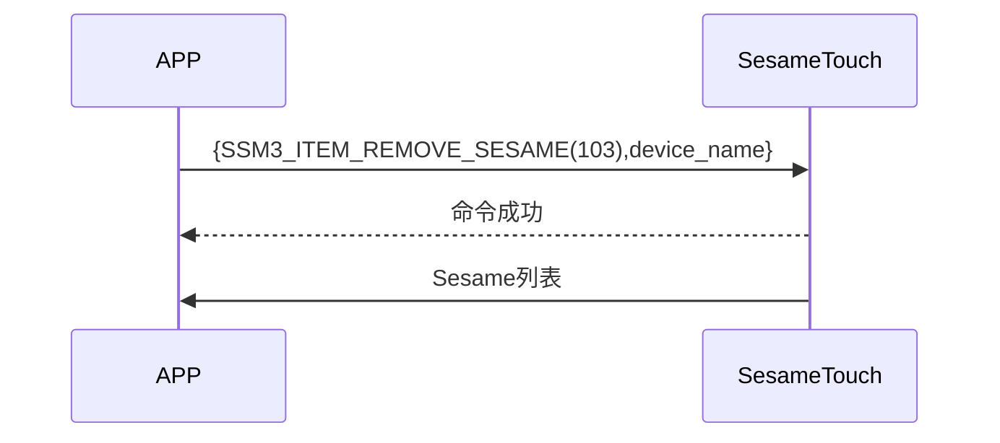

# 103 Remove Sesame (删除设备)

手機發送刪除指令及設備名稱，sesame5 回覆指令成功，ssm_touch 主動推送 Sesame 列表給手機。(Sesame 列表詳見 `102_pub_ssm_key`)

## 循序圖




## 手機送出資料

| Byte |   16 ~ 1    |     0     |
| ---- | :---------: | :-------: |
| Data | device_name | item code |

item code : SSM3_ITEM_REMOVE_SESAME (103)

## ssm_touch 回傳內容

| Byte |      2       |     1     |    0     |
| ---- | :----------: | :-------: | :------: |
| Data |     res      | item_code |   type   |
| 說明 | 命令處裡狀態 | 指令編號  | 推送類型 |

type : SSM2_OP_CODE_RESPONSE (0x07)

item code : SSM3_ITEM_REMOVE_SESAME (103)

res : CMD_RESULT_SUCCESS (0x00)

## iOS、Android、ESP32 範例

<CustomBashOSPlatformRemoveSesame ios='true' android='true'  esp32='true'/>

<!-- 

### Android 範例

```jsx | pure
  override fun removeSesame(tag: String, result: CHResult<CHEmpty>) {
      if (checkBle(result)) return
      if (ssm2KeysMap.get(tag)!!.get(0).toInt() == 0x04) {// ss4
          val noDashUUID = tag.replace("-", "")
          val b64k = noDashUUID.hexStringToByteArray().base64Encode().replace("=", "")
          val ssmIRData = b64k.toByteArray()
          sendCommand(SesameOS3Payload(SesameItemCode.REMOVE_SESAME.value, ssmIRData)) { ssm2ResponsePayload ->
              result.invoke(Result.success(CHResultState.CHResultStateBLE(CHEmpty())))
          }
      } else {//ss5
          val noDashUUID = tag.replace("-", "")
          sendCommand(SesameOS3Payload(SesameItemCode.REMOVE_SESAME.value, noDashUUID.hexStringToByteArray())) { ssm2ResponsePayload ->
              result.invoke(Result.success(CHResultState.CHResultStateBLE(CHEmpty())))
          }
      }
  }
```

### iOS 範例

```jsx | pure
    func removeSesame(tag: String, result: @escaping CHResult<CHEmpty>) {
        if (self.checkBle(result)) { return }
        L.d("[hub3][removeSesame]",tag)
        let noDashUUID = tag.replacingOccurrences(of: "-", with: "", options: [], range: nil)
        sendCommand(.init(.removeSesame,noDashUUID.hexStringtoData())) { (response) in
            result(.success(CHResultStateNetworks(input: CHEmpty())))
        }
    }
```

### ESP 範例

```jsx | pure
        log_info_array_ex("[main][SSM3_ITEM_REMOVE_SESAME]", p_param->data, p_param->length)
        appm_stop_init();
        co_timer_set(&dis_timer, 1, TIMER_ONE_SHOT, delay_disconnect_all_ssm, NULL);

        talk_to_mob(p_param->conidx, SSM2_SEG_PARSING_TYPE_CIPHERTEXT, ble_tx_buf, 3);
        ssm_remove_key(p_param->data, p_param->length);
        publish_ssm_keys(p_param->conidx);
``` 
-->
