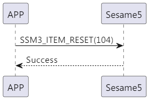

# 104 リセット

携帯電話がリセット指令を送信し、sesame5 が指令成功と応答し、データをクリアして再起動します。

## シーケンス図

<p align="left" >
  
</p>

## 携帯電話からの送信データ

| バイト |       0        |
| ------ | :------------: |
| データ | アイテムコード |

アイテムコード：SSM3_ITEM_RESET（104）

## ssm5 からの返信内容

| バイト |      2       |       1        |       0        |
| ------ | :----------: | :------------: | :------------: |
| データ |     res      | アイテムコード |      type      |
| 説明   | 命令処理状態 |    指令番号    | プッシュタイプ |

タイプ：SSM2_OP_CODE_RESPONSE（0x07）

アイテムコード：SSM3_ITEM_RESET（104）

res：CMD_RESULT_SUCCESS（0x00）

## iOS、Android、ESP32 のエグザンプル

<CustomBashOSPlatformReset
  ios='true'
  android='true' 
  esp32='true'
/>

<!-- ## Androidのエグザンプル

```jsx | pure
    open fun reset(result: CHResult<CHEmpty>) {
        sendCommand(SesameOS3Payload(SesameItemCode.Reset.value, byteArrayOf()), DeviceSegmentType.cipher) { res ->
            if (res.cmdResultCode == SesameResultCode.success.value) {
                dropKey(result)
            } else {
                result.invoke(Result.failure(NSError(res.cmdResultCode.toString(), "CBCentralManager", res.cmdResultCode.toInt())))
            }
        }
    }
```

## iOSのエグザンプル

```jsx | pure
    func reset(result: @escaping (CHResult<CHEmpty>)) {
        if (self.checkBle(result)) { return }
        sendCommand(.init(.reset)) { (responsePayload) in
                self.dropKey { dropResult in
                    switch dropResult {
                    case .success(_):
                        result(.success(CHResultStateNetworks(input: CHEmpty())))
                    case .failure(let error):
                        result(.failure(error))
                    }
                }
            }
        }
```

## ESPのエグザンプル

```jsx | pure
if (src_id == SSM3_ITEM_RESET) {
        talk_to_mob(p_param->conidx, SSM2_SEG_PARSING_TYPE_CIPHERTEXT, ble_tx_buf, 3);
        static co_timer_t reset_timer;
        co_timer_set(&reset_timer, 1000, TIMER_ONE_SHOT, after_100ms_reboot, NULL);
    }
``` -->
