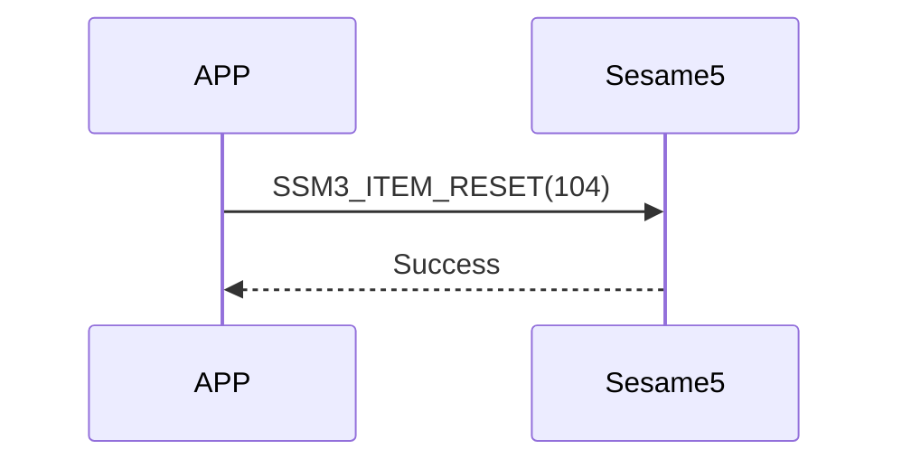

# 104 Reset (重置)

手機發送重置指令，sesame5 回覆指令成功，並清除資料和重新啟動。

## 循序圖




## 手機送出資料

| Byte |     0     |
| ---- | :-------: |
| Data | item code |

item code : SSM3_ITEM_RESET (104)

## ssm5 回傳內容

| Byte |      2       |     1     |    0     |
| ---- | :----------: | :-------: | :------: |
| Data |     res      | item_code |   type   |
| 說明 | 命令處裡狀態 | 指令編號  | 推送類型 |

type : SSM2_OP_CODE_RESPONSE (0x07)

item code : SSM3_ITEM_RESET (104)

res : CMD_RESULT_SUCCESS (0x00)

## iOS、Android、ESP32 範例

<CustomBashOSPlatformReset
  ios='true'
  android='true' 
  esp32='true'
/>

<!-- 

### Android 範例

```jsx | pure
    open fun reset(result: CHResult<CHEmpty>) {
        sendCommand(SesameOS3Payload(SesameItemCode.Reset.value, byteArrayOf()), DeviceSegmentType.cipher) { res ->
            if (res.cmdResultCode == SesameResultCode.success.value) {
                dropKey(result)
            } else {
                result.invoke(Result.failure(NSError(res.cmdResultCode.toString(), "CBCentralManager", res.cmdResultCode.toInt())))
            }
        }
    }
```

### iOS 範例

```jsx | pure
    func reset(result: @escaping (CHResult<CHEmpty>)) {
        if (self.checkBle(result)) { return }
        sendCommand(.init(.reset)) { (responsePayload) in
                self.dropKey { dropResult in
                    switch dropResult {
                    case .success(_):
                        result(.success(CHResultStateNetworks(input: CHEmpty())))
                    case .failure(let error):
                        result(.failure(error))
                    }
                }
            }
        }
```

### ESP 範例

```jsx | pure
if (src_id == SSM3_ITEM_RESET) {
        talk_to_mob(p_param->conidx, SSM2_SEG_PARSING_TYPE_CIPHERTEXT, ble_tx_buf, 3);
        static co_timer_t reset_timer;
        co_timer_set(&reset_timer, 1000, TIMER_ONE_SHOT, after_100ms_reboot, NULL);
    }
``` 

-->
