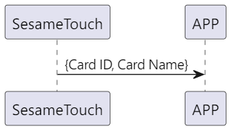

# 107 カード変更（修正）

1. ssm_touch が新しいカードを追加し、新しいカード ID と名前を携帯電話に自動的に送信します。
2. 携帯電話は id と新しい名前を ssm_touch に送信し、ssm_touch は命令の受信を成功した後でカード名を変更し、新しいカード ID と名前を携帯電話に自動的に送信します（名前が 20 バイトを超える場合、最初の 20 バイトだけを取ります）。

## シーケンス図 (新規カード追加)

  

## シーケンス図 (カード名の変更)

  

## 携帯電話からの送信データ

| バイト |  N ~ 1  |     0     |
| ------ | :-----: | :-------: |
| データ | payload | item code |

item code : SSM_OS3_CARD_CHANGE (107)

payload : 下の表を参照してください。

### payload

| バイト | (Card Name Len + Card ID Len + 1) ~ (Card ID Len + 2) | Card ID Len + 1 | Card ID Len ~ 1 |        0         |
| :----: | :---------------------------------------------------: | :-------------: | :-------------: | :--------------: |
| データ |                       カード名                        | カード名の長さ  |    カード ID    | カード ID の長さ |

#### 例

id_len = 5

name_len = 4

| バイト |  10 ~ 7  |       6        |   5 ~ 1   |        0         |
| :----: | :------: | :------------: | :-------: | :--------------: |
| データ | カード名 | カード名の長さ | カード ID | カード ID の長さ |

## ssm_touch からの返信内容

| バイト |       2        |     1     |     0      |
| ------ | :------------: | :-------: | :--------: |
| データ |      res       | item_code |    type    |
| 説明   | 命令の処理状況 | 指令番号  | 返信タイプ |

type : SSM2_OP_CODE_RESPONSE (0x07)

item code : SSM_OS3_CARD_CHANGE (107)

res : CMD_RESULT_SUCCESS (0x00)

## ssm_touch からのプッシュ通知内容

| バイト |       N ~ 2        |     1     |         0          |
| ------ | :----------------: | :-------: | :----------------: |
| データ |      payload       | item_code |        type        |
| 説明   | 携帯電話へのデータ | 指令番号  | プッシュ通知タイプ |

type : SSM2_OP_CODE_PUBLISH (0x08)

item code : SSM_OS3_CARD_CHANGE (107)

payload : 下の表を参照してください。

### payload

| バイト | (Card Name Len + Card ID Len + 1) ~ (Card ID Len + 2) | Card ID Len + 1 | Card ID Len ~ 1 |        0         |
| :----: | :---------------------------------------------------: | :-------------: | :-------------: | :--------------: |
| データ |                       カード名                        | カード名の長さ  |    カード ID    | カード ID の長さ |

#### 例

id_len = 5

name_len = 4

| バイト |  10 ~ 7  |       6        |   5 ~ 1   |        0         |
| :----: | :------: | :------------: | :-------: | :--------------: |
| データ | カード名 | カード名の長さ | カード ID | カード ID の長さ |

## iOS、Android、ESP32 の例

<CustomBashOSPlatformCardChange ios='true' android='true'  esp32='true'/>
