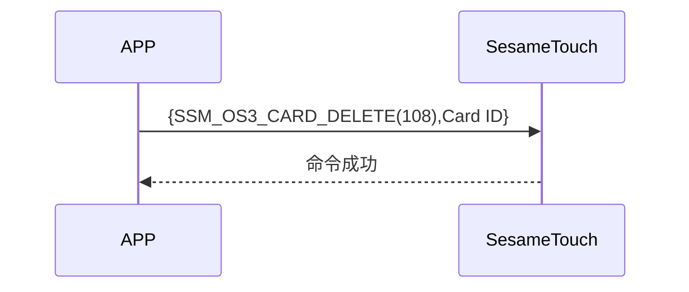

# 108 Card Delete （删除卡片）

手機發送刪除指令及卡片 ID，ssm_touch 回覆指令成功並刪除指定卡片。

## 循序圖




## 手機送出資料

| Byte | 16 ~ 1  |     0     |
| ---- | :-----: | :-------: |
| Data | Card ID | item code |

item code : SSM_OS3_CARD_DELETE (108)

## ssm_touch 回傳內容

| Byte |      2       |     1     |    0     |
| ---- | :----------: | :-------: | :------: |
| Data |     res      | item_code |   type   |
| 說明 | 命令處裡狀態 | 指令編號  | 推送類型 |

type : SSM2_OP_CODE_RESPONSE (0x07)

item code : SSM_OS3_CARD_DELETE (108)

res : CMD_RESULT_SUCCESS (0x00)

## iOS、Android、ESP32 範例

<CustomBashOSPlatformCardDelete ios='true' android='true'  esp32='true'/>

<!-- 

### Android 範例

```jsx | pure
  override fun cardDelete(ID: String, result: CHResult<CHEmpty>) {
      if (checkBle(result)) return
      sendCommand(SesameOS3Payload(SesameItemCode.SSM_OS3_CARD_DELETE.value, ID.hexStringToByteArray())) { res ->
          L.d("hcia", "[cardDelete][ID]" + ID)
          result.invoke(Result.success(CHResultState.CHResultStateBLE(CHEmpty())))
      }
  }
```

### iOS 範例

```jsx | pure
  func cardsDelete(ID: String, result: @escaping (CHResult<CHEmpty>)) {
        if (self.checkBle(result)) { return }

        sendCommand(.init(.SSM_OS3_CARD_DELETE,ID.hexStringtoData())) { _ in
            result(.success(CHResultStateNetworks(input: CHEmpty())))
        }
    }
```

### ESP 範例

```jsx | pure

``` 
-->
