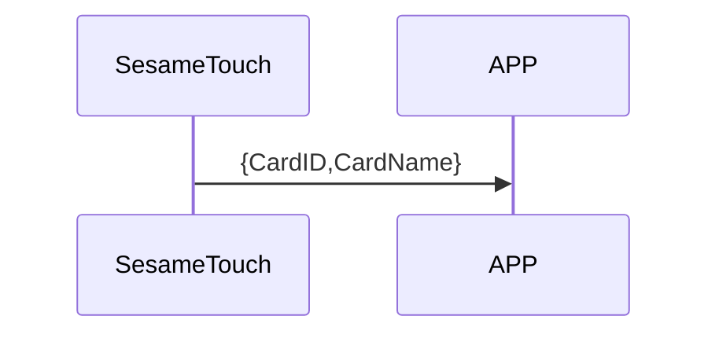

# 110 Card Notify （推送卡片）

ssm_touch 主動推送卡片資料給手機。

## 循序圖




## ssm_touch 推送內容

| Byte |     N ~ 2      |     1     |    0     |
| ---- | :------------: | :-------: | :------: |
| Data |    payload     | item_code |   type   |
| 說明 | 送給手機的資料 | 指令編號  | 推送類型 |

type : SSM2_OP_CODE_PUBLISH (0x08)

item code : SSM2_ITEM_CODE_INITIAL (102)

payload : 詳見以下表格

### payload

| Byte | (Card ID Len + Card Name Len + 2) ~ (Card ID Len + 3) | Card ID Len + 2 | (Card ID Len + 1) ~ 2 |      1      |     0     |
| :--: | :---------------------------------------------------: | :-------------: | :-------------------: | :---------: | :-------: |
| Data |                       card_name                       |  card_name_len  |        card_id        | card_id_len | card_type |

#### 範例

card_id_len = 7

card_name_len = 8

| Byte |  17 ~ 10  |       9       |  8 ~ 2  |      1      |     0     |
| :--: | :-------: | :-----------: | :-----: | :---------: | :-------: |
| Data | card_name | card_name_len | card_id | card_id_len | card_type |

## iOS、Android、ESP32 範例

<CustomBashOSPlatformCardNotify ios='true' android='true'  esp32='true'/>

<!-- 

### Android 範例

```jsx | pure
if (receivePayload.cmdItCode == SesameItemCode.SSM_OS3_CARD_NOTIFY.value) {
            val card = CHSesameTouchCard(receivePayload.payload)
            (delegate as? CHSesameTouchProDelegate)?.onCardReceive(this, card.cardID, card.cardName, card.cardType)
}
```

### iOS 範例

```jsx | pure
    case .SSM_OS3_CARD_NOTIFY:
        let card = CHSesameTouchCard(data:data)
        (self.delegate as? CHSesameTouchProDelegate)?.onCardReceive(device:self, id: card.cardID, name: card.cardName, type: card.cardType)
```

-->
