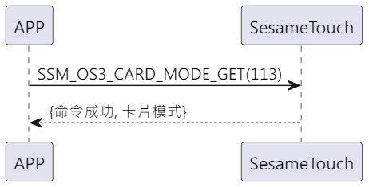

# 113 カードモード取得

携帯電話から新規の指示を送り、ssm_touch が新規追加モードなのかカード認証モードなのかを取得します。その後、sesame5 が指令成功とモードを応答します。

## シーケンス図

<p align="left" >
  
</p>

## 携帯電話から送信するデータ

| バイト |       0        |
| ------ | :------------: |
| データ | アイテムコード |

アイテムコード：SSM_OS3_CARD_MODE_GET (113)

## ssm_touch からの応答内容

| バイト |      4       |  3  |       2        |  1   |    0    |
| ------ | :----------: | :-: | :------------: | :--: | :-----: |
| データ | カードモード | res | アイテムコード | type | op code |

type：SSM2_OP_CODE_RESPONSE(0x07)

アイテムコード：SSM_OS3_CARD_MODE_GET (113)

res：CMD_RESULT_SUCCESS (0x00)

### カードモード

0x00->認証モード

0x01->新規モード

## iOS、Android、ESP32 の例

<CustomBashOSPlatformCardModeGet ios='true' android='true'  esp32='true'/>

<!-- ## Androidの例

```jsx | pure
  override fun cardModeGet(result: CHResult<Byte>) {
      if (checkBle(result)) return
      sendCommand(SesameOS3Payload(SesameItemCode.SSM_OS3_CARD_MODE_GET.value, byteArrayOf())) { res ->
          result.invoke(Result.success(CHResultState.CHResultStateBLE(res.payload[0])))
      }
  }
```

## iOSの例

```jsx | pure
    func cardsModeGet(result: @escaping (CHResult<UInt8>)) {
        if (self.checkBle(result)) { return }

        sendCommand(.init(.SSM_OS3_CARD_MODE_GET)) { response in
            result(.success(CHResultStateNetworks(input: response.data[0])))
        }
    }
```

廃止 -->
