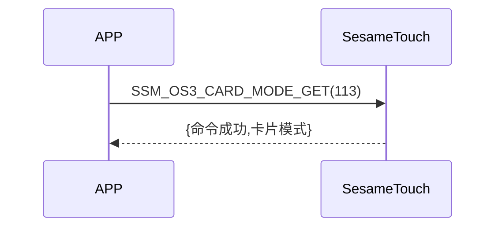

# 113 Card Mode Get(卡片模式)

手機發送新增指令獲取 ssm_touch 現在處於新增或是驗證卡片模式，sesame5 回覆指令成功及模式。

## 循序圖



## 手機送出資料

| Byte |     0     |
| ---- | :-------: |
| Data | item code |

item code : SSM_OS3_CARD_MODE_GET (113)

## ssm_touch 回傳內容

| Byte |     4     |  3  |     2     |  1   |    0    |
| ---- | :-------: | :-: | :-------: | :--: | :-----: |
| Data | card mode | res | item code | type | op code |

type : SSM2_OP_CODE_RESPONSE(0x07)

item code : SSM_OS3_CARD_MODE_GET (113)

res : CMD_RESULT_SUCCESS (0x00)

### card mode

0x00->驗證模式

0x01->新增模式

## iOS、Android、ESP32 範例

<CustomBashOSPlatformCardModeGet ios='true' android='true'  esp32='true'/>

<!-- 

### Android 範例

```jsx | pure
  override fun cardModeGet(result: CHResult<Byte>) {
      if (checkBle(result)) return
      sendCommand(SesameOS3Payload(SesameItemCode.SSM_OS3_CARD_MODE_GET.value, byteArrayOf())) { res ->
          result.invoke(Result.success(CHResultState.CHResultStateBLE(res.payload[0])))
      }
  }
```

### iOS 範例

```jsx | pure
    func cardsModeGet(result: @escaping (CHResult<UInt8>)) {
        if (self.checkBle(result)) { return }

        sendCommand(.init(.SSM_OS3_CARD_MODE_GET)) { response in
            result(.success(CHResultStateNetworks(input: response.data[0])))
        }
    }
```

-->
