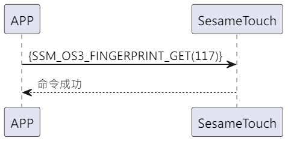

# 117\_フィンガーゲット（指紋取得）

携帯電話が ssm_touch に指指令を送信し、ssm_touch が命令の成功を応答し、その後指紋データを携帯電話に転送します。

## シーケンス図

<p align="left">
  
</p>

## 携帯電話が送信するデータ

| バイト |       0        |
| ------ | :------------: |
| データ | アイテムコード |

アイテムコード：SSM_OS3_FINGERPRINT_GET (117)

## ssm_touch の応答内容

| バイト |      2       |        1         |       0        |
| ------ | :----------: | :--------------: | :------------: |
| データ |     res      | アイテム\_コード |     タイプ     |
| 説明   | 命令処理状況 |     指令番号     | プッシュタイプ |

タイプ：SSM2_OP_CODE_RESPONSE (0x07)

アイテムコード：SSM_OS3_FINGERPRINT_GET (117)

res：CMD_RESULT_SUCCESS (0x00)

## iOS、Android、ESP32 の例

<CustomBashOSPlatformFingerGet ios='true' android='true'  esp32='true'/>

<!-- ## Android例

```jsx | pure
    override fun fingerPrints(result: CHResult<CHEmpty>) {
        if (checkBle(result)) return
        sendCommand(SesameOS3Payload(SesameItemCode.SSM_OS3_FINGERPRINT_GET.value, byteArrayOf())) { res ->
            result.invoke(Result.success(CHResultState.CHResultStateBLE(CHEmpty())))
        }
    }
```

## iOS例

```jsx | pure
    func fingerPrints( result: @escaping (CHResult<CHEmpty>)) {
        if (self.checkBle(result)) { return }
        sendCommand(.init(.SSM_OS3_FINGERPRINT_GET)) { _ in
            result(.success(CHResultStateNetworks(input: CHEmpty())))
        }
    }
```

## ESP例

```jsx | pure

``` -->
