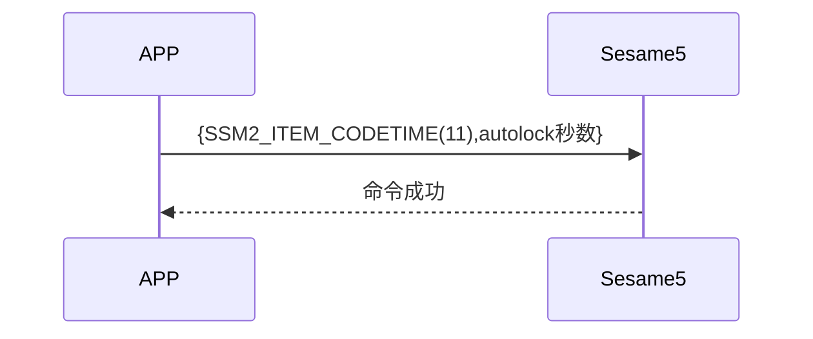

# 11 Autolock (自动上锁)

手機主動送出更新時間(item_code:11)指令及 autolock 秒數，ssm5 開啟 autolock 定時器並回傳成功。

## 循序圖




## 手機送出資料

| Byte |     2 ~ 1     |     0     |
| ---- | :-----------: | :-------: |
| Data | autolock 秒數 | item code |

item code : SSM2_ITEM_CODE_AUTOLOCK (11)

## ssm5 回傳內容

| Byte |      2       |     1     |    0     |
| ---- | :----------: | :-------: | :------: |
| Data |     res      | item_code |   type   |
| 說明 | 命令處裡狀態 | 指令編號  | 推送類型 |

type : SSM2_OP_CODE_RESPONSE (0x07)

item code : SSM2_ITEM_CODE_AUTOLOCK (11)

res : CMD_RESULT_SUCCESS (0x00)

## iOS、Android、ESP32 範例

<CustomBashOSPlatformAutoLock
  ios='true'
  android='true' 
  esp32='true'
/>

<!-- 

### Android 範例

```java
    override fun autolock(delay: Int, result: CHResult<Int>) {
        if (checkBle(result)) return
        sendCommand(SesameOS3Payload(SesameItemCode.autolock.value, delay.toShort().toReverseBytes()), DeviceSegmentType.cipher) { res ->
            mechSetting?.autoLockSecond = delay.toShort()
            result.invoke(Result.success(CHResultState.CHResultStateBLE(delay)))
        }
    }
```

### iOS 範例

```jsx | pure
    public func autolock(historytag: Data?, delay: Int, result: @escaping (CHResult<Int>))  {
        if(checkBle(result)){return}

        var autolockSet = Sesame2Autolock(Int16(delay))
        let payload = autolockSet.toData()

        return sendCommand(.init( .autolock, payload)) { (payload) in
            if payload.cmdResultCode == .success {
                result(.success(CHResultStateBLE(input: delay)))
            }
        }
    }
```

### ESP 範例

```jsx | pure
void autolock_sentence(void) {
    //    log_info("autolock_sentence")
    if (g_device_config.mech_setting.auto_lock_second != 0) {
        //        if (g_device_config.mech_status.is_low_battery == false) {/// 低電量不觸發自動關鎖
        if (UNLOCKERED) {
            log_info("[autolock][go][%ds]", g_device_config.mech_setting.auto_lock_second)
                    co_timer_set(&autolock_timer, g_device_config.mech_setting.auto_lock_second * 1000,
                            TIMER_ONE_SHOT, autolock_trigger, NULL);
        }
        //        }
    }
}
``` 

-->
