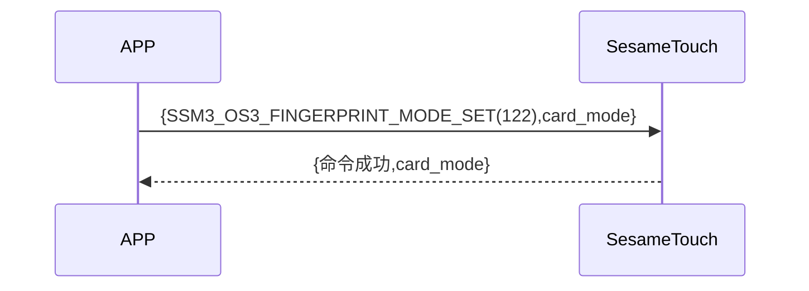

# 114 Finger Mode Set(指纹模式设置)

手機發送新增指令獲取 ssm_touch 現在處於新增或是驗證指紋模式，sesame5 回覆指令成功及模式。

## 循序圖




## 手機送出資料

| Byte |      1      |     0     |
| ---- | :---------: | :-------: |
| Data | finger_mode | item code |

item code : SSM_OS3_CARD_MODE_SET (114)

## ssm_touch 回傳內容

| Byte |      4      |  3  |     2     |  1   |    0    |
| ---- | :---------: | :-: | :-------: | :--: | :-----: |
| Data | finger mode | res | item code | type | op code |

type : SSM2_OP_CODE_RESPONSE(0x07)

item code : SSM_OS3_CARD_MODE_SET (114)

res : CMD_RESULT_SUCCESS (0x00)

## finger mode

0x00->驗證模式

0x01->新增模式

## iOS、Android、ESP32 範例

<CustomBashOSPlatformFingerModeSet ios='true' android='true'  esp32='true'/>

<!-- 

### Android 範例

```jsx | pure
   override fun fingerPrintModeSet(mode: Byte, result: CHResult<CHEmpty>) {
        if (checkBle(result)) return
        sendCommand(SesameOS3Payload(SesameItemCode.SSM_OS3_FINGERPRINT_MODE_SET.value, byteArrayOf(mode))) {
            result.invoke(Result.success(CHResultState.CHResultStateBLE(CHEmpty())))
        }
    }
```

### iOS 範例

```jsx | pure
    func fingerPrintModeSet(mode: UInt8, result: @escaping (CHResult<CHEmpty>)) {
        if (self.checkBle(result)) { return }

        sendCommand(.init(.SSM_OS3_FINGERPRINT_MODE_SET,Data([mode]))) { _ in
            result(.success(CHResultStateNetworks(input: CHEmpty())))
        }
    }
```

### ESP 範例

```jsx | pure

``` 

-->
