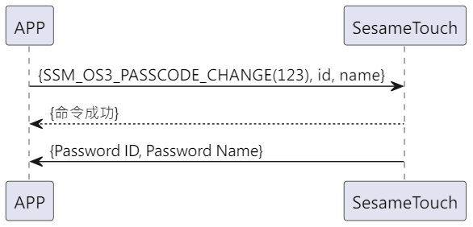

# 123 Password Change

1. ssm_touch adds a new password, initiative to push new password ID and name to the phone.
2. The phone sends id and new name to ssm_touch, ssm_touch returns a command reception success and modifies the password name, and initiative to push new password ID and name to the phone.(If the name is over 20Bytes, only the first 20Bytes are taken).

## Sequence diagram (New password)

  

## Sequence diagram (Modify password name)

  

## Mobile phone sends data

| Byte |   N ~ 1   |     0     |
| ---- | :-------: | :-------: |
| Data | payload   | item code |

item code : SSM_OS3_PASSCODE_CHANGE (123)

payload : Please refer to the table below

### Payload

| Byte | (Password Name Len + Password ID Len + 1) ~ (Password ID Len + 2) | Password ID Len + 1 | Password ID Len ~ 1 |        0        |
| :--: | :---------------------------------------------------------------: | :-----------------: | :-----------------: | :-------------: |
| Data |                           Password Name                           |  Password Name Len  |     Password ID     | Password ID Len |

#### Example

id_len = 5

name_len = 4

| Byte |    10 ~ 7     |         6         |    5 ~ 1    |        0        |
| :--: | :-----------: | :---------------: | :---------: | :-------------: |
| Data | Password Name | Password Name Len | Password ID | Password ID Len |

## ssm_touch Return content

| Byte |  2   |    1    |   0    |
| ---- | :--: | :-----: | :----: |
| Data | res  | item_code |  type  |
| Note | Command handling status | Command number  | Push type |

type : SSM2_OP_CODE_RESPONSE (0x07)

item code : SSM_OS3_PASSCODE_CHANGE (123)

res : CMD_RESULT_SUCCESS (0x00)

## ssm_touch Push Content

| Byte |    N ~ 2     |    1    |   0    |
| ---- | :----------: | :-----: | :----: |
| Data |  payload     | item_code |  type  |
| Note | Data sent to the phone | Command number  | Push type |

type : SSM2_OP_CODE_PUBLISH (0x08)

item code : SSM_OS3_PASSCODE_CHANGE (123)

payload : Please refer to the table below

### Payload
| Byte | (Password Name Len + Password ID Len + 1) ~ (Password ID Len + 2) | Password ID Len + 1 | Password ID Len ~ 1 |        0        |
| :--: | :---------------------------------------------------------------: | :-----------------: | :-----------------: | :-------------: |
| Data |                           Password Name                           |  Password Name Len  |     Password ID     | Password ID Len |

#### Example
id_len = 5

name_len = 4

| Byte |    10 ~ 7     |         6         |    5 ~ 1    |        0        |
| :--: | :-----------: | :---------------: | :---------: | :-------------: |
| Data | Password Name | Password Name Len | Password ID | Password ID Len |

## iOS, Android, ESP32 Examples
<CustomBashOSPlatformPwChange ios='true' android='true'  esp32='true'/>