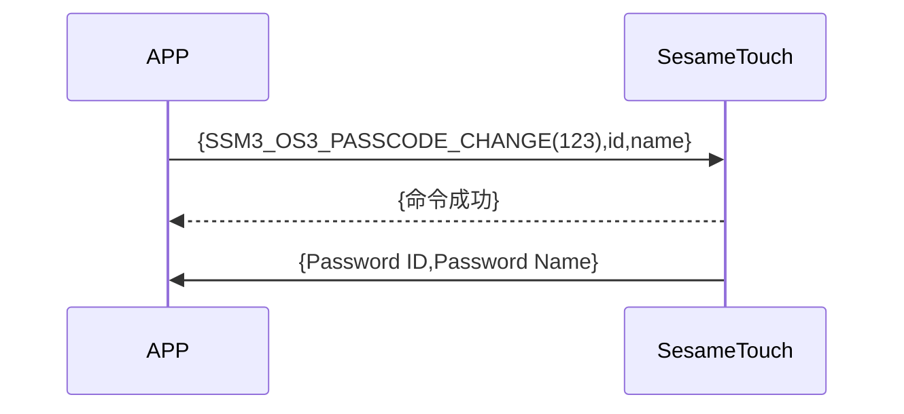

# 123 Password Change(密码更新)

1. ssm_touch 加入新密碼，主動推送新密碼 ID 及名字給手機。
2. 手機將 id 及新名稱傳給 ssm_touch，ssm_touch 回傳命令接收成功後修改密碼名稱，並主動推送新密碼 ID 及名字給手機(名字超過 20Bytes，只取前 20Bytes)。

## 循序圖 (新增密碼)




## 循序圖 (修改密碼名稱)


## 手機送出資料

| Byte |  N ~ 1  |     0     |
| ---- | :-----: | :-------: |
| Data | payload | item code |

item code : SSM_OS3_PASSCODE_CHANGE (123)

payload : 詳見以下表格

### payload

| Byte | (Password Name Len + Password ID Len + 1) ~ (Password ID Len + 2) | Password ID Len + 1 | Password ID Len ~ 1 |        0        |
| :--: | :---------------------------------------------------------------: | :-----------------: | :-----------------: | :-------------: |
| Data |                           Password Name                           |  Password Name Len  |     Password ID     | Password ID Len |

#### 範例

id_len = 5

name_len = 4

| Byte |    10 ~ 7     |         6         |    5 ~ 1    |        0        |
| :--: | :-----------: | :---------------: | :---------: | :-------------: |
| Data | Password Name | Password Name Len | Password ID | Password ID Len |

## ssm_touch 回傳內容

| Byte |      2       |     1     |    0     |
| ---- | :----------: | :-------: | :------: |
| Data |     res      | item_code |   type   |
| 說明 | 命令處裡狀態 | 指令編號  | 推送類型 |

type : SSM2_OP_CODE_RESPONSE (0x07)

item code : SSM_OS3_PASSCODE_CHANGE (123)

res : CMD_RESULT_SUCCESS (0x00)

## ssm_touch 推送內容

| Byte |     N ~ 2      |     1     |    0     |
| ---- | :------------: | :-------: | :------: |
| Data |    payload     | item_code |   type   |
| 說明 | 送給手機的資料 | 指令編號  | 推送類型 |

type : SSM2_OP_CODE_PUBLISH (0x08)

item code : SSM_OS3_PASSCODE_CHANGE (123)

payload : 詳見以下表格

### payload

| Byte | (Password Name Len + Password ID Len + 1) ~ (Password ID Len + 2) | Password ID Len + 1 | Password ID Len ~ 1 |        0        |
| :--: | :---------------------------------------------------------------: | :-----------------: | :-----------------: | :-------------: |
| Data |                           Password Name                           |  Password Name Len  |     Password ID     | Password ID Len |

#### 範例

id_len = 5

name_len = 4

| Byte |    10 ~ 7     |         6         |    5 ~ 1    |        0        |
| :--: | :-----------: | :---------------: | :---------: | :-------------: |
| Data | Password Name | Password Name Len | Password ID | Password ID Len |

## iOS、Android、ESP32 範例

<CustomBashOSPlatformPwChange ios='true' android='true'  esp32='true'/>

<!-- 

### Android 範例

```jsx | pure
    override fun keyBoardPassCodeChange(ID: String, name: String, result: CHResult<CHEmpty>) {
        if (checkBle(result)) return
        sendCommand(SesameOS3Payload(SesameItemCode.SSM_OS3_PASSCODE_CHANGE.value, byteArrayOf(ID.hexStringToByteArray().size.toByte()) + ID.hexStringToByteArray() + name.toByteArray())) { res ->
            result.invoke(Result.success(CHResultState.CHResultStateBLE(CHEmpty())))
        }
    }
```

### iOS 範例

```jsx | pure
    func passCodeChange(ID: String, name: String, result: @escaping (CHResult<CHEmpty>)) {
        if (self.checkBle(result)) { return }

        let idData = ID.hexStringtoData()
        let payload = Data([UInt8(idData.count)]) + idData + name.bytes
        sendCommand(.init(.SSM_OS3_PASSCODE_CHANGE, payload)) { _ in
            result(.success(CHResultStateNetworks(input: CHEmpty())))
        }
    }
```

### ESP 範例

```jsx | pure

``` 

-->
