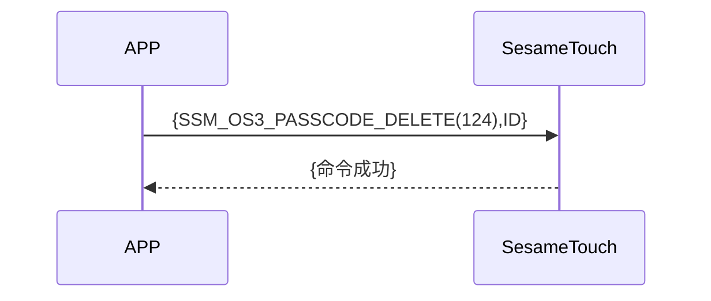

# 124 Password Delete(密码删除)

手機端傳送要刪除的密碼 ID，ssm_touch 回傳成功訊息，刪除指定密碼。

## 循序圖




## 手機送出資料

| Byte |   1   |     0     |
| ---- | :---: | :-------: |
| Data | pw_id | item code |

item code : SSM_OS3_PASSCODE_DELETE (124)

pw_id : 要刪除的密碼 ID

## ssm_touch 回傳內容

| Byte |      2       |     1     |    0     |
| ---- | :----------: | :-------: | :------: |
| Data |     res      | item_code |   type   |
| 說明 | 命令處裡狀態 | 指令編號  | 推送類型 |

type : SSM2_OP_CODE_RESPONSE (0x07)

item code : SSM_OS3_PASSCODE_DELETE (124)

res : CMD_RESULT_SUCCESS (0x00)

## iOS、Android、ESP32 範例

<CustomBashOSPlatformPwDelete ios='true' android='true'  esp32='true'/>

<!-- 

### Android 範例

```jsx | pure
    override fun keyBoardPassCodeDelete(ID: String, result: CHResult<CHEmpty>) {
        if (checkBle(result)) return
        sendCommand(SesameOS3Payload(SesameItemCode.SSM_OS3_PASSCODE_DELETE.value, ID.hexStringToByteArray())) { res ->
            result.invoke(Result.success(CHResultState.CHResultStateBLE(CHEmpty())))
        }
    }
```

### iOS 範例

```jsx | pure
    func passCodeDelete(ID: String, result: @escaping (CHResult<CHEmpty>)) {
        if (self.checkBle(result)) { return }

        sendCommand(.init(.SSM_OS3_PASSCODE_DELETE,ID.hexStringtoData())) { _ in
            result(.success(CHResultStateNetworks(input: CHEmpty())))
        }
    }
```

### ESP 範例

```jsx | pure

``` 
-->
