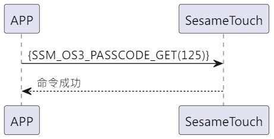

# 125 パスワード取得

携帯端末から ssm_touch にパスワード取得のコマンドを送り、ssm_touch はコマンドを受けて直後に携帯端末へパスワード情報を伝えます。

## シーケンス図

<p align="left" >
  
</p>

## 携帯端末から送信されるデータ

| Byte |     0     |
| ---- | :-------: |
| Data | item code |

item code : SSM_OS3_PASSCODE_GET (125)

## ssm_touch からの返信内容

| Byte |      2       |     1     |     0      |
| ---- | :----------: | :-------: | :--------: |
| Data |     res      | item_code |    type    |
| 説明 | 命令処理状態 | コマンド  | 送信タイプ |

type : SSM2_OP_CODE_RESPONSE (0x07)

item code : SSM_OS3_PASSCODE_GET (125)

res : CMD_RESULT_SUCCESS (0x00)

## iOS、Android、ESP32 の例

<CustomBashOSPlatformPwGet ios='true' android='true'  esp32='true'/>

<!-- ## Androidの例

```jsx | pure
  override fun keyBoardPassCode(result: CHResult<CHEmpty>) {
      if (checkBle(result)) return
      sendCommand(SesameOS3Payload(SesameItemCode.SSM_OS3_PASSCODE_GET.value, byteArrayOf())) { res ->
          result.invoke(Result.success(CHResultState.CHResultStateBLE(CHEmpty())))
      }
  }
```

## iOSの例

```jsx | pure
    func passCodes(result: @escaping (CHResult<CHEmpty>)) {
        if (self.checkBle(result)) { return }

        sendCommand(.init(.SSM_OS3_PASSCODE_GET)) { _ in
            L.d("SSM_OS3_PASSCODE_GET ok")
            result(.success(CHResultStateNetworks(input: CHEmpty())))
        }
    }
```

## ESPの例

```jsx | pure

``` -->
