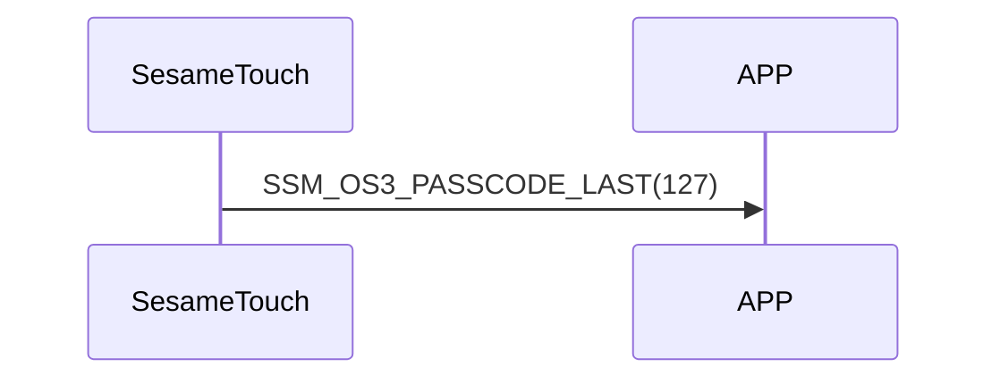

# Item: Password Last

ssm_touch 送完密碼資料後，送Password Last給手機，表示密碼資料已經送完了。

## 循序圖

## ssm_touch 推送內容
| Byte | 1         | 0    |
|-------|:---------:|:----:|
| Data  | item_code | type |
| 說明    | 指令編號      | 推送類型 |

type : SSM2_OP_CODE_PUBLISH (0x08)

item code : SSM_OS3_PASSCODE_LAST (127)