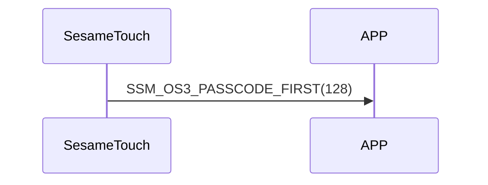

# Item: Password Start

ssm_touch 收到 `125_pw_get` 後ssm_touch送出 Password Start 指令，表示接下來要開始傳密碼資料給手機了(詳見 `126_pw_notify`)。

## 循序圖

## ssm_touch 推送內容
| Byte | 1         | 0    |
|-------|:---------:|:----:|
| Data  | item_code | type |
| 說明    | 指令編號      | 推送類型 |

type : SSM2_OP_CODE_PUBLISH (0x08)

item code : SSM_OS3_PASSCODE_FIRST (128)