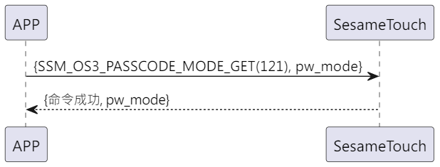

# 129 パスワードモード取得

携帯電話が新規作成指令を送信して ssm_touch がパスワード追加または確認モードであることを取得し、sesame5 が指令成功及びモードを返答します。

## シーケンス図

<p align="left" >
  
</p>

## 携帯電話からデータ送信

| バイト |       0        |
| ------ | :------------: |
| データ | アイテムコード |

アイテムコード：SSM_OS3_FINGERPRINT_MODE_GET (121)

## ssm_touch からの回答内容

| バイト | 4 | 3 | 2 | 1 | 0 |
| ---- | :-----: | ... | :-------: | ... | :-----: |
| データ | pw モード | res | アイテムコード | タイプ | op コード |

タイプ：SSM2_OP_CODE_RESPONSE(0x07)

アイテムコード：SSM_OS3_FINGERPRINT_MODE_GET (121)

res：CMD_RESULT_SUCCESS (0x00)

### pw モード

0x00->認証モード

0x01->新規作成モード

## iOS、Android、ESP32 の例

<CustomBashOSPlatformPwModeGet ios='true' android='true'  esp32='true'/>

<!-- ## Androidの例

```jsx | pure
  override fun keyBoardPassCodeModeGet(result: CHResult<Byte>) {
      if (checkBle(result)) return
      sendCommand(SesameOS3Payload(SesameItemCode.SSM_OS3_PASSCODE_MODE_GET.value, byteArrayOf())) { res ->
          result.invoke(Result.success(CHResultState.CHResultStateBLE(res.payload[0])))
      }
  }
```

## iOSの例

```jsx | pure
    func passCodeModeGet(result: @escaping (CHResult<UInt8>)) {
        if (self.checkBle(result)) { return }

        sendCommand(.init(.SSM_OS3_PASSCODE_MODE_GET)) { response in
            result(.success(CHResultStateNetworks(input: response.data[0])))
        }
    }
```

## ESPの例

```jsx | pure

``` -->
