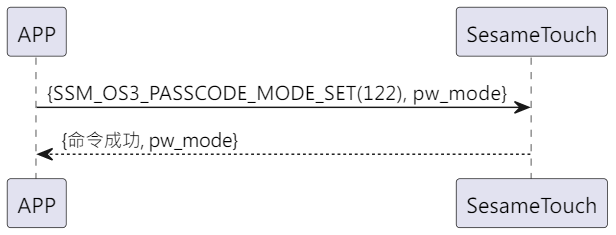

# 130 Password Mode Set(Password Mode Set)

The phone sends a new command to get whether the ssm_touch is currently in the new or verify password mode. Sesame5 replies with the successful command and mode.

## Sequence Diagram

<p align="left" >
  
</p>

## Data Sent by Phone

| Byte |    1    |     0     |
| ---- | :-----: | :-------: |
| Data | pw_mode | item code |

item code : SSM_OS3_PASSCODE_MODE_SET (130)

## ssm_touch Return Content

| Byte |    4    |  3  |     2     |  1   |    0    |
| ---- | :-----: | :-: | :-------: | :--: | :-----: |
| Data | pw mode | res | item code | type | op code |

type : SSM2_OP_CODE_RESPONSE(0x07)

item code : SSM_OS3_PASSCODE_MODE_SET (130)

res : CMD_RESULT_SUCCESS (0x00)

## pw mode

0x00->Verify mode

0x01->New mode

## iOS, Android, ESP32 Example

<CustomBashOSPlatformPwModeSet ios='true' android='true'  esp32='true'/> 

<!--
## Android Example

```jsx | pure
    override fun keyBoardPassCodeModeSet(mode: Byte, result: CHResult<CHEmpty>) {
        if (checkBle(result)) return
        sendCommand(SesameOS3Payload(SesameItemCode.SSM_OS3_PASSCODE_MODE_SET.value, byteArrayOf(mode))) { res ->
            result.invoke(Result.success(CHResultState.CHResultStateBLE(CHEmpty())))
        }
    }
```

## iOS Example

```jsx | pure
    func passCodeModeSet(mode: UInt8, result: @escaping (CHResult<CHEmpty>)) {
        if (self.checkBle(result)) { return }

        sendCommand(.init(.SSM_OS3_PASSCODE_MODE_SET,Data([mode]))) { _ in
            result(.success(CHResultStateNetworks(input: CHEmpty())))
        }
    }
```

## ESP Example

```jsx | pure

``` -->
