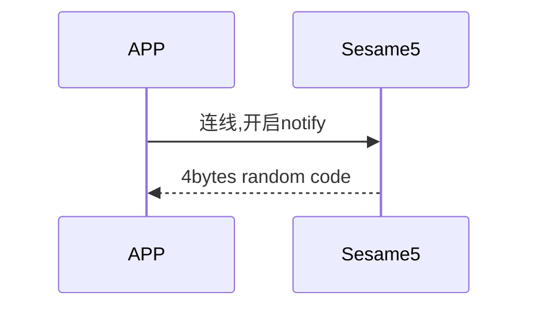

# 14 Initial (初始化)

手機與 Sesame5 建立連線後並開啟 notify，Sesame5 回傳 4Bytes random code

## 循序圖




## ssm5 回傳內容

| Byte |     N ~ 2      |     1     |    0     |
| ---- | :------------: | :-------: | :------: |
| Data |    payload     | item_code |   type   |
| 說明 | 送給手機的資料 | 指令編號  | 推送類型 |

type : SSM2_OP_CODE_PUBLISH (0x08)

item code : SSM2_ITEM_CODE_INITIAL (14)

### payload

| Byte |        3 ~ 0        |
| ---- | :-----------------: |
| Data | 4 bytes random code |

## iOS、Android、ESP32 範例

<CustomBashOSPlatformInitial ios='true' android='true'  esp32='true'/>

<!-- 

### Android 範例

```java
    override fun onGattSesamePublish(receivePayload: SSM3PublishPayload) {
        if (receivePayload.cmdItCode == SesameItemCode.initial.value) {
            mSesameToken = receivePayload.payload
            L.d("hcia", "isNeedAuthFromServer:" + isNeedAuthFromServer)
            if (isRegistered) {
                if (isNeedAuthFromServer == true) {
                    CHAccountManager.signGuestKey(CHRemoveSignKeyRequest(deviceId.toString().uppercase(), mSesameToken.toHexString(), sesame2KeyData!!.secretKey)) {
                        it.onSuccess {
                            (this as CHDeviceUtil).login(it.data)
                        }
                    }
                } else {
                    (this as CHDeviceUtil).login()
                }
            } else {
                deviceStatus = CHDeviceStatus.ReadyToRegister
            }
        }
    }

```

### iOS 範例

```jsx | pure
    func onGattSesamePublish(_ payload: SesameOS3PublishPayload) {
        let itemCode = payload.itemCode
//        L.d("[註冊]itemCode=>",itemCode.rawValue)
        let data = payload.payload
        if(itemCode == .initalization){
            self.mSesameToken = data
            if self.isRegistered {
                if isGuestKey {
                    (self as! CHDevice).sign(token: mSesameToken!.toHexString()) { signResult in
                        if case let .success(signedToken) = signResult {
                            (self as! CHDeviceUtil).login(token: signedToken.data)
                        }
                    }
                } else if deviceStatus == .waitingGatt() {
                    (self as! CHDeviceUtil).login(token: nil)
                }
            } else {
                deviceStatus = .readyToRegister()
            }
        }
    }
```

### ESP 範例

```jsx | pure
static void ssm_initial_handle(sesame * ssm, uint8_t cmd_it_code) {
    ssm->cipher.encrypt.nouse = 0; // reset cipher
    ssm->cipher.decrypt.nouse = 0;
    memcpy(ssm->cipher.encrypt.random_code, ssm->b_buf, 4);
    memcpy(ssm->cipher.decrypt.random_code, ssm->b_buf, 4);
    ssm->cipher.encrypt.count = 0;
    ssm->cipher.decrypt.count = 0;

    if (p_ssms_env->ssm.device_secret[0] == 0) {
        ESP_LOGI(TAG, "[ssm][no device_secret]");
        send_reg_cmd_to_ssm(ssm);
        return;
    }
    send_login_cmd_to_ssm(ssm);
}
``` 

-->
