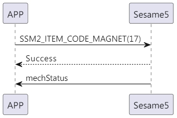

# 17 マグネット（角度補正）

携帯電話から sesame5 へ角度補正命令を送信し、補正が完了すると成功の返信を受け取ります。その後、sesame5 は主導的に mechstatus（機械の状態）を送信します。

mechStatus の詳細は 80_mechStatus の説明を参照してください。

## シーケンス図

<p align="left" >
  
</p>

## 携帯からのデータ送信

| バイト |       0        |
| ------ | :------------: |
| データ | アイテムコード |

アイテムコード：SSM2_ITEM_CODE_MAGNET (17)

## ssm5 からの返信内容

| バイト |        2         |       1        |       0        |
| ------ | :--------------: | :------------: | :------------: |
| データ |       res        | アイテムコード |     タイプ     |
| 説明   | コマンド処理状態 |  コマンド番号  | プッシュタイプ |

タイプ：SSM2_OP_CODE_RESPONSE (0x07)

アイテムコード：SSM2_ITEM_CODE_MAGNET (17)

res：CMD_RESULT_SUCCESS (0x00)

## iOS、Android、ESP32 の例

<CustomBashOSPlatformMagnet ios='true' android='true'  esp32='true'/>

<!-- ## Androidの例

```java
    override fun magnet(result: CHResult<CHEmpty>) {
        if (checkBle(result)) return
        sendCommand(SesameOS3Payload(SesameItemCode.magnet.value, byteArrayOf()), DeviceSegmentType.cipher) { res ->
            result.invoke(Result.success(CHResultState.CHResultStateBLE(CHEmpty())))
        }
    }
```

## iOSの例

```jsx | pure
    func magnet(result: @escaping (CHResult<CHEmpty>)) {
        if(checkBle(result)){return}

        sendCommand(.init(.magnet)) { responsePayload in
            if responsePayload.cmdResultCode == .success {
                result(.success(CHResultStateBLE(input: CHEmpty())))
            } else {
                result(.failure(self.errorFromResultCode(responsePayload.cmdResultCode)))
            }
        }
    }
```

## ESPの例

```jsx | pure
if (src_id == SSM2_ITEM_CODE_MAGNET) {
        app_ss5_magnet();// 測定し、マグネットの角度を更新します
        tell_device_status_to_mobile();// 角度を再度通知する
    }
if (cmd_it_code == SSM2_ITEM_CODE_MAGNET) {
    talk_to_mobile(mobile, SSM2_SEG_PARSING_TYPE_CIPHERTEXT, (uint8_t *) ss5_res,
                                   offsetof(ss5_response, payload));
}
``` -->
