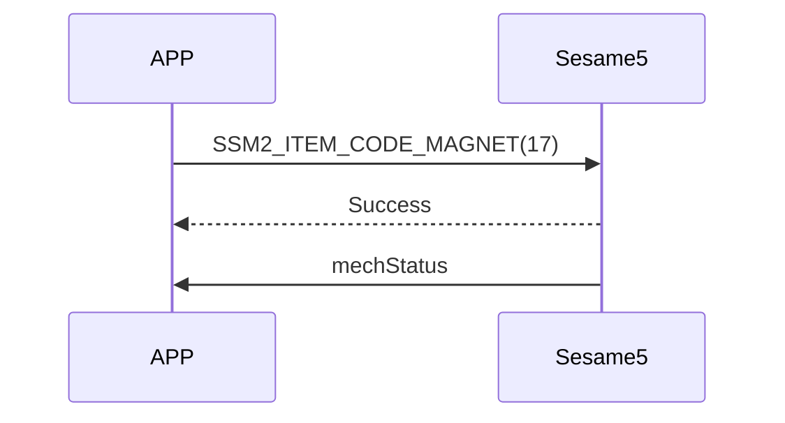

# 17 Megnet (角度校正)

手機發送 sesame5 角度校正指令，校正完成後回覆成功，sesame5 主動發送 mechstatus(機械狀態)

mechStatus 細節詳見 80_mechStatus 說明

## 循序圖




## 手機送出資料

| Byte |     0     |
| ---- | :-------: |
| Data | item code |

item code : SSM2_ITEM_CODE_MAGNET (17)

## ssm5 回傳內容

| Byte |      2       |     1     |    0     |
| ---- | :----------: | :-------: | :------: |
| Data |     res      | item_code |   type   |
| 說明 | 命令處裡狀態 | 指令編號  | 推送類型 |

type : SSM2_OP_CODE_RESPONSE (0x07)

item code : SSM2_ITEM_CODE_MAGNET (17)

res : CMD_RESULT_SUCCESS (0x00)

## iOS、Android、ESP32 範例

<CustomBashOSPlatformMegnet ios='true' android='true'  esp32='true'/>

<!-- 

### Android 範例

```java
    override fun magnet(result: CHResult<CHEmpty>) {
        if (checkBle(result)) return
        sendCommand(SesameOS3Payload(SesameItemCode.magnet.value, byteArrayOf()), DeviceSegmentType.cipher) { res ->
            result.invoke(Result.success(CHResultState.CHResultStateBLE(CHEmpty())))
        }
    }
```

### iOS 範例

```jsx | pure
    func magnet(result: @escaping (CHResult<CHEmpty>)) {
        if(checkBle(result)){return}

        sendCommand(.init(.magnet)) { responsePayload in
            if responsePayload.cmdResultCode == .success {
                result(.success(CHResultStateBLE(input: CHEmpty())))
            } else {
                result(.failure(self.errorFromResultCode(responsePayload.cmdResultCode)))
            }
        }
    }
```

### ESP 範例

```jsx | pure
if (src_id == SSM2_ITEM_CODE_MAGNET) {
        app_ss5_magnet();// 量测并且更新磁铁角度
        tell_device_status_to_mobile();// 再通知一次角度
    }
if (cmd_it_code == SSM2_ITEM_CODE_MAGNET) {
    talk_to_mobile(mobile, SSM2_SEG_PARSING_TYPE_CIPHERTEXT, (uint8_t *) ss5_res,
                                   offsetof(ss5_response, payload));
}
``` 

-->
