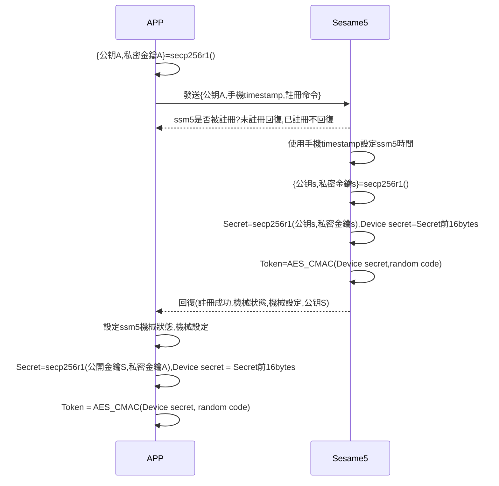
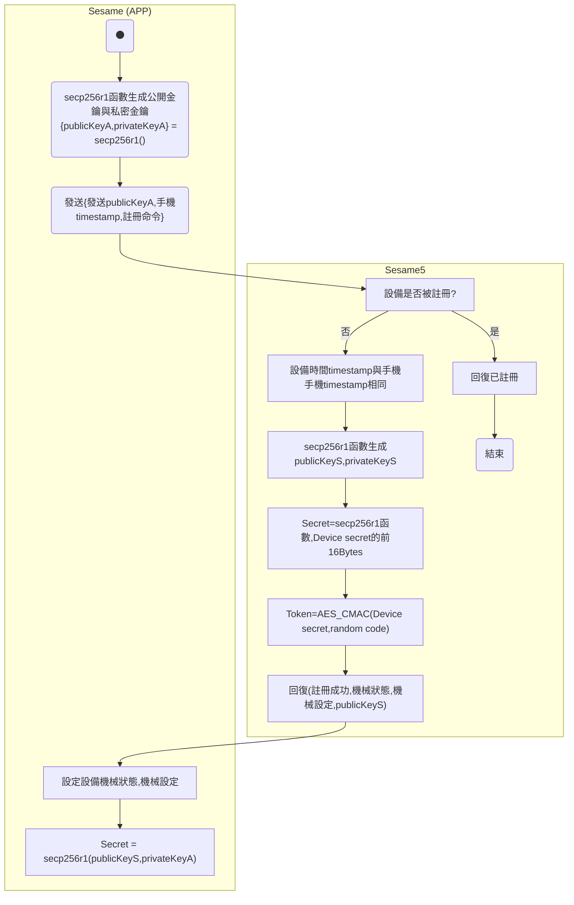

# 1 Register (註冊設備)

Register(註冊)是 APP 跟 Sesame5 配對的動作，只有配對過的 APP 才能控制該 Sesame5。

加密實作詳見 `security layer`。

## Sesame(APP) 註冊 Sesame5 的循序圖




## Sesame(APP) 註冊 Sesame5 的活動圖




## 手機傳送資料

| Byte |    68 ~ 65     |   64 ~ 1   |     0     |
| ---- | :------------: | :--------: | :-------: |
| Data | 手機 timestamp | publicKeyA | item_code |

## Sesame5 回傳資料(已註冊)

| Byte |      2       |     1     |    0     |
| ---- | :----------: | :-------: | :------: |
| Data |     res      | item_code |   type   |
| 說明 | 命令處裡狀態 | 指令編號  | 推送類型 |

type : SSM2_OP_CODE_RESPONSE (0x07)

item code : SSM2_ITEM_CODE_REGISTRATION (1)

res : CMD_RESULT_INVALID_ACTION (0x09)

## Sesame5 回傳資料(未註冊)

| Byte |     N ~ 3      |      2       |     1     |    0     |
| ---- | :------------: | :----------: | :-------: | :------: |
| Data |    payload     |     res      | item_code |   type   |
| 說明 | 送給手機的資料 | 命令處裡狀態 | 指令編號  | 推送類型 |

type : SSM2_OP_CODE_RESPONSE (0x07)

item code : SSM2_ITEM_CODE_REGISTRATION(1)

res : CMD_RESULT_SUCCESS (0x00)

payload : 詳見以下表格

### Payload

| Byte |  76 ~ 13   |   12 ~ 7    |   6 ~ 0    |
| ---- | :--------: | :---------: | :--------: |
| Data | publicKeyS | mechSetting | mechStatus |

## iOS、Android、ESP32 範例

 <CustomBashOSPlatformLogin ios='true' android='true'  esp32='true'/>

<!--

### Android 範例

```jsx | pure
override fun register(result: CHResult<CHEmpty>) {
        if (deviceStatus != CHDeviceStatus.ReadyToRegister) {
            result.invoke(Result.failure(NSError("Busy", "CBCentralManager", 7)))
            return
        }
        deviceStatus = CHDeviceStatus.Registering
        L.d("hcia", "register:!!")
        makeApiCall(result) {
            val serverSecret = mSesameToken.toHexString()
            CHAccountManager.jpAPIclient.myDevicesRegisterSesame5Post(deviceId.toString(), CHOS3RegisterReq(advertisement!!.productModel!!.productType().toString(), serverSecret))
            sendCommand(SesameOS3Payload(SesameItemCode.registration.value, EccKey.getPubK().hexStringToByteArray() + System.currentTimeMillis().toUInt32ByteArray()), DeviceSegmentType.plain) { IRRes ->
                mechStatus = CHSesame5MechStatus(IRRes.payload.toHexString().hexStringToByteArray().sliceArray(0..6))
                mechSetting = CHSesame5MechSettings(IRRes.payload.toHexString().hexStringToByteArray().sliceArray(7..12))

                val eccPublicKeyFromSS5 = IRRes.payload.toHexString().hexStringToByteArray().sliceArray(13..76)
                val ecdhSecret = EccKey.ecdh(eccPublicKeyFromSS5)
                val ecdhSecretPre16 = ecdhSecret.sliceArray(0..15)
                val deviceSecret = ecdhSecretPre16.toHexString()
                val candyDevice = CHDevice(deviceId.toString(), advertisement!!.productModel!!.deviceModel(), null, "0000", deviceSecret, serverSecret)
                sesame2KeyData = candyDevice
                val sessionAuth = AesCmac(ecdhSecretPre16, 16).computeMac(mSesameToken)
                cipher = SesameOS3BleCipher("customDeviceName", sessionAuth!!, ("00" + mSesameToken.toHexString()).hexStringToByteArray())
                CHDB.CHSS2Model.insert(candyDevice) {
                    result.invoke(Result.success(CHResultState.CHResultStateBLE(CHEmpty())))
                }

                deviceStatus = if (mechStatus?.isInLockRange == true) CHDeviceStatus.Locked else CHDeviceStatus.Unlocked

            }
        }
    }
```

### iOS 範例

```jsx | pure
public func register(result: @escaping CHResult<CHEmpty>)  {
      if deviceStatus != .readyToRegister() {
          result(.failure(NSError.deviceStatusNotReadyToRegister))
          return
      }
      deviceStatus = .registering()
      let date = Date()
      var timestamp: UInt32 = UInt32(date.timeIntervalSince1970)
      let timestampData = Data(bytes: &timestamp,count: MemoryLayout.size(ofValue: timestamp))
      let payload = Data(appKeyPair.publicKey)+timestampData
      self.commandQueue = DispatchQueue(label:deviceId.uuidString, qos: .userInitiated)

      let request = CHAPICallObject(.post, "/device/v1/sesame5/(self.deviceId.uuidString)", [
          "t":advertisement!.productType!.rawValue,
          "pk":self.mSesameToken!.toHexString()
      ] as [String : Any])
      CHAccountManager
          .shared
          .API(request: request) { response in
              switch response {
              case .success(_):
                  self.sendCommand(.init(.registration, payload), isCipher: .plaintext) { response in
                      let ecdhSecretPre16 = Data(self.appKeyPair.ecdh(remotePublicKey: response.data[0...63].bytes))[0...15]
                      let sessionAuth = CC.CMAC.AESCMAC(self.mSesameToken!, key: ecdhSecretPre16)

                      self.cipher = SesameOS3BleCipher(name: self.deviceId.uuidString,
                                           sessionKey: sessionAuth,
                                                         sessionToken: ("00(self.mSesameToken!.toHexString())").hexStringtoData())

                      self.sesame2KeyData = CHDeviceKey(// 建立設備
                          deviceUUID: self.deviceId,
                          deviceModel: self.productModel.deviceModel(),
                          historyTag: nil,
                          keyIndex: "0000",
                          secretKey: ecdhSecretPre16.toHexString(),
                          sesame2PublicKey: self.mSesameToken!.toHexString()
                      )
                      self.isRegistered = true // 設定為已註冊
                      self.goIOT()
                      CHDeviceCenter.shared.appendDevice(self.sesame2KeyData!) // 存到SDK層的DB中
                      self.deviceStatus = .unlocked()
                      result(.success(CHResultStateNetworks(input: CHEmpty())))
                  }
              case .failure(let error):
                  L.d("[ss5]register error",error)
                  result(.failure(error))
                  self.disconnect(){_ in}
              }
          }
  }     
```

### ESP 範例

```jsx | pure
void send_reg_cmd_to_ssm(sesame * ssm) {
      ESP_LOGW(TAG, "[esp32->ssm][register]");
      uECC_set_rng(crypto_backend_micro_ecc_rng_callback);
      uint8_t ecc_public_esp32[64];
      uECC_make_key_lit(ecc_public_esp32, ecc_private_esp32, uECC_secp256r1());
      ssm->c_offset = sizeof(ecc_public_esp32) + 1;
      ssm->b_buf[0] = SSM_ITEM_CODE_REGISTRATION;
      memcpy(ssm->b_buf + 1, ecc_public_esp32, sizeof(ecc_public_esp32));
      talk_to_ssm(ssm, SSM_SEG_PARSING_TYPE_PLAINTEXT);
  }
  
  void handle_reg_data_from_ssm(sesame * ssm) {
      ESP_LOGW(TAG, "[esp32<-ssm][register]");
      memcpy(ssm->public_key, &ssm->b_buf[13], 64);
      uint8_t ecdh_secret_ssm[32];
      uECC_shared_secret_lit(ssm->public_key, ecc_private_esp32, ecdh_secret_ssm, uECC_secp256r1());
      memcpy(ssm->device_secret, ecdh_secret_ssm, 16);
      // ESP_LOG_BUFFER_HEX("deviceSecret", ssm->device_secret, 16);
      AES_CMAC(ssm->device_secret, (const unsigned char *) ssm->cipher.decrypt.random_code, 4, ssm->cipher.token);
      ssm->device_status = SSM_LOGGIN;
      p_ssms_env->ssm_cb__(ssm); // callback: ssm_action_handle() in main.c
  }
```

-->

