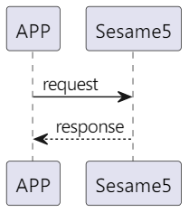

# Application layer
手機跟 Sesame 有兩種溝通方式。第一種是 Publish，Sesame 主動將訂閱訊息傳送給手機，如 `81_mechStatus`。第二種是 Response，手機要 Sesame 幹活，Sesame 回覆，如 `82_lock`。

## 1. Publish
Sesame 主動將訂閱訊息傳送給手機，如 `81_mechStatus`。
<p align="left" >
  
</p>

### 1.1 Publsh 資料格式
| Byte  | N ~ 2   | 1         | 0    |
|-------|:-------:|:---------:|:----:|
| Data  | payload | item_code | type |
| 說明    | 送給手機的資料 | 指令編號      | 推送類型 |

```c
#pragma pack(1)
typedef struct {
    uint8_t type;               /// 推送類型 : publish
    uint8_t item_code;          /// 指令(詳見 item_details)
    union ss5_payload payload;  /// 送給手機的資料
} ss5_publish;
#pragma pack()
```

## 2. Response
手機要 Sesame 幹活，Sesame 回覆，如 `82_lock`。
<p align="left" >
  
</p>

### 2.1 Request 資料格式
| Byte  | N ~ 1         | 0         |
|-------|:-------------:|:---------:|
| Data  | payload       | item_code |
| 說明    | 送給 Sesame 的資料 | 指令編號      |

```c
#pragma pack(1)
typedef struct {
    uint8_t item_code;              /// 指令(詳見 item_details)
    union ss5_payload payload;      /// 送給 Sesame5 的資料
} ss5_request;
#pragma pack()
```

### 2.2 Response 資料格式
| Byte  | N ~ 3   | 2      | 1         | 0    |
|-------|:-------:|:------:|:---------:|:----:|
| Data  | payload | res    | item_code | type |
| 說明    | 送給手機的資料 | 命令處裡狀態 | 指令編號      | 推送類型 |

```c
#pragma pack(1)
typedef struct {
    uint8_t type;                   /// 推送類型 : Response
    uint8_t item_code;              /// 指令(詳見 item_details)
    uint8_t res;                    /// 命令處理狀態 (都回 success)
    union ss5_payload payload;      /// 送給手機的資料
} ss5_response;
#pragma pack()
```

## 3. Application layer 指令對照表
### type 推送類型
```c
typedef enum {
    SSM2_OP_CODE_RESPONSE = 0x07,
    SSM2_OP_CODE_PUBLISH = 0x08,
} ssm2_op_code_e;
```

### item_code
各指令互動細節詳見 `item_details` 說明。
```c
typedef enum {
    SSM2_ITEM_CODE_NONE = 0,
    SSM2_ITEM_CODE_REGISTRATION = 1,
    SSM2_ITEM_CODE_LOGIN = 2,
    SSM2_ITEM_CODE_HISTORY = 4,
    SSM2_ITEM_CODE_VERSION_DETAIL = 5,
    SSM2_ITEM_CODE_TIME = 8,
    SSM2_ITEM_CODE_AUTOLOCK = 11,
    SSM2_ITEM_CODE_INITIAL = 14,
    SSM2_ITEM_CODE_IRER = 15,
    SSM2_ITEM_CODE_MAGNET = 17,

    SSM2_ITEM_CODE_MECH_SETTING = 80,
    SSM2_ITEM_CODE_MECH_STATUS = 81,
    SSM2_ITEM_CODE_LOCK = 82,
    SSM2_ITEM_CODE_UNLOCK = 83,

    SSM3_ITEM_RESET = 104
} ssm2_item_code_e;
```

### res 命令處理狀態
```c
typedef enum {
    CMD_RESULT_SUCCESS = 0,         /// 手機下命令 Sesame5 會直接回 success
    CMD_RESULT_INVALID_ACTION = 9,  /// 已經註冊還下註冊命令 
} cmd_result_e;
```