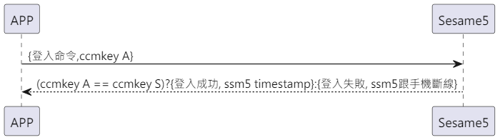

# 2 ログイン（ログイン）

Sesame5 に登録済みの機器は、接続後にログインが必要です。これにより、コントロールを行うことができます。

暗号化の詳細は `security layer`を参照してください。

## Sesame(APP) から Sesame5 へのログインフロー図

APP から Sesame5 への ccmKey のログインでは、最初の 4 バイトだけが比較されます。

<p align="left" >
  
</p>
 
## Sesame(APP) 註冊 Sesame5 的循序圖

<p align="left" >
  
</p>

## スマートフォンからのデータ送信

| バイト |  4 ~ 1   |       0        |
| ------ | :------: | :------------: |
| データ | ccmkey A | アイテムコード |

アイテムコード： SSM2_ITEM_CODE_LOGIN (2)

## Sesame5 からの応答メッセージ

| バイト |           N ~ 3            |        2         |       1        |     0      |
| ------ | :------------------------: | :--------------: | :------------: | :--------: |
| データ |          payload           |       res        | アイテムコード |    type    |
| 説明   | スマートフォンへ送るデータ | コマンド処理結果 |    指示番号    | 推送タイプ |

タイプ： SSM2_OP_CODE_RESPONSE (0x07)

アイテムコード： SSM2_ITEM_CODE_LOGIN (2)

結果： CMD_RESULT_SUCCESS (0x00)

payload : 詳細は下の表を参照してください。

### payload

| バイト |     3 ~ 0      |
| ------ | :------------: |
| データ | タイムスタンプ |

## iOS、Android、ESP32 のサンプル

 <CustomBashOSPlatformLogin ios='true' android='true'  esp32='true'/>
 
<!--
## Androidのサンプル

```jsx | pure
    override fun login(token: String?) {
        deviceStatus = CHDeviceStatus.BleLogining
        val sessionAuth: ByteArray? = AesCmac(sesame2KeyData!!.secretKey.hexStringToByteArray(), 16).computeMac(mSesameToken)

        cipher = SesameOS3BleCipher("customDeviceName", sessionAuth!!, ("00" + mSesameToken.toHexString()).hexStringToByteArray())
        sendCommand(SesameOS3Payload(SesameItemCode.login.value, sessionAuth!!.sliceArray(0..3)), DeviceSegmentType.plain) { loginPayload ->
            val systemTime = loginPayload.payload.sliceArray(0..3).toBigLong()
            val currentTimestamp = System.currentTimeMillis() / 1000
            val timeMinus = currentTimestamp.minus(systemTime)

            if (PreferenceManager.getDefaultSharedPreferences(CHBleManager.appContext).getString("nickname", "")?.contains(BuildConfig.testname) == true) {
                deviceTimestamp = systemTime
                loginTimestamp = currentTimestamp
            } else {
                if (abs(timeMinus) > 3) {
                    sendCommand(SesameOS3Payload(SesameItemCode.time.value, System.currentTimeMillis().toUInt32ByteArray()), DeviceSegmentType.cipher) {}
                }
            }
        }
    }
```

## iOS のサンプル

```jsx | pure
    func login(token: String? = nil) {
        guard let sesame2KeyData = sesame2KeyData, let sessionToken = mSesameToken else {
            return
        }
        self.deviceStatus = .bleLogining()
        let sessionAuth: Data = token?.hexStringtoData() ?? CC.CMAC.AESCMAC(sessionToken, key: sesame2KeyData.secretKey.hexStringtoData())
        self.cipher = SesameOS3BleCipher(name: self.deviceId.uuidString,sessionKey: sessionAuth,sessionToken:("00"+sessionToken.toHexString()).hexStringtoData())
        self.commandQueue = DispatchQueue(label: deviceId.uuidString, qos: .userInitiated)
        sendCommand(.init(.login, sessionAuth[0...3]), isCipher: .plaintext) { res in
            let  time = Sesame5Time.fromData(res.data).time
            let sesameTime = Date(timeIntervalSince1970: TimeInterval(time))

            let timeErrorInterval = sesameTime.timeIntervalSince1970 - Date().timeIntervalSince1970
            if abs(timeErrorInterval) > 3 {
                var timestamp: UInt32 = UInt32(Date().timeIntervalSince1970)
                let timestampData = Data(bytes: &timestamp,count: MemoryLayout.size(ofValue: timestamp))
                self.sendCommand(.init(.time,timestampData)) { res in
                }
            }
        }
    }
```

## ESP のサンプル

````jsx | pure

void send_login_cmd_to_ssm(sesame * ssm) {
    ESP_LOGW(TAG, "[esp32->ssm][login]");
    ssm->b_buf[0] = SSM_ITEM_CODE_LOGIN;
    AES_CMAC(ssm->device_secret, (const unsigned char *) ssm->cipher.decrypt.random_code, 4, ssm->cipher.token);
    memcpy(&ssm->b_buf[1], ssm->cipher.token, 4);
    ssm->c_offset = 5;
    talk_to_ssm(ssm, SSM_SEG_PARSING_TYPE_PLAINTEXT);
}

``` -->
````
