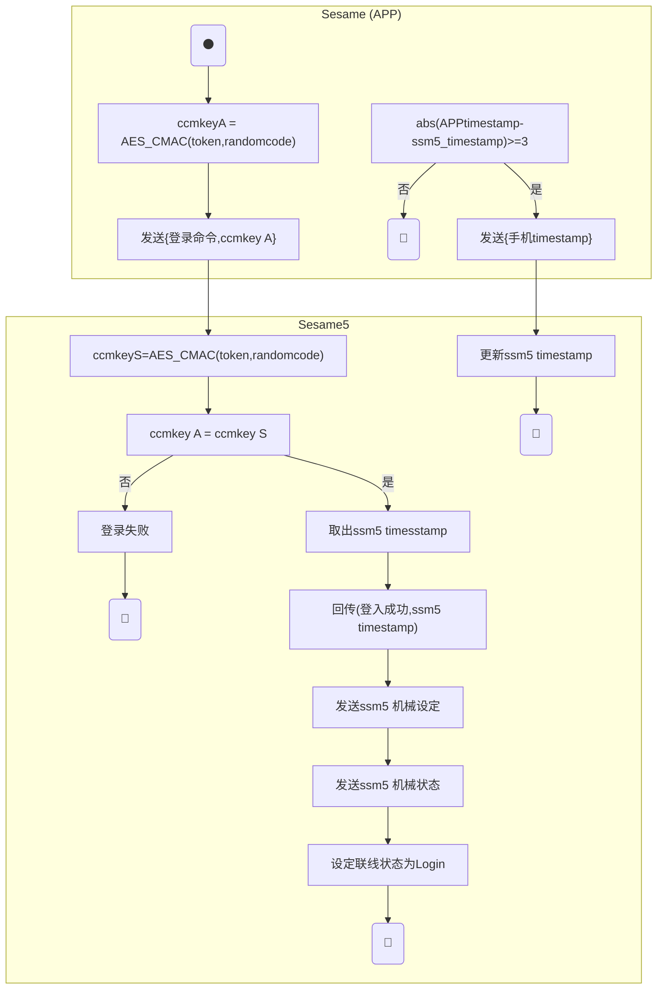
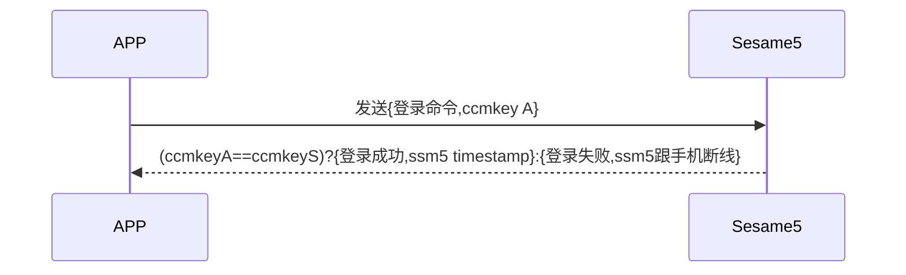

# 2 Login (登入)

已經跟 Sesame5 註冊過的設備需要在連線之後進行登入，才能進行控制。

加密實作詳見 `security layer`。

## Sesame(APP) 登入 Sesame5 的活動圖

APP 登入 Sesame5 ccmKey 只比較前 4 Bytes。




## Sesame(APP) 註冊 Sesame5 的循序圖





## 手機送出資料

| Byte |  4 ~ 1   |     0     |
| ---- | :------: | :-------: |
| Data | ccmkey A | item code |

item code : SSM2_ITEM_CODE_LOGIN (2)

## Sesame5 回應訊息

| Byte |     N ~ 3      |      2       |     1     |    0     |
| ---- | :------------: | :----------: | :-------: | :------: |
| Data |    payload     |     res      | item_code |   type   |
| 說明 | 送給手機的資料 | 命令處裡狀態 | 指令編號  | 推送類型 |

type : SSM2_OP_CODE_RESPONSE (0x07)

item code : SSM2_ITEM_CODE_LOGIN (2)

res : CMD_RESULT_SUCCESS (0x00)

payload : 詳見以下表格

### payload

| Byte |   3 ~ 0   |
| ---- | :-------: |
| Data | timestamp |

## iOS、Android、ESP32 範例

 <CustomBashOSPlatformLogin ios='true' android='true'  esp32='true'/>

<!--

### Android 範例

```jsx | pure
    override fun login(token: String?) {
        deviceStatus = CHDeviceStatus.BleLogining
        val sessionAuth: ByteArray? = AesCmac(sesame2KeyData!!.secretKey.hexStringToByteArray(), 16).computeMac(mSesameToken)

        cipher = SesameOS3BleCipher("customDeviceName", sessionAuth!!, ("00" + mSesameToken.toHexString()).hexStringToByteArray())
        sendCommand(SesameOS3Payload(SesameItemCode.login.value, sessionAuth!!.sliceArray(0..3)), DeviceSegmentType.plain) { loginPayload ->
            val systemTime = loginPayload.payload.sliceArray(0..3).toBigLong()
            val currentTimestamp = System.currentTimeMillis() / 1000
            val timeMinus = currentTimestamp.minus(systemTime)

            if (PreferenceManager.getDefaultSharedPreferences(CHBleManager.appContext).getString("nickname", "")?.contains(BuildConfig.testname) == true) {
                deviceTimestamp = systemTime
                loginTimestamp = currentTimestamp
            } else {
                if (abs(timeMinus) > 3) {
                    sendCommand(SesameOS3Payload(SesameItemCode.time.value, System.currentTimeMillis().toUInt32ByteArray()), DeviceSegmentType.cipher) {}
                }
            }
        }
    }
```

### iOS 範例

```jsx | pure
    func login(token: String? = nil) {
        guard let sesame2KeyData = sesame2KeyData, let sessionToken = mSesameToken else {
            return
        }
        self.deviceStatus = .bleLogining()
        let sessionAuth: Data = token?.hexStringtoData() ?? CC.CMAC.AESCMAC(sessionToken, key: sesame2KeyData.secretKey.hexStringtoData())
        self.cipher = SesameOS3BleCipher(name: self.deviceId.uuidString,sessionKey: sessionAuth,sessionToken:("00"+sessionToken.toHexString()).hexStringtoData())
        self.commandQueue = DispatchQueue(label: deviceId.uuidString, qos: .userInitiated)
        sendCommand(.init(.login, sessionAuth[0...3]), isCipher: .plaintext) { res in
            let  time = Sesame5Time.fromData(res.data).time
            let sesameTime = Date(timeIntervalSince1970: TimeInterval(time))

            let timeErrorInterval = sesameTime.timeIntervalSince1970 - Date().timeIntervalSince1970
            if abs(timeErrorInterval) > 3 {
                var timestamp: UInt32 = UInt32(Date().timeIntervalSince1970)
                let timestampData = Data(bytes: &timestamp,count: MemoryLayout.size(ofValue: timestamp))
                self.sendCommand(.init(.time,timestampData)) { res in
                }
            }
        }
    }
```

### ESP 範例

```jsx | pure

void send_login_cmd_to_ssm(sesame * ssm) {
    ESP_LOGW(TAG, "[esp32->ssm][login]");
    ssm->b_buf[0] = SSM_ITEM_CODE_LOGIN;
    AES_CMAC(ssm->device_secret, (const unsigned char *) ssm->cipher.decrypt.random_code, 4, ssm->cipher.token);
    memcpy(&ssm->b_buf[1], ssm->cipher.token, 4);
    ssm->c_offset = 5;
    talk_to_ssm(ssm, SSM_SEG_PARSING_TYPE_PLAINTEXT);
}

```

-->
