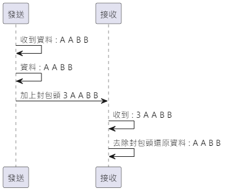
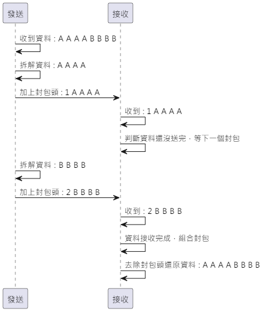
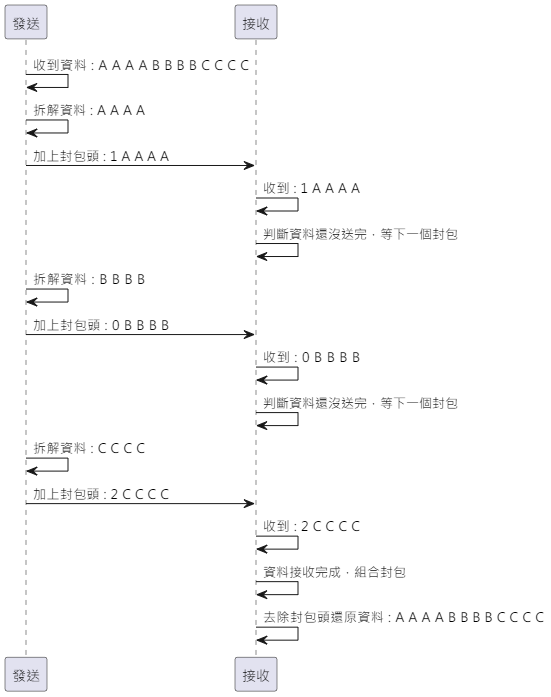
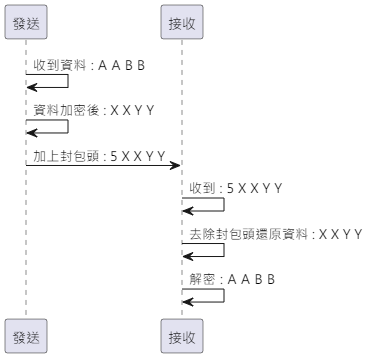
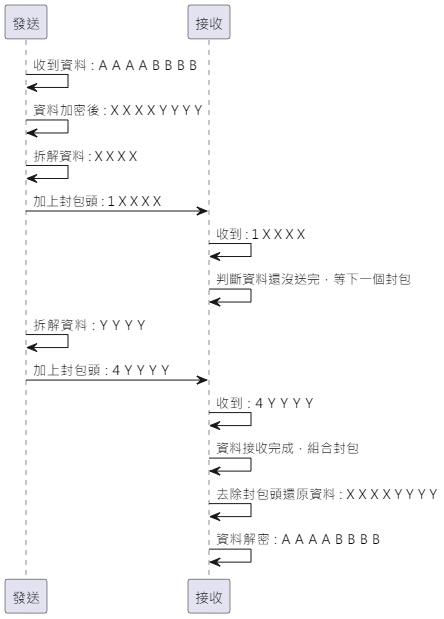

# Segment layer
Segment layer 要做兩件事情。

1. Sesame5 與 手機通訊時，限制封包最大長度 20Bytes，送長訊息需要對資料進行拆解，傳到接收端再組合。
2. 標記傳送的資料是否有加密

## 對照表
Segment layer 在封包頭中的標記此封包是否被切割或加密，接收端可以按照標記做相應的處理，將封包還原成原始資料。以下為 Segment layer 標記對照表。

Segment layer 標記有 8bits，其中 bit 7 ~ 1 表示是否為結束封包及資料是否加密，bit 0 表示該封包是否為一筆資料的起始封包。

| bit 7 ~ 1 | 結束   | bit 0 | 開始  |
|-----------|------|-------|-----|
| b0000000  | 沒結束  | 0     | 非開始 |
| b0000000  | 沒結束  | 1     | 開始  |
| b0000001  | 明文結束 | 0     | 非開始 |
| b0000001  | 明文結束 | 1     | 開始  |
| b0000010  | 加密結束 | 0     | 非開始 |
| b0000010  | 加密結束 | 1     | 開始  |

## 標記以 16 進位解讀
0 表示該封包不是開始封包也不是結束封包

1 表示該封包是開始封包不是結束封包

2 表示該封包不是開始封包是結束封包，並且組合起來的資料是明文

3 表示該封包是開始封包也是結束封包，並且資料是明文，資料沒有被切割，不需要組合

4 表示該封包不是開始封包是結束封包，並且組合起來的資料是密文

5 表示該封包是開始封包也是結束封包，並且資料是密文，資料沒有被切割，不需要組合

| 標記   | 開始  | 結束   |
|------|-----|------|
| 0x00 | 非開始 | 沒結束  |
| 0x01 | 開始  | 沒結束  |
| 0x02 | 非開始 | 明文結束 |
| 0x03 | 開始  | 明文結束 |
| 0x04 | 非開始 | 加密結束 |
| 0x05 | 開始  | 加密結束 |

## 範例
假設一個封包能放 4bytes 的資料，超過4bytes就需要進行分割(實際為 20bytes)。

### 短明文封包
資料: A A B B

  

發送:

    1. 收到資料 : A A B B
    2. 資料 : A A B B
    3. 加上封包頭 : 3 A A B B

接收:

    4. 收到 : 3 A A B B
    5. 去除封包頭還原資料 : A A B B

### 中明文封包
資料: A A A A B B B B

  

發送:

    1. 收到資料 : A A A A B B B B
    2. 拆解資料 : A A A A 
    3. 加上封包頭 : 1 A A A A
    6. 拆解資料 : B B B B
    7. 加上封包頭 : 2 B B B B

接收:

    4. 收到 : 1 A A A A
    5. 判斷資料還沒送完，等下一個封包
    8. 收到 : 2 B B B B
    9. 資料接收完成，組合封包
    10. 去除封包頭還原資料 : A A A A B B B B

### 長明文封包
資料 : A A A A B B B B C C C C

  

發送:

    1. 收到資料 : A A A A B B B B C C C C
    2. 拆解資料 : A A A A 
    3. 加上封包頭 : 1 A A A A
    6. 拆解資料 : B B B B
    7. 加上封包頭 : 0 B B B B
    10. 拆解資料 : C C C C
    11. 加上封包頭 : 2 C C C C

接收:

    4. 收到 : 1 A A A A
    5. 判斷資料還沒送完，等下一個封包
    8. 收到 : 0 B B B B
    9. 判斷資料還沒送完，等下一個封包
    12. 收到 : 2 C C C C
    13. 資料接收完成，組合封包
    14. 去除封包頭還原資料 : A A A A B B B B C C C C

### 短密文封包
資料 : A A B B

資料加密後 : X X Y Y

  

發送:

    1. 收到資料 : A A B B
    2. 資料加密後 : X X Y Y
    3. 加上封包頭 : 5 X X Y Y

接收:

    4. 收到 : 5 X X Y Y
    5. 去除封包頭還原資料 : X X Y Y
    6. 解密 : A A B B

### 中密文封包
資料: A A A A B B B B

資料加密後 : X X X X Y Y Y Y

  

發送:

    1. 收到資料 : A A A A B B B B
    2. 資料加密後 : X X X X Y Y Y Y
    3. 拆解資料 : X X X X 
    4. 加上封包頭 : 1 X X X X
    7. 拆解資料 : Y Y Y Y
    8. 加上封包頭 : 4 Y Y Y Y

接收:

    5. 收到 : 1 X X X X
    6. 判斷資料還沒送完，等下一個封包
    9. 收到 : 4 Y Y Y Y
    10. 資料接收完成，組合封包
    11. 去除封包頭還原資料 : X X X X Y Y Y Y
    12. 資料解密 : A A A A B B B B

### 長密文封包
資料 : A A A A B B B B C C C C

資料加密後 : X X X X Y Y Y Y Z Z Z Z

  

發送:

    1. 收到資料 : A A A A B B B B C C C C
    2. 資料加密後 : X X X X Y Y Y Y Z Z Z Z
    3. 拆解資料 : X X X X 
    4. 加上封包頭 : 1 X X X X
    7. 拆解資料 : Y Y Y Y
    8. 加上封包頭 : 0 Y Y Y Y
    11. 拆解資料 : Z Z Z Z
    12. 加上封包頭 : 4 Z Z Z Z

接收:

    5. 收到 : 1 X X X X
    6. 判斷資料還沒送完，等下一個封包
    9. 收到 : 0 Y Y Y Y
    10. 判斷資料還沒送完，等下一個封包
    13. 收到 : 4 Z Z Z Z
    14. 資料接收完成，組合封包
    15. 去除封包頭還原資料 : X X X X Y Y Y Y Z Z Z Z
    16. 資料解密 : A A A A B B B B C C C C

## 注意 !!!
資料經過 AES_CCM 加密後除了密文外還會產生 4Bytes 的 ccm_tag 用於解密，密文及 ccm_tag 需要一起傳給接收端，因此加密後的資料會增加 4Bytes，詳見 `security_layer` 說明。