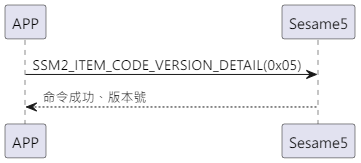

# 5 バージョン詳細 (版本记录)

携帯が積極的にバージョン詳細（item_code:0x05）の指令を送り、ssm5 は ssm5 のバージョン番号を返します。

## シーケンス図

<p align="left">
  
</p>

## 携帯が送信するデータ

| バイト |       1        |     0     |
| ------ | :------------: | :-------: |
| データ | アイテムコード | op コード |

item code: SSM2_ITEM_CODE_VERSION_DETAIL (0x05)

## ssm5 返信内容

| バイト |   15 ~ 4   |  3  |       2        |   1    |     0     |
| ------ | :--------: | :-: | :------------: | :----: | :-------: |
| データ | ペイロード | res | アイテムコード | タイプ | op コード |

type: SSM2_OP_CODE_RESPONSE(0x07)

item code: SSM2_ITEM_CODE_VERSION_DETAIL (0x05)

res: CMD_RESULT_SUCCESS (0x00)

## iOS、Android、ESP32 の例

 <CustomBashOSPlatformVersionDetail ios='true' android='true'  esp32='true'/>

<!-- ## Android例

```jsx | pure
    override fun getVersionTag(result: CHResult<String>) {
        if (checkBle(result)) return
        sendEncryptCommand(SSM2Payload(SSM2OpCode.read, SesameItemCode.versionTag, byteArrayOf())) { res ->
            val gitTag = res.payload.sliceArray(4..15)
            CHAccountManager.putSesameInfor(this, String(gitTag)) {}
            result.invoke(Result.success(CHResultState.CHResultStateBLE(String(gitTag))))
        }
    }
```

## iOS例

```jsx | pure

    func getVersionTag(result: @escaping (CHResult<String>))  {
        if(checkBle(result)){return}
        sendCommand(.init(.versionTag)) { (response) in
            if response.cmdResultCode == .success {
                let versionTag = String(data: response.data, encoding: .utf8) ?? ""
                result(.success(CHResultStateNetworks(input: versionTag)))
            } else {
                result(.failure(self.errorFromResultCode(response.cmdResultCode)))
            }
        }
    }

```

## ESP例

```jsx | pure
if (src_id == SSM2_ITEM_CODE_VERSION_DETAIL) {
        memcpy(ble_tx_buf + 3, GIT_SHORT_HASH, strlen(GIT_SHORT_HASH));
        talk_to_mob(p_param->conidx, SSM2_SEG_PARSING_TYPE_CIPHERTEXT, ble_tx_buf, (strlen(GIT_SHORT_HASH) + 3));
    }
``` -->
