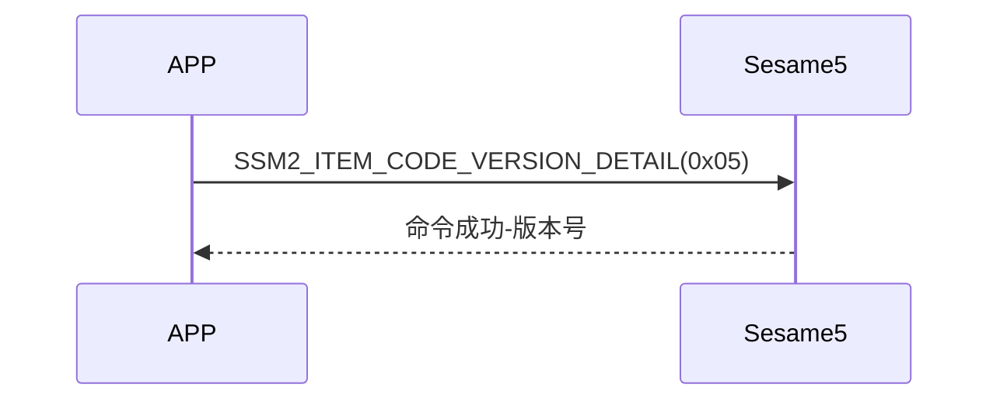

# 5 Version detail (版本记录)

手機主動送出 Version detail(item_code:0x05)指令，ssm5 回傳 ssm5 的版本號。

## 循序圖




## 手機送出資料

| Byte |     1     |    0    |
| ---- | :-------: | :-----: |
| Data | item code | op code |

item code : SSM2_ITEM_CODE_VERSION_DETAIL (0x05)

## ssm5 回傳內容

| Byte | 15 ~ 4  |  3  |     2     |  1   |    0    |
| ---- | :-----: | :-: | :-------: | :--: | :-----: |
| Data | payload | res | item code | type | op code |

type : SSM2_OP_CODE_RESPONSE(0x07)

item code : SSM2_ITEM_CODE_VERSION_DETAIL (0x05)

res : CMD_RESULT_SUCCESS (0x00)

## iOS、Android、ESP32 範例

 <CustomBashOSPlatformVersionDetail ios='true' android='true'  esp32='true'/>

<!-- 

### Android 範例

```jsx | pure
    override fun getVersionTag(result: CHResult<String>) {
        if (checkBle(result)) return
        sendEncryptCommand(SSM2Payload(SSM2OpCode.read, SesameItemCode.versionTag, byteArrayOf())) { res ->
            val gitTag = res.payload.sliceArray(4..15)
            CHAccountManager.putSesameInfor(this, String(gitTag)) {}
            result.invoke(Result.success(CHResultState.CHResultStateBLE(String(gitTag))))
        }
    }
```

### iOS 範例

```jsx | pure

    func getVersionTag(result: @escaping (CHResult<String>))  {
        if(checkBle(result)){return}
        sendCommand(.init(.versionTag)) { (response) in
            if response.cmdResultCode == .success {
                let versionTag = String(data: response.data, encoding: .utf8) ?? ""
                result(.success(CHResultStateNetworks(input: versionTag)))
            } else {
                result(.failure(self.errorFromResultCode(response.cmdResultCode)))
            }
        }
    }

```

### ESP 範例

```jsx | pure
if (src_id == SSM2_ITEM_CODE_VERSION_DETAIL) {
        memcpy(ble_tx_buf + 3, GIT_SHORT_HASH, strlen(GIT_SHORT_HASH));
        talk_to_mob(p_param->conidx, SSM2_SEG_PARSING_TYPE_CIPHERTEXT, ble_tx_buf, (strlen(GIT_SHORT_HASH) + 3));
    }
``` 
-->
