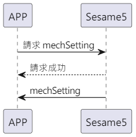

# 80 Mech Setting (Mechanical Settings)

MechSetting is the mechanical setting of Sesame5, including the number of autolock seconds and the angles of unlocking and locking in Sesame5.

There are two situations for transmitting MechSetting:

- The APP actively requests MechSetting from Sesame5.
- Sesame5 actively pushes MechSetting to the mobile phone.

## Sequence diagram of the interaction between the mobile phone and ssm5 transmitting mechsetting

The APP actively requests MechSetting from Sesame5.

<p align="left" >
  
</p>

Sesame5 actively pushes MechSetting to the mobile phone.

<p align="left" >
  
</p>

## APP request command

| Byte |    5 ~ 1    |     0     |
| ---- | :---------: | :-------: |
| Data | mechSetting | item code |

item code : SSM2_ITEM_CODE_MECH_SETTING (80)

mechSetting : Mechanical settings

## ssm5 response message

| Byte |      2       |     1     |    0     |
| ---- | :----------: | :-------: | :------: |
| Data |     res      | item_code |   type   |
| Description | Command Processing Status | Command Number  | Push Type |

type : SSM2_OP_CODE_RESPONSE (0x07)

item code : SSM2_ITEM_CODE_MECH_SETTING (80)

res : CMD_RESULT_SUCCESS (0x00)

## ssm5 push content

| Byte |     N ~ 2      |     1     |    0     |
| ---- | :------------: | :-------: | :------: |
| Data |    payload     | item_code |   type   |
| Description | Data sent to mobile phone | Command Number  | Push Type |

type : SSM2_OP_CODE_PUBLISH (0x08)

item code : SSM2_ITEM_CODE_MECH_SETTING (80)

payload : See the following table for details

### payload

| Bit  |    5 ~ 0    |
| ---- | :---------: |
| Data | mechSetting |

## mechSetting Structure Content

MechSetting stores the number of autolock seconds and the angles of unlocking and locking in Sesame5. Below is the structure content of MechSetting:

| Byte |      5 ~ 4      |  3 ~ 2   |  1 ~ 0   |
| :--: | :-------------: | :------: | :------: |
| Data | autolock_second |  unlock  |   lock   |
| Description |  Auto-lock Time   | Unlock Angle | Lock Angle |

```c
typedef struct door_lock_unlock_s {
    int16_t lock;
    int16_t unlock;
} door_lock_unlock_t;

typedef struct mech_setting_s {
    door_lock_unlock_t lock_unlock;
    uint16_t auto_lock_second;
} mech_setting_t;
```

## iOS, Android, ESP32 examples

<CustomBashOSPlatformMechSetting ios='true' android='true'  esp32='true'/>