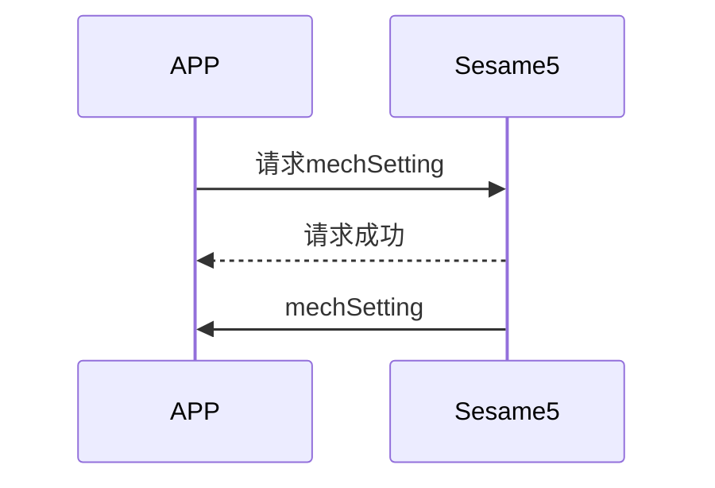
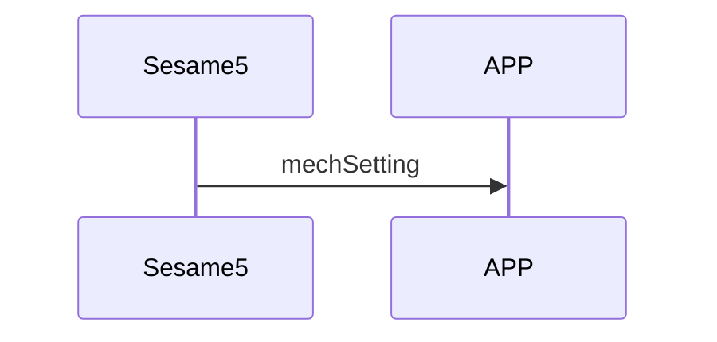

# 80 Mech Setting (機械設定)

mechSetting 是 Sesame5 的機械設定，包含 autolock 秒數及 sesame5 開鎖及關鎖的角度。

傳送 mechsetting 的狀況又兩種:

- APP 端主動向 Sesame5 要 mechSetting。
- Sesame5 主動向手機推送 mechSetting。

## 手機與 ssm5 傳輸 mechsetting 互動循序圖

APP 端主動向 Sesame5 要 mechSetting。



Sesame5 主動向手機推送 mechSetting。



## APP 請求命令

| Byte |    5 ~ 1    |     0     |
| ---- | :---------: | :-------: |
| Data | mechSetting | item code |

item code : SSM2_ITEM_CODE_MECH_SETTING (80)

mechSetting : 機械設定

## ssm5 回應訊息

| Byte |      2       |     1     |    0     |
| ---- | :----------: | :-------: | :------: |
| Data |     res      | item_code |   type   |
| 說明 | 命令處裡狀態 | 指令編號  | 推送類型 |

type : SSM2_OP_CODE_RESPONSE (0x07)

item code : SSM2_ITEM_CODE_MECH_SETTING (80)

res : CMD_RESULT_SUCCESS (0x00)

## ssm5 推送內容

| Byte |     N ~ 2      |     1     |    0     |
| ---- | :------------: | :-------: | :------: |
| Data |    payload     | item_code |   type   |
| 說明 | 送給手機的資料 | 指令編號  | 推送類型 |

type : SSM2_OP_CODE_PUBLISH (0x08)

item code : SSM2_ITEM_CODE_MECH_SETTING (80)

payload : 詳見以下表格

### payload

| Bit  |    5 ~ 0    |
| ---- | :---------: |
| Data | mechSetting |

## mechSetting 結構內容

mechSetting 裡存放 autolock 秒數及 sesame5 開鎖及關鎖的角度，以下為 mechSetting 的結構內容

| Byte |      5 ~ 4      |  3 ~ 2   |  1 ~ 0   |
| :--: | :-------------: | :------: | :------: |
| Data | autolock_second |  unlock  |   lock   |
| 說明 |  自動關鎖時間   | 開鎖角度 | 關鎖角度 |

```c
typedef struct door_lock_unlock_s {
    int16_t lock;
    int16_t unlock;
} door_lock_unlock_t;

typedef struct mech_setting_s {
    door_lock_unlock_t lock_unlock;
    uint16_t auto_lock_second;
} mech_setting_t;
```

## iOS、Android、ESP32 範例

<CustomBashOSPlatformMechSetting ios='true' android='true'  esp32='true'/>

<!-- 

### Android 範例

```java
    override fun configureLockPosition(lockTarget: Short, unlockTarget: Short, result: CHResult<CHEmpty>) {
        val cmd = SesameOS3Payload(SesameItemCode.mechSetting.value, lockTarget.toReverseBytes() + unlockTarget.toReverseBytes())
        sendCommand(cmd, DeviceSegmentType.cipher) { res ->
            if (res.cmdResultCode == SesameResultCode.success.value) {
                mechSetting?.lockPosition = lockTarget
                mechSetting?.unlockPosition = unlockTarget
                result.invoke(Result.success(CHResultState.CHResultStateBLE(CHEmpty())))
            } else {
                result.invoke(Result.failure(NSError(res.cmdResultCode.toString(), "CBCentralManager", res.cmdResultCode.toInt())))
            }
        }
    }
```

```java
    override fun onGattSesamePublish(receivePayload: SSM3PublishPayload) {
        super.onGattSesamePublish(receivePayload)
//        L.d("hcia", "[ss5] " + receivePayload.cmdItCode)
        if (receivePayload.cmdItCode == SesameItemCode.mechStatus.value) {
            mechStatus = CHSesame5MechStatus(receivePayload.payload)
            deviceStatus = if (mechStatus!!.isInLockRange) CHDeviceStatus.Locked else CHDeviceStatus.Unlocked
            readHistoryCommand()
        }
        if (receivePayload.cmdItCode == SesameItemCode.mechSetting.value) {
            mechSetting = CHSesame5MechSettings(receivePayload.payload)
        }
    }
```

```java
class CHSesame5MechSettings(data: ByteArray) {
    var lockPosition: Short = bytesToShort(data[0], data[1])
    var unlockPosition: Short = bytesToShort(data[2], data[3])
    var autoLockSecond: Short = bytesToShort(data[4], data[5])
}
```

### iOS 範例

```jsx | pure
    super.onGattSesamePublish(payload)
    let itemCode = payload.itemCode
    let data = payload.payload
    switch itemCode {
        case .mechStatus:
            mechStatus = Sesame5MechStatus.fromData(data)!
            self.readHistoryCommand(){_ in}
            self.deviceStatus = mechStatus!.isInLockRange  ? .locked() :.unlocked()
        case .mechSetting:
            mechSetting = CHSesame5MechSettings.fromData(data)!
        case .OPS_CONTROL:
            opsSetting = CHSesame5OpsSettings.fromData(data)!
        L.d("[ops]收到上鎖秒數UInt16",opsSetting!.opsLockSecond)
    default:
        L.d("!![ss5][pub][\(itemCode.rawValue)]")
    }
```

```jsx | pure
   public func configureLockPosition(lockTarget: Int16, unlockTarget: Int16,result: @escaping (CHResult<CHEmpty>)) {
        if(checkBle(result)){return}

        var configure = CHSesame5LockPositionConfiguration(lockTarget: lockTarget, unlockTarget: unlockTarget)
        let payload = configure.toData()

        sendCommand(.init(.mechSetting, payload)) { (responsePayload) in
            if responsePayload.cmdResultCode == .success {
                result(.success(CHResultStateBLE(input: CHEmpty())))
            } else {
                result(.failure(self.errorFromResultCode(responsePayload.cmdResultCode)))
            }

        }
    }
```

```jsx | pure
    case .mechSetting:
        guard data.count > 0 else { break }
        mechSetting?.wifiSSID = String(data: data[0..<30], encoding: .utf8)
        mechSetting?.wifiPassword = String(data: data[30..<60], encoding: .utf8)
        (delegate as? CHWifiModule2Delegate)?.onAPSettingChanged(device: self, settings: mechSetting!)
```

### ESP 範例

```jsx | pure
if (cmd_it_code == SSM2_ITEM_CODE_MECH_SETTING) {
        log_info_array_ex("mech_setting", ss5->b_buf, ss5->c_offset)
        memcpy(&ss5->mechSetting, ss5->b_buf, 6);   //mech_setting 6bytes
    }

static void ssm_set_angle(sesame *ssm) {
    if (ssm->ss2_device_status >= SSM2_LOGGIN) {
        log_info("[ss5][ss5_set_angle]")
        ssm->c_offset = 7;
        ssm->b_buf[0] = SSM2_ITEM_CODE_MECH_SETTING;
        memcpy(ssm->b_buf + 1, ssm->mechSetting, 6);
        talk_to_ssm(ssm, SSM2_SEG_PARSING_TYPE_CIPHERTEXT);
    }
}

void tell_mobile_mech_setting(mobile_app *mobile) {
    ss5_publish *ss5_pub = (ss5_publish *) ble_tx_buf;
    ss5_pub->type = SSM2_OP_CODE_PUBLISH;
    ss5_pub->it = SSM2_ITEM_CODE_MECH_SETTING;
    ss5_pub->payload.mech_setting = g_device_config.mech_setting;
//    memcpy(&ble_tx_buf[2], &g_device_config.mech_setting, sizeof(mech_setting_t));
    talk_to_mobile(mobile, SSM2_SEG_PARSING_TYPE_CIPHERTEXT, (uint8_t *) ss5_pub,
                   (sizeof(mech_setting_t) + offsetof(ss5_publish, payload)));
}
``` 
-->
