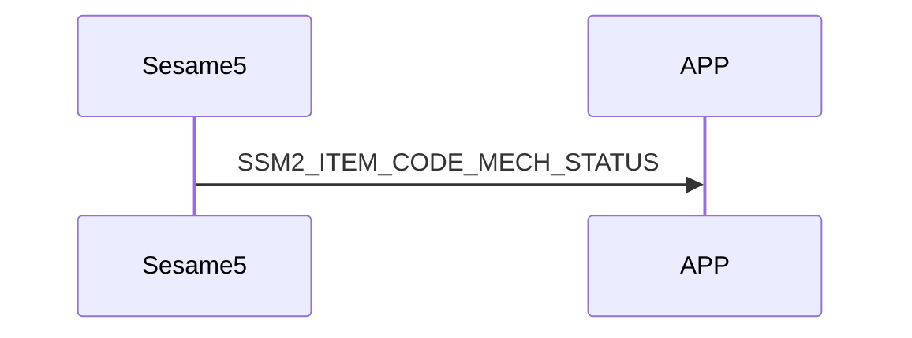

# 81 Mech Status (機械狀態)

mechStatus 裡存放 sesame5 各個硬體的狀態。

## mechStatus 的結構內容:

```c
#pragma pack(1)
typedef struct mech_status_s {
    uint16_t battery;
    int16_t target;                     // 馬達想到的地方
    int16_t position;                   // 感測器同步到的最新角度
    uint8_t is_clutch_failed: 1;        // 電磁鐵作棟是否成功(沒用到)
    uint8_t is_lock_range: 1;           // 在關鎖位置
    uint8_t is_unlock_range: 1;         // 在開鎖位置
    uint8_t is_critical: 1;             // 開關鎖時間超時，馬達停轉
    uint8_t is_stop: 1;                 // 把手角度沒有變化
    uint8_t is_low_battery: 1;          // 低電量(<5V)
    uint8_t is_clockwise: 1;            // 馬達轉動方向
} mech_status_t;
#pragma pack()
```

為了防止客戶端頻繁跟 sesame5 請求機械狀態，只能由 sesame5 在機械狀態改變時主動發送。

## 手機與 ssm5 傳輸 mechStatus 互動循序圖




## ssm5 推送內容

| Byte |     N ~ 2      |     1     |    0     |
| ---- | :------------: | :-------: | :------: |
| Data |    payload     | item_code |   type   |
| 說明 | 送給手機的資料 | 指令編號  | 推送類型 |

type : SSM2_OP_CODE_PUBLISH (0x08)

item code : SSM2_ITEM_CODE_MECH_STATUS (81)

payload : 詳見以下表格

### payload

| Byte |   6 ~ 0    |
| ---- | :--------: |
| Data | mechStatus |

## mech status

| Byte |     6      |  5 ~ 4   | 3 ~ 2  |  1 ~ 0  |
| :--: | :--------: | :------: | :----: | :-----: |
| Data | other data | position | target | battery |

## other data

| Bit  |  7   |      6       |       5        |    4    |      3      |        2        |       1       |        0         |
| :--: | :--: | :----------: | :------------: | :-----: | :---------: | :-------------: | :-----------: | :--------------: |
| Data | NULL | is_clockwise | is_low_battery | is_stop | is_critical | is_unlock_range | is_lock_range | is_clutch_failed |

## iOS、Android、ESP32 範例

<CustomBashOSPlatformMechStatus ios='true' android='true'  esp32='true'/>

<!-- 

### Android 範例

```java
    override fun onGattSesamePublish(receivePayload: SSM3PublishPayload) {
        super.onGattSesamePublish(receivePayload)
//        L.d("hcia", "[ss5] " + receivePayload.cmdItCode)
        if (receivePayload.cmdItCode == SesameItemCode.mechStatus.value) {
            mechStatus = CHSesame5MechStatus(receivePayload.payload)
            deviceStatus = if (mechStatus!!.isInLockRange) CHDeviceStatus.Locked else CHDeviceStatus.Unlocked
            readHistoryCommand()
        }
        if (receivePayload.cmdItCode == SesameItemCode.mechSetting.value) {
            mechSetting = CHSesame5MechSettings(receivePayload.payload)
        }
    }
```

```java
class CHSesame5MechStatus(override val data: ByteArray) : CHSesameProtocolMechStatus {
    private val battery = bytesToShort(data[0], data[1])
    override val position: Short = bytesToShort(data[4], data[5])
    override val target: Short? = if ((bytesToShort(data[2], data[3]).toInt() == -32768)) null else bytesToShort(data[2], data[3])
    private val flags = data[6].toInt()
    override var isInLockRange: Boolean = flags and 2 > 0
    override var isBatteryCritical: Boolean = flags and 32 > 0
    override var isStop: Boolean? = flags and 16 > 0
    override fun getBatteryVoltage(): Float {
//        L.d("hcia", "[ss5][volt]" + battery * 2f / 1000f)
        return battery * 2f / 1000f
    }
}
```

### iOS 範例

```jsx | pure
   func onGattHub3Publish(_ payload: SesameOS3PublishPayload) {
    let itemCode = payload.itemCode
    let data = payload.payload
    L.d("[Hub3][onGattHub3Publish]itemCode:",itemCode.rawValue,"data:", data.bytes)
    switch itemCode {
    case .mechStatus:
        var content = data.copyData
        guard content.count > 0 else { break }
        let isAp: Bool = (content[0...0].toInt8() & 2) > 0
        let isNet: Bool = (content[0...0].toInt8() & 4) > 0
        let isIoT: Bool = (content[0...0].toInt8() & 8) > 0
        let isAPConnecting: Bool = (content[0...0].toInt8() & 32) > 0
        let isNETConnecting: Bool = (content[0...0].toInt8() & 64) > 0
        let isIOTConnecting: Bool = content[0...0].toInt8() < 0
        mechStatus = CHWifiModule2NetworkStatus(isAPWork: isAp, isNetwork: isNet, isIoTWork: isIoT, isBindingAPWork: isAPConnecting, isConnectingNetwork: isNETConnecting, isConnectingIoT: isIOTConnecting)
   }

```

### ESP 範例

```jsx | pure
    case SSM_ITEM_CODE_MECH_STATUS:
        memcpy((void *) &(ssm->mech_status), ssm->b_buf, 7);
        device_status_t lockStatus = ssm->mech_status.is_lock_range ? SSM_LOCKED : (ssm->mech_status.is_unlock_range ? SSM_UNLOCKED : SSM_MOVED);
        if (ssm->device_status != lockStatus) {
            ssm->device_status = lockStatus;
            p_ssms_env->ssm_cb__(ssm); // callback: ssm_action_handle
        }
        break;

    void publish_all_mechstatus(void) {
    ble_tx_buf[0] = SSM2_OP_CODE_PUBLISH;
    ble_tx_buf[1] = SSM2_ITEM_CODE_MECH_STATUS;
    memcpy(ble_tx_buf + 2, &g_mech_status, sizeof(mech_status_t));
    talk_to_all_mob(SSM2_SEG_PARSING_TYPE_CIPHERTEXT, ble_tx_buf, sizeof(mech_status_t) + 2);
}
``` 
-->
