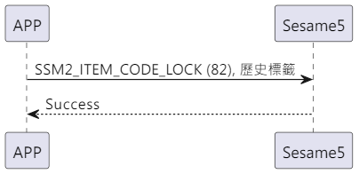

# 82 ロック

携帯電話から lock コマンドと履歴タグを送信し、携帯電話がコマンド成功を返信し、ロック履歴を作成してロックします。

## シーケンス図

<p align="left" >
  
</p>

## 携帯電話が送信するデータ

| Byte |  7 ～ 1  |       0        |
| ---- | :------: | :------------: |
| Data | 履歴タグ | アイテムコード |

アイテムコード : SSM2_ITEM_CODE_LOCK (82)

履歴タグ : sesame5 の履歴リストに表示されるタグ

## ssm5 が返す内容

| Bytes |       2        |       1        |       0        |
| ----- | :------------: | :------------: | :------------: |
| Data  |      res       | アイテムコード |      type      |
| 説明  | 命令の処理状態 |  コマンド番号  | プッシュタイプ |

type : SSM2_OP_CODE_RESPONSE (0x07)

アイテムコード : SSM2_ITEM_CODE_LOCK (82)

res : CMD_RESULT_SUCCESS (0x00)

## iOS、Android、ESP32 の例

<CustomBashOSPlatformLock ios='true' android='true'  esp32='true'/>

<!-- ## Android 例

```java
    override fun lock(historytag: ByteArray?, result: CHResult<CHEmpty>) {
        if (deviceStatus.value == CHDeviceLoginStatus.UnLogin && isConnectedByWM2) {
            CHAccountManager.cmdSesame(SesameItemCode.lock, this, sesame2KeyData!!.hisTagC(historytag), result)
        } else {
            if (checkBle(result)) return
//        L.d("hcia", "[ss5][lock] historyTag:" + sesame2KeyData!!.createHistagV2(historyTag).toHexString())
            sendCommand(SesameOS3Payload(SesameItemCode.lock.value, sesame2KeyData!!.createHistagV2(historytag)), DeviceSegmentType.cipher) { res ->
                if (res.cmdResultCode == SesameResultCode.success.value) {
                    result.invoke(Result.success(CHResultState.CHResultStateBLE(CHEmpty())))
                } else {
                    result.invoke(Result.failure(NSError(res.cmdResultCode.toString(), "CBCentralManager", res.cmdResultCode.toInt())))
                }
            }
        }

    }
```

## iOS の例

```jsx | pure
    public func lock(historytag: Data?, result: @escaping (CHResult<CHEmpty>))  {
        if deviceShadowStatus != nil,
           deviceStatus.loginStatus == .unlogined {
            CHIoTManager.shared.sendCommandToWM2(.lock, self) { _ in
                result(.success(CHResultStateNetworks(input: CHEmpty())))
            }
            return
        }
        if (self.checkBle(result)) { return }
        let hisTag = Data.createOS2Histag(historytag ?? self.sesame2KeyData?.historyTag)

        sendCommand(.init(.lock,hisTag)) { responsePayload in
            if responsePayload.cmdResultCode == .success {
                result(.success(CHResultStateBLE(input: CHEmpty())))
            } else {
                result(.failure(self.errorFromResultCode(responsePayload.cmdResultCode)))
            }
        }
    }
```

## ESP 例

```jsx | pure
void ssm_lock(uint8_t * tag, uint8_t tag_length) {
    // ESP_LOGI(TAG, "[ssm][ssm_lock][%s]", SSM_STATUS_STR(p_ssms_env->ssm.device_status));
    sesame * ssm = &p_ssms_env->ssm;
    if (ssm->device_status >= SSM_LOGGIN) {
        if (tag_length == 0) {
            tag = tag_esp32;
            tag_length = sizeof(tag_esp32);
        }
        ssm->b_buf[0] = SSM_ITEM_CODE_LOCK;
        ssm->b_buf[1] = tag_length;
        ssm->c_offset = tag_length + 2;
        memcpy(ssm->b_buf + 2, tag, tag_length);
        talk_to_ssm(ssm, SSM_SEG_PARSING_TYPE_CIPHERTEXT);
    }
}
``` -->
