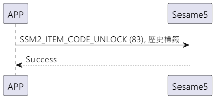

# 83 解錠

携帯電話から unlock 指令と履歴タグを送信し、携帯電話は指令が成功したことを返信し、解錠履歴を作成し、解錠します。

## シーケンス図

<p align="left" >
  
</p>

## 携帯電話からのデータ送信

| バイト |  7 ~ 1   |     0      |
| ------ | :------: | :--------: |
| データ | 履歴タグ | 項目コード |

項目コード：SSM2_ITEM_CODE_UNLOCK (83)

履歴タグ：sesame5 の履歴リストに表示されるタグ

## ssm5 からの返信内容

| バイト |        2         |     1      |     0      |
| ------ | :--------------: | :--------: | :--------: |
| データ |       res        | 項目コード | 送信タイプ |
| 説明   | コマンド処理状態 |  指令番号  | 送信タイプ |

タイプ：SSM2_OP_CODE_RESPONSE (0x07)

項目コード：SSM2_ITEM_CODE_UNLOCK (82)

res：CMD_RESULT_SUCCESS (0x00)

## iOS、Android、ESP32 のサンプル

<CustomBashOSPlatformUnlock ios='true' android='true'  esp32='true'/>

<!-- ## Androidのサンプル

```java
    override fun unlock(historytag: ByteArray?, result: CHResult<CHEmpty>) {
        if (deviceStatus.value == CHDeviceLoginStatus.UnLogin && isConnectedByWM2) {
            CHAccountManager.cmdSesame(SesameItemCode.unlock, this, sesame2KeyData!!.hisTagC(historytag), result)
        } else {
            if (checkBle(result)) return
//        L.d("hcia", "[ss5][unlock] historyTag:" + sesame2KeyData!!.createHistagV2(historyTag).toHexString())
            sendCommand(SesameOS3Payload(SesameItemCode.unlock.value, sesame2KeyData!!.createHistagV2(historytag)), DeviceSegmentType.cipher) { res ->
                if (res.cmdResultCode == SesameResultCode.success.value) {
                    result.invoke(Result.success(CHResultState.CHResultStateBLE(CHEmpty())))
                } else {
                    result.invoke(Result.failure(NSError(res.cmdResultCode.toString(), "CBCentralManager", res.cmdResultCode.toInt())))
                }
            }
        }
    }
```

## iOSのサンプル

```jsx | pure
    public func unlock(historytag: Data?, result: @escaping (CHResult<CHEmpty>))  {
        if deviceShadowStatus != nil,
           deviceStatus.loginStatus == .unlogined {
//            L.d("[ss5][toggle][wm2]")
            CHIoTManager.shared.sendCommandToWM2(.unlock, self) { _ in
                result(.success(CHResultStateNetworks(input: CHEmpty())))
            }
            return
        }
        if (self.checkBle(result)) { return }
        let hisTag = Data.createOS2Histag(historytag ?? self.sesame2KeyData?.historyTag)

        sendCommand(.init(.unlock,hisTag)) { responsePayload in
            if responsePayload.cmdResultCode == .success {
                result(.success(CHResultStateBLE(input: CHEmpty())))
            } else {
                result(.failure(self.errorFromResultCode(responsePayload.cmdResultCode)))
            }
        }
    }
```

## ESPのサンプル

```jsx | pure
void ssm_lock(uint8_t * tag, uint8_t tag_length) {
    // ESP_LOGI(TAG, "[ssm][ssm_lock][%s]", SSM_STATUS_STR(p_ssms_env->ssm.device_status));
    sesame * ssm = &p_ssms_env->ssm;
    if (ssm->device_status >= SSM_LOGGIN) {
        if (tag_length == 0) {
            tag = tag_esp32;
            tag_length = sizeof(tag_esp32);
        }
        ssm->b_buf[0] = SSM_ITEM_CODE_UNLOCK;
        ssm->b_buf[1] = tag_length;
        ssm->c_offset = tag_length + 2;
        memcpy(ssm->b_buf + 2, tag, tag_length);
        talk_to_ssm(ssm, SSM_SEG_PARSING_TYPE_CIPHERTEXT);
    }
}
``` -->
