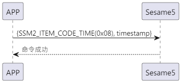

# 8 Update Time

The mobile phone actively sends out an update time command (item_code:0x08) and a mobile phone timestamp, ssm5 updates the timestamp and returns a success update.

## Sequence Diagram

<p align="left" >
  
</p>

## Mobile Phone Sends Data

| Byte |   4 ~ 1   |     0     |
| ---- | :-------: | :-------: |
| Data | timestamp | item code |

item code : SSM2_ITEM_CODE_TIME (0x08)

timestamp : mobile phone's timestamp

## ssm5 Returns Content

| Byte        |             2             |       1        |     0     |
| ----------- | :-----------------------: | :------------: | :-------: |
| Data        |            res            |   item_code    |   type    |
| Explanation | Command processing status | Command number | Push type |

type : SSM2_OP_CODE_RESPONSE (0x07)

item code : SSM2_ITEM_CODE_TIME (0x08)

res : CMD_RESULT_SUCCESS (0x00)

## iOS, Android, ESP32 Examples

 <CustomBashOSPlatformTime ios='true' android='true'  esp32='true'/>

<!--
## Android Example

```jsx | pure

    override fun updateTime(result: CHResult<CHEmpty>) {
        if (checkBle(result)) return
        sendCommand(SesameOS3Payload(SesameItemCode.time.value, System.currentTimeMillis().toUInt32ByteArray()), DeviceSegmentType.cipher) { res ->
            result.invoke(Result.success(CHResultState.CHResultStateBLE(CHEmpty())))
        }
    }

```

## iOS Example

```jsx | pure

    func handleLoginReceived(_ res: SesameOS3CmdResponsePayload) {
            let timestampData = Data(bytes: &timestamp,count: MemoryLayout.size(ofValue: timestamp))
            self.sendCommand(.init(.time,timestampData)) { res in
            }
        }
    }

```

## ESP Example

```jsx | pure

if (cmd_it_code == SSM2_ITEM_CODE_TIME) {
                HS_RTC->SR = request->payload.time;
                talk_to_mobile(mobile, SSM2_SEG_PARSING_TYPE_CIPHERTEXT, (uint8_t *) ss5_res,
                               offsetof(ss5_response, payload));
            }
``` -->
