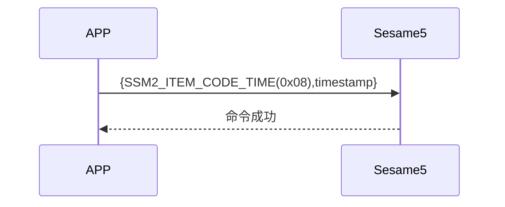

# 8 Update Time (更新時間)

手機主動送出更新時間(item_code:0x08)指令及手機 timestamp，ssm5 更新時間戳並回傳更新成功。

## 循序圖




## 手機送出資料

| Byte |   4 ~ 1   |     0     |
| ---- | :-------: | :-------: |
| Data | timestamp | item code |

item code : SSM2_ITEM_CODE_TIME (0x08)

timestamp : 手機的 timestamp

## ssm5 回傳內容

| Byte |      2       |     1     |    0     |
| ---- | :----------: | :-------: | :------: |
| Data |     res      | item_code |   type   |
| 說明 | 命令處裡狀態 | 指令編號  | 推送類型 |

type : SSM2_OP_CODE_RESPONSE (0x07)

item code : SSM2_ITEM_CODE_TIME (0x08)

res : CMD_RESULT_SUCCESS (0x00)

## iOS、Android、ESP32 範例

 <CustomBashOSPlatformTime ios='true' android='true'  esp32='true'/>

<!-- 

### Android 範例

```jsx | pure

    override fun updateTime(result: CHResult<CHEmpty>) {
        if (checkBle(result)) return
        sendCommand(SesameOS3Payload(SesameItemCode.time.value, System.currentTimeMillis().toUInt32ByteArray()), DeviceSegmentType.cipher) { res ->
            result.invoke(Result.success(CHResultState.CHResultStateBLE(CHEmpty())))
        }
    }

```

### iOS 範例

```jsx | pure

    func handleLoginReceived(_ res: SesameOS3CmdResponsePayload) {
            let timestampData = Data(bytes: &timestamp,count: MemoryLayout.size(ofValue: timestamp))
            self.sendCommand(.init(.time,timestampData)) { res in
            }
        }
    }

```

### ESP 範例

```jsx | pure
if (cmd_it_code == SSM2_ITEM_CODE_TIME) {
                HS_RTC->SR = request->payload.time;
                talk_to_mobile(mobile, SSM2_SEG_PARSING_TYPE_CIPHERTEXT, (uint8_t *) ss5_res,
                               offsetof(ss5_response, payload));
            }
``` 
-->
