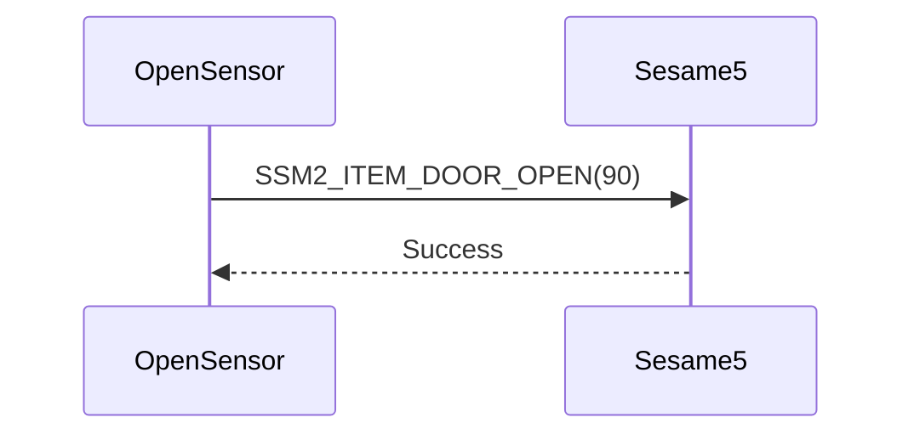

# Item: Door Open (開門)

Open Sensor跟Sesame5配對後，Open Sensor偵測到開門，會通知Sesame5。

## Open Sensor與Sesame5互動循序圖

## Open Sensor發送訊息

| Byte |     0     |
|------|:---------:|
| Data | item code |

item code : SSM2_ITEM_DOOR_OPEN (90)

## ssm5 回應訊息

| Byte |   2    |     1     |  0   |
|------|:------:|:---------:|:----:|
| Data |  res   | item_code | type |
| 說明   | 命令處裡狀態 |   指令編號    | 推送類型 |

type : SSM2_OP_CODE_RESPONSE (0x07)

item code : SSM2_ITEM_DOOR_OPEN (90)

res : CMD_RESULT_SUCCESS (0x00)
