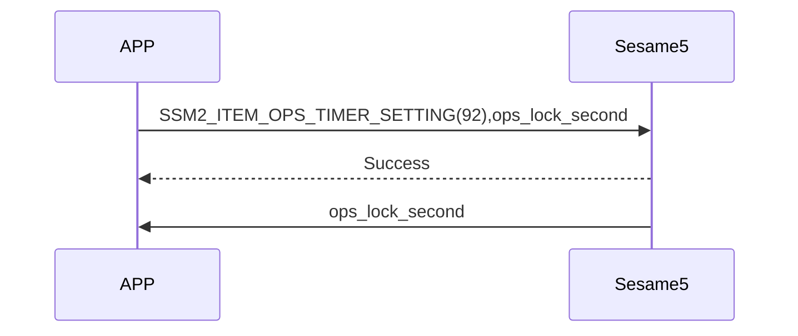
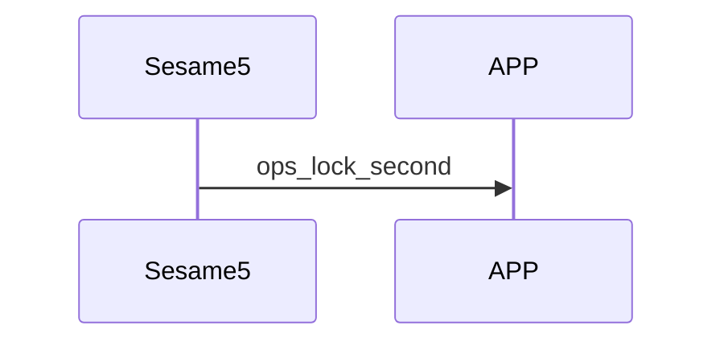

# Item: OpenSensor timer setting

OpenSensor 關門自動上鎖延遲時間

## 手機與 Sesame5 互動循序圖

APP 對 Sesame5 設定關門自動上鎖延遲時間。

Sesame5 主動向手機推送關門自動上鎖延遲時間。

## APP 送出命令

| Byte |      2 ~ 1      |     0     |
|------|:---------------:|:---------:|
| Data | ops_lock_second | item code |

item code : SSM2_ITEM_OPS_TIMER_SETTING (92)

ops_lock_second : 關門自動上鎖延遲時間

## ssm5 回應訊息

| Byte |   2    |     1     |  0   |
|------|:------:|:---------:|:----:|
| Data |  res   | item_code | type |
| 說明   | 命令處裡狀態 |   指令編號    | 推送類型 |

type : SSM2_OP_CODE_RESPONSE (0x07)

item code : SSM2_ITEM_OPS_TIMER_SETTING (92)

res : CMD_RESULT_SUCCESS (0x00)

## ssm5 推送內容

| Byte |      3 ~ 2      |     1     |  0   |
|------|:---------------:|:---------:|:----:|
| Data | ops_lock_second | item_code | type |
| 說明   |    關門上鎖延遲時間     |   指令編號    | 推送類型 |

type : SSM2_OP_CODE_PUBLISH (0x08)

item code : SSM2_ITEM_OPS_TIMER_SETTING (92)

ops_lock_second : 關門自動上鎖延遲時間
