# 序言

- 藍牙通信的編程非常貼近物理層面，越是接近物理世界，就越遠離那些完美的抽象編程概念。
  處理這些藍牙指令確實非常繁瑣，而所謂的 SesameSDK，正是將這些複雜的操作良好實現，並封裝成一個開源庫以便於使用。
- 這整套藍牙協議是 CANDY HOUSE 三代工程師超過十年（2014〜2016、2017〜2019、2020〜）辛勤工作和智慧的結晶，它的免費開源並不意味著"便宜無好貨"，相反，我們希望這個我們認為接近完美的作品能作為一套「活」的藍牙協議，得以在世界範圍內傳承中心思想和發揚光大。
- 藍牙操作涉及兩個主要部分：藍牙廣播(BLE Advertising) 和 藍牙數據傳(BLE Data Transmission)，接下來將進行詳細介紹。

<hr>

## 藍牙廣播（BLE Advertising）

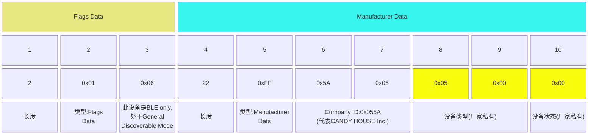
```mermaid
block-beta
  columns 10
  title1["Flags Data"]:3 title2["Manufacturer Data"]:7
  1 2 3 4 5 6 7 8 9 10
  
  loc1["2"] loc2["0x01"] loc3["0x06"] loc4["22"] loc5["0xFF"] loc6["0x5A"] loc7["0x05"] loc8["0x05"] loc9["0x00"] loc10["0x00"]
  
  ins1["长度"] ins2["类型:Flags\n Data"] ins3["此设备是BLE only,\n处于General \nDiscoverable Mode"] ins4["长度"] ins5["类型:Manufacturer\n Data"] ins6_7["Company ID:0x055A\n(代表CANDY HOUSE Inc.)"]:2 ins8_9["设备类型(厂家私有)"]:2 ins10["设备状态(厂家私有)"]

classDef titledef1 fill:#E7E882
class title1 titledef1
classDef titledef2 fill:#38F5ED
class title2 titledef2

classDef privatedef fill: #f9fb0c
class loc8,loc9,loc10 privatedef
```
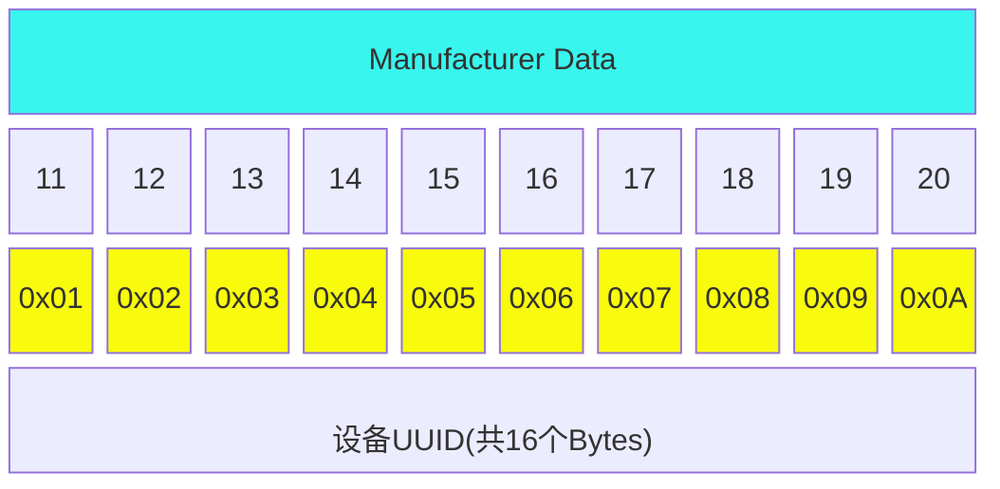
```mermaid
block-beta
  columns 10
  title2["Manufacturer Data"]:10
  11 12 13 14 15 16 17 18 19 20
  
  loc1["0x01"] loc2["0x02"] loc3["0x03"] loc4["0x04"] loc5["0x05"] loc6["0x06"] loc7["0x07"] loc8["0x08"] loc9["0x09"] loc10["0x0A"]
  
  ins1["\n设备UUID(共16个Bytes)\n"]:10
  
classDef titledef2 fill:#38F5ED
class title2 titledef2

classDef privatedef fill: #f9fb0c
class loc1,loc2,loc3,loc4,loc5,loc6,loc7,loc8,loc9,loc10 privatedef
```
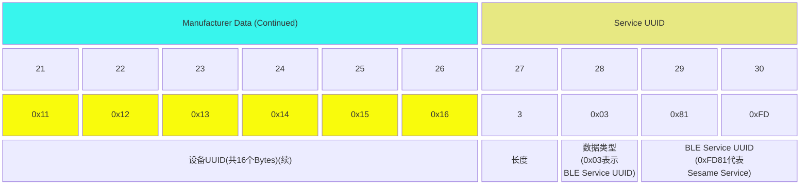
```mermaid
block-beta
  columns 10
  title2["Manufacturer Data (Continued)"]:6 title3["Service UUID"]:4
  21 22 23 24 25 26 27 28 29 30
  
  loc1["0x11"] loc2["0x12"] loc3["0x13"] loc4["0x14"] loc5["0x15"] loc6["0x16"] loc7["3"] loc8["0x03"] loc9["0x81"] loc10["0xFD"]
  
  ins1_6["设备UUID(共16个Bytes)(续)"]:6 ins7["长度"] ins8["数据类型\n(0x03表示\nBLE Service UUID)"] ins9_10["BLE Service UUID\n(0xFD81代表\nSesame Service)"]:2
  
  
classDef titledef1 fill:#E7E882
class title3 titledef1
classDef titledef2 fill:#38F5ED
class title2 titledef2  

classDef privatedef fill: #f9fb0c
class loc1,loc2,loc3,loc4,loc5,loc6 privatedef
```

> 第一行：属于蓝牙规范，还是厂家定义
>
> 第二行：序号
>
> 第三行：十六进制值
>
> 第四行：内容描述


- Bluetooth LE 4.0 advertising 長度最長為 31 Bytes.
- <span style="background-color: #fdea8e;color:#000000">黃底</span>或<span style="background-color: #e4dc7f;color:#000000">黃底</span>標記表示 CANDY HOUSE 定義的協議。<br>
- 其餘白底皆是依 Bluetooth SIG 規範要求的義務宣告。<br>

### Bluetooth SIG 官方 IDs

- https://www.bluetooth.com/specifications/assigned-numbers/
- CANDY HOUSE 註冊於藍芽技術聯盟(Bluetooth SIG)的官方 Identifiers：

|                  | Decimal |  Hex   |
| :--------------: | :-----: | :----: |
| BLE Service UUID |  64897  | 0xFD81 |
|    Company ID    |  1370   | 0x055A |

### 機種 Product Model

- 藍芽廣播裡的第 8th 9th Bytes 表達機種

| 8th 9th Bytes |        機種        |
| :-----------: | :----------------: |
|       0       |      Sesame 3      |
|       1       |   WiFi Module 2    |
|       2       |    Sesame Bot 1    |
|       3       |   Sesame Bike 1    |
|       4       |      Sesame 4      |
|       5       |      Sesame 5      |
|       6       |   Sesame Bike 2    |
|       7       |    Sesame 5 Pro    |
|       8       |    Open Sensor     |
|       9       | Sesame Touch 1 Pro |
|      10       |   Sesame Touch 1   |
|      11       |   Ble Connector    |
|      13       |       Hub 3        |
|      14       |   Sesame Remote    |
|      15       |    Remote Nano     |
|      16       |    Sesame 5 Usa    |
|      17       |    Sesame Bot 2    |
|      18       |        F2          |
|      19       |        F1          |
|      20       |Bluetooth半導體光繼電器|

### 設備狀態 Device Status

- 藍芽廣播裡的第 10th Byte 切分成 8 個 bits, 每個 bit 表達設備的各種狀態
<table>
  <tbody>
    <tr>
      <td rowspan="2" style="text-align: center;">第10th Byte 的 8 個 bits</td>
      <td colspan="2" style="text-align: center;">設備狀態</td>
    </tr>
    <tr>
      <td style="text-align: center;">0</td>
      <td style="text-align: center;">1</td>
    </tr>
    <tr>
      <td style="text-align: center;">1st bit</td>
      <td style="text-align: center;">Unregistered</td>
      <td style="text-align: center;">Registered</td>
    </tr>
    <tr>
      <td style="text-align: center;">2nd bit</td>
      <td style="text-align: center;"></td>
      <td style="text-align: center;"></td>
    </tr>
    <tr>
      <td style="text-align: center;">3rd bit</td>
      <td style="text-align: center;"></td>
      <td style="text-align: center;"></td>
    </tr>
    <tr>
      <td style="text-align: center;">4th bit</td>
      <td style="text-align: center;"></td>
      <td style="text-align: center;"></td>
    </tr>
    <tr>
      <td style="text-align: center;">5th bit</td>
      <td style="text-align: center;"></td>
      <td style="text-align: center;"></td>
    </tr>
    <tr>
      <td style="text-align: center;">6th bit</td>
      <td style="text-align: center;"></td>
      <td style="text-align: center;"></td>
    </tr>
    <tr>
      <td style="text-align: center;">7th bit</td>
      <td style="text-align: center;"></td>
      <td style="text-align: center;"></td>
    </tr>
    <tr>
      <td style="text-align: center;">8th bit</td>
      <td style="text-align: center;"></td>
      <td style="text-align: center;"></td>
    </tr>
  </tbody>
</table>

#### 遵守  Accessory Design Guidelines for Apple Devices

- 49.2 Advertising Channels  
  The accessory should advertise on `all three advertising channels (37, 38, and 39)` at each advertising event. See the Bluetooth 4.0 specification, Volume 6, Part B, Section 4.4.2.1.
- https://developer.apple.com/accessories/Accessory-Design-Guidelines.pdf Release R21

#### 鼓勵用 nRF Connect app 熟悉 Sesame BLE adv

<a href="https://docs.google.com/drawings/d/1HXljFMZW53Rwn7eOhT03Sc2oP_C_Y6lPCpO2FyVkVmE/"><p align="left" >


</p></a>

- 推薦您使用 nRF Connect app 驗證並熟悉 Sesame BLE adv
- https://play.google.com/store/apps/details?id=no.nordicsemi.android.mcp
- https://apps.apple.com/app/id1054362403

<hr>

### 藍牙數據透傳(BLE Data Transmission)

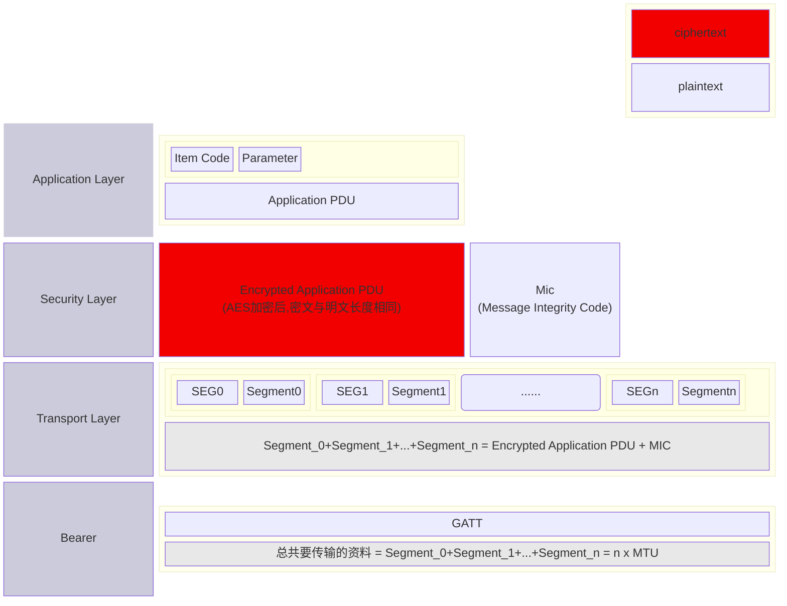
```mermaid
block-beta

columns 5

space:4
block:upper_right:1
	columns 1
    ur1["ciphertext"] 
    ur2["plaintext"]
end


T1["Application Layer"]:1
block:ID:2
	columns 1
	block
		A [" Item Code "] 
		B ["Parameter"]
	end
    G ["Application PDU"]
end
space:2
style T1 fill:#0,stroke-width:0px


T2["Security Layer"]:1
T21	["Encrypted Application PDU
    (AES加密后,密文与明文长度相同)"]:2
T22	["Mic
    (Message Integrity Code)"]:1
space:1


T3["Transport Layer"]:1
block:Content3:4
	columns 1
	block:updonw
        columns 4
        block:ID31
            A311 ["SEG0"]
            B312 ["Segment0"]
        end
        block:ID32
            A321 ["SEG1"]
            B322 ["Segment1"]
        end
        temp ("......")
        block:ID3n
            A32n ["SEGn"]
            B32n ["Segmentn"]
        end        
        
    end
	text3["Segment_0+Segment_1+...+Segment_n = Encrypted Application PDU + MIC"]
end

T4["Bearer"]:1
%%Content4 ["GATT"]:4
block:total_transfer:4
    columns 1
	Content4 ["GATT"]
    total4["总共要传输的资料 = Segment_0+Segment_1+...+Segment_n = n x MTU"] 
end

classDef ciphertextDef fill:#f20000
class ur1,T21 ciphertextDef

classDef commentDef fill:#e8e8e8
class total4,text3 commentDef

classDef tDef fill:#cbcbdb
class T1,T2,T3,T4 tDef
```
**单个SEG的定义:**

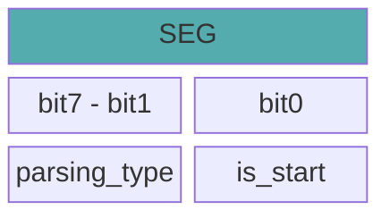
```mermaid
block-beta
  columns 2
  SEG["SEG"]:2
  i00["bit7 - bit1"] i01["bit0"]
  i10["parsing_type"] i11["is_start"]
  
    classDef titleDef fill:#55acaf
    class SEG titleDef
```
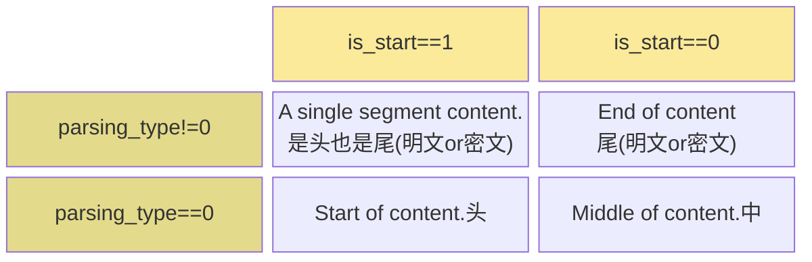
```mermaid
block-beta
  columns 3
  space i01["is_start==1"] i02["is_start==0"]
  i10["parsing_type!=0"] i11["A single segment content.
  是头也是尾(明文or密文)"]	i12["End of content
  尾(明文or密文)"]
  i20["parsing_type==0"] i21["Start of content.头"] i22["Middle of content.中"]
  
    classDef titleDef fill:#faea9a
    class i01,i02 titleDef
    
    classDef rowDef fill:#e3db8b
    class i10,i20 rowDef
```


- 受到 TCP/IP 模型的啟發, 我們將藍芽通信分成 4 層。
- `明文的任意格式之信息` 經過 `加密`、`切割`後 `透過藍芽GATT收發`。4 個狀態分別稱 <u>Application Layer</u>, <u>Security Layer</u>, <u>Transport Layer</u>, <u>Gatt Bearer Layer</u>.
- 這套切割信息的作法, 可以傳輸無限長度的任意格式之信息。

### 傳輸協議 Request, Response and Publish

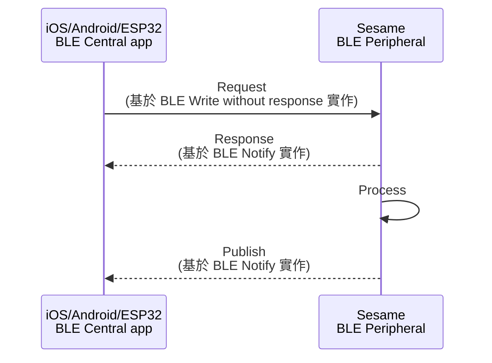
```mermaid
sequenceDiagram
    participant Central as iOS/Android/ESP32<br/>BLE Central app
    participant Peripheral as Sesame<br/>BLE Peripheral
    
    Central->>Peripheral: Request<br/>(基於 BLE Write without response 實作)
    Peripheral-->>Central: Response<br/>(基於 BLE Notify 實作)
    Peripheral->>Peripheral: Process
    Peripheral-->>Central: Publish<br/>(基於 BLE Notify 實作)
```

- 受到 RESTful API 增刪查改數據庫 POST 方法的啟發, 我們基於 `BLE write without response` 封裝了 1 命令方法：<br><span style="background-color: #fdea8e;color:#000000">・Request</span>
- 受到 RESTful API async/sync 的啟發, 我們基於`BLE notify`封裝成 2 個收 Callback 方法：<br><span style="background-color: #fdea8e;color:#000000">・Response</span><br><span style="background-color: #fdea8e;color:#000000">・Publish</span>
- `Response`方法與 <u>BLE write without `response`</u> 同名卻完全無關, 造成困擾我們十分抱歉。
- 每個 `Request` 都會立即得到一次 `Response`反饋。需要執行時間才能得知執行結果的信息以 `Publish`反饋。

### 只用到 2 個 BLE Characteristics 收發藍芽信息

- 透過 Request, Response, Publish 方法收發藍芽信息時, 只會用到 Sesame BLE Service(0xFD81) 的 2 個 BLE Characteristics.
- UUID 1686000<b>2</b>-a5ae-9856-b6d3-dbb4c676993e 的 Characteristics 是用來 write BLE commands without response
- UUID 1686000<b>3</b>-a5ae-9856-b6d3-dbb4c676993e 的 Characteristics 是用來 收 BLE Notify
<a href="https://docs.google.com/drawings/d/1E8PNgi7bTOfxj_APXK-yBPA2bjA4bNWQju8qv9Nx4SI/"><p align="left" >

</p></a>

## Application Layer 裡的業務內容

### 1. Sesame 「註冊」活動圖
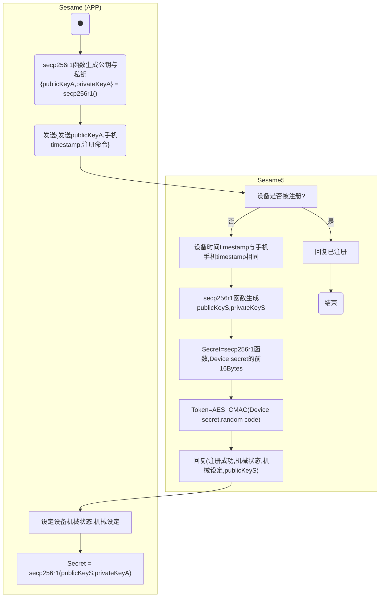
```mermaid
flowchart TD
    subgraph Sesame5
    a1[设备是否被注册?]--否-->a4[设备时间timestamp与手机手机timestamp相同]-->a5[secp256r1函数生成publicKeyS,privateKeyS]-->a6[Secret=secp256r1函数,Device secret的前16Bytes]-->a7["Token=AES_CMAC(Device secret,random code)"]-->a8["回复(注册成功,机械状态,机械设定,publicKeyS)"]
    a1--是-->a2[回复已注册]-->a3(结束)
    end
	
    subgraph "Sesame (APP)"
    c1(#9899;)-->c2("secp256r1函数生成公钥与私钥{publicKeyA,privateKeyA} = secp256r1()")
    c2-->c3("发送{发送publicKeyA,手机timestamp,注册命令}")
    c4[设定设备机械状态,机械设定]-->c5["Secret = secp256r1(publicKeyS,privateKeyA)"]
    end    
	c3-->a1
	a8-->c4
```


### 2. Sesame「註冊」循序圖

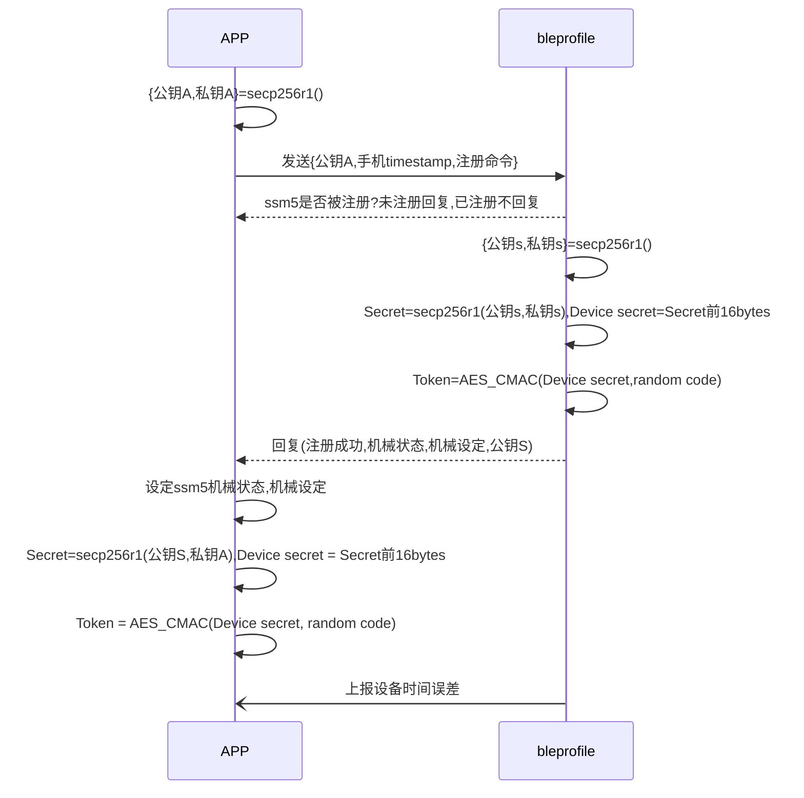
```mermaid
sequenceDiagram
APP->>APP: {公钥A,私钥A}=secp256r1()
APP->>bleprofile: 发送{公钥A,手机timestamp,注册命令}
bleprofile-->>APP: ssm5是否被注册?未注册回复,已注册不回复
bleprofile->>bleprofile: {公钥s,私钥s}=secp256r1()
bleprofile->>bleprofile: Secret=secp256r1(公钥s,私钥s),Device secret=Secret前16bytes
bleprofile->>bleprofile: Token=AES_CMAC(Device secret,random code)
bleprofile-->>APP: 回复(注册成功,机械状态,机械设定,公钥S)
APP->>APP: 设定ssm5机械状态,机械设定
APP->>APP: Secret=secp256r1(公钥S,私钥A),Device secret = Secret前16bytes
APP->>APP: Token = AES_CMAC(Device secret, random code)
bleprofile-)APP: 上报设备时间误差
```


### 3. Sesame「登录」循序圖

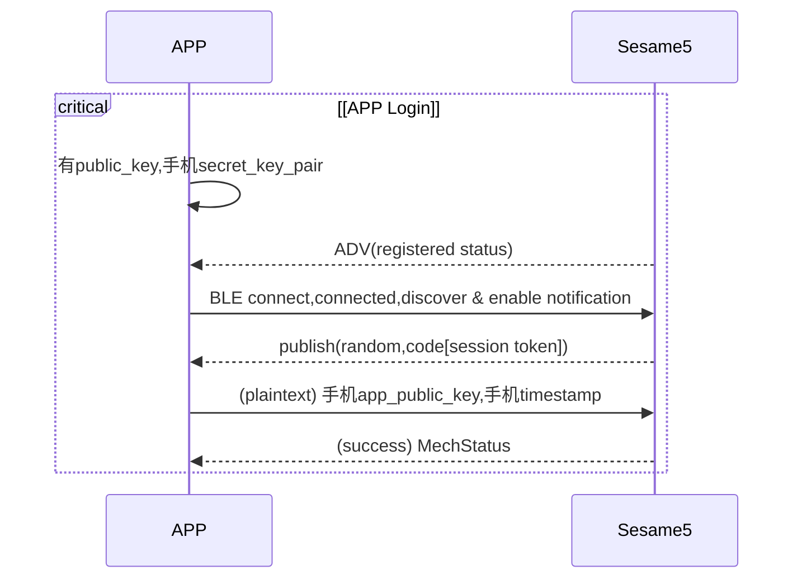
```mermaid

sequenceDiagram
critical [APP Login]
    APP->>APP: 有public_key,手机secret_key_pair
    Sesame5-->>APP: ADV(registered status)
    APP->>Sesame5: BLE connect,connected,discover & enable notification
    Sesame5-->>APP: publish(random,code[session token])
    APP->>Sesame5: (plaintext) 手机app_public_key,手机timestamp
    Sesame5-->>APP: (success) MechStatus
end
```


### 4. Sesame「发送命令」循序圖

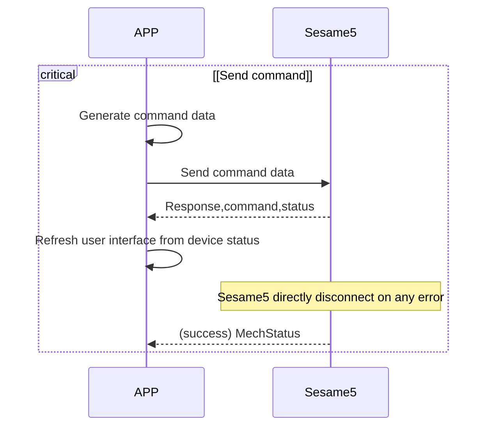
```mermaid

sequenceDiagram
critical [Send command]
    APP->>APP: Generate command data
    APP->>Sesame5: Send command data
    Sesame5-->>APP: Response,command,status
    APP->>APP: Refresh user interface from device status
    Note over Sesame5: Sesame5 directly disconnect on any error
    Sesame5-->>APP: (success) MechStatus
end
```


### 5. 對外封裝後的手機 SesameSDK 狀態機 State Machine

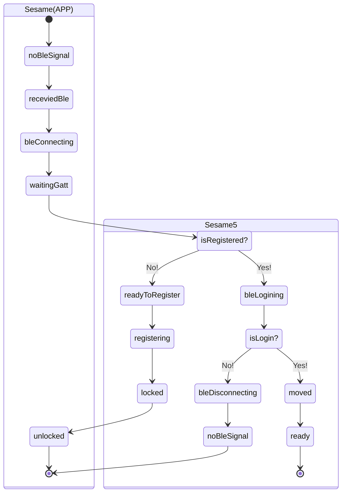
```mermaid
stateDiagram-v2

    state Sesame(APP) {
        [*] --> noBleSignal1
        noBleSignal1 --> receviedBle
        receviedBle --> bleConnecting
        bleConnecting --> waitingGatt
        waitingGatt --> isRegistered?
        
        locked --> unlocked 
        unlocked --> [*]
        
        noBleSignal2 --> [*]
        
        noBleSignal1 : noBleSignal
        noBleSignal2 : noBleSignal
    }
    
    state Sesame5 {
    	isRegistered? --> readyToRegister : No!
    		readyToRegister --> registering
    		registering --> locked
    	isRegistered? --> bleLogining : Yes!
    		bleLogining --> isLogin?
    			isLogin? --> bleDisconnecting : No!
    				bleDisconnecting --> noBleSignal2
    			isLogin? --> moved : Yes!
    				moved --> ready
    					ready --> [*]
    }
```


### 6. Sesame 時序圖


```mermaid
sequenceDiagram
autonumber
actor User
participant SesameApp
participant BleDevice

note over User,BleDevice: Preparation
alt BLE status == ON
    SesameApp->>SesameApp: Scan for Bluetooth devices
    SesameApp->>+BleDevice: Connect
    SesameApp->>SesameApp: Discover services
    SesameApp->>SesameApp: Discover characteristics
    SesameApp->>BleDevice: 5.Enable notifications
    BleDevice->>-SesameApp: 6.Initialization successful and a random code returned
    SesameApp->>SesameApp: 7.Save random code (session token)
    SesameApp->>SesameApp: 8.Generate key pair A
else BLE status != ON
	SesameApp->>SesameApp: Remind the user to turn on Bluetooth
end


note over User,BleDevice: Registration

User->>+SesameApp: Add device

par SesameS/Bike2/Open Sensor/Sesame Touch
	SesameApp->>SesameApp: Generate command data using public key of key pair A + timestamp
	SesameApp->>+BleDevice: Send command data
	BleDevice->>BleDevice: Synchronize time
	BleDevice->>BleDevice: Generate key pair B
	BleDevice->>BleDevice: Generate key with public key of key pair A and private key of key pair B
	BleDevice->>-SesameApp: Return status, settings, public key of key pair B
and WiFiModule2
    SesameApp->>SesameApp: Generate command data using public key of key pair A
    SesameApp->>+BleDevice: Send command data
    BleDevice->>BleDevice: Generate key pair B
    BleDevice->>BleDevice: Generate key with public key of key pair A and private key of key pair B
    BleDevice->>-SesameApp: Return public key of key pair B
    SesameApp->>SesameApp: Scan WiFi, set password, connect WiFi
end
SesameApp->>SesameApp: Generate key with private key of key pair A and public key of key pair B
SesameApp->>SesameApp: Update command encoder/decoder
SesameApp->>SesameApp: Insert device information with key
SesameApp->>SesameApp: Restore device state from shadow
SesameApp->>-User: Add device Result


Note over User,BleDevice: Login


par SesameS/Bike2/Open Sensor/Sesame Touch
    SesameApp->>SesameApp: Generate session authorization with signature
    SesameApp->>SesameApp: Without signature, generate session authorization with session token and key
    SesameApp->>SesameApp: Update command encoder/decoder
    
    SesameApp->>+BleDevice: Send command data
    BleDevice->>SesameApp: Verify key consistency
    BleDevice-->>-SesameApp: Return timestamp

    alt abs(device timestamp - app timestamp) >= 3
        SesameApp->>SesameApp: Get current time
        SesameApp->>BleDevice: Send command data
        BleDevice->>BleDevice: Synchronize time from App
    end
and WiFiModule2
    SesameApp->>SesameApp: Update command encoder/decoder
    SesameApp->>SesameApp: Generate command data with key and session token
    SesameApp->>BleDevice: Send command data
end
BleDevice-->>SesameApp: Response successful
BleDevice-->>SesameApp: Publish device status
SesameApp->>SesameApp: Respond with device status


Note over User,BleDevice: Send command
User->>SesameApp: Tap Sesame
par SesameS/Bike2/Open Sensor/Sesame Touch
	alt BLE connected
        SesameApp->>SesameApp: Generate command data
        SesameApp->>+BleDevice: Send command data
        BleDevice-->>-SesameApp: Publish device status
        SesameApp->>SesameApp: Restore interface from device status
    end
and WiFiModule2
    SesameApp->>SesameApp: Generate command data (key and public key when needed)
    SesameApp->>+BleDevice: Send command data
    BleDevice-->>-SesameApp: Publish device status
    SesameApp->>SesameApp: Restore interface from device status
end
SesameApp->>User: Return Result
```


## 手機藍牙跟 Sesame 兩種溝通方式

- 第一種是 <span style="background-color: #fdea8e;color:#000000">Publish</span>，Sesame 主動將訊息傳送給手機
- 第二種是 <span style="background-color: #fdea8e;color:#000000">Request</span>，手機要 Sesame 幹活，Sesame 回覆 <span style="background-color: #fdea8e;color:#000000">Response</span>應答

### 1. Publish【Sesame->手机】

当 NotifyEnable = `True` 的時候啓用，Sesame 主動將訂閱訊息推送給手機，如[「應答指令对照表」](#應答指令对照表) `81_機械狀態`。

| 字节索引 |    0     |     1     |     2 \~ N     |
| :------: | :------: | :-------: | :------------: |
|   Data   |   type   | item_code |    payload     |
|   說明   | 推送類型 | 指令編號  | 送給手機的資料 |

```c

typedef struct {
    uint8_t type;               /// 推送類型 : publish
    uint8_t item_code;          /// 指令 item_code
    union ss5_payload payload;  /// 送給手機的資料
} ss5_publish;

```

### 2. Request【手机->Sesame】

- `Request`即是手機要 Sesame 幹活，Sesame 回覆接收狀態，如[「請求指令對照表」](#請求指令對照表) `82_關鎖`
- 爲了避免混亂，需要一個保證順序的队列，支持同步串行发送，BLE 作為下位機的時候，就是讀寫各一個特徵值`Characteristics`，讀寫的操作方法是发送协议的內容

| 字节索引 |     0     |       1 ~ N        |
| :------: | :-------: | :----------------: |
|   Data   | item_code |      payload       |
|   說明   | 指令編號  | 送給 Sesame 的資料 |

```c

typedef struct {
    uint8_t item_code;              /// 指令(詳見 item_code)
    union ss5_payload payload;      /// 送給 Sesame5 的資料
} ss5_request;

```

```c
typedef enum {
    ITEM_CODE_NONE = 0,
    ITEM_CODE_REGISTRATION = 1,
    ITEM_CODE_LOGIN = 2,
    ITEM_CODE_HISTORY = 4,
    ITEM_CODE_VERSION_DETAIL = 5,
    ITEM_CODE_TIME = 8,
    ITEM_CODE_AUTOLOCK = 11,
    ITEM_CODE_INITIAL = 14,
    ITEM_CODE_IRER = 15,
    ITEM_CODE_MAGNET = 17,
    ITEM_CODE_MECH_SETTING = 80,
    ITEM_CODE_MECH_STATUS = 81,
    ITEM_CODE_LOCK = 82,
    ITEM_CODE_UNLOCK = 83,

	......
	
    SSM3_ITEM_RESET = 104
} item_code_e;
```

#### 2.1. Response 應答指令資料格式

| 字节索引 |    0     |     1     |      2       |     3 ～ N     |
| :------: | :------: | :-------: | :----------: | :------------: |
|   Data   |   type   | item_code |     res      |    payload     |
|   說明   | 推送類型 | 指令編號  | 命令處裡狀態 | 送給手機的資料 |

```c
typedef struct {
    uint8_t type;                   /// 推送類型:Response
    uint8_t item_code;              /// 指令(item_code)
    uint8_t res;                    /// 命令處理狀態 (都回 success)
    union ss5_payload payload;      /// 送給手機的資料
} ss5_response;

```

#### Result 處理狀態

```c
typedef enum {
    CMD_RESULT_SUCCESS = 0,         /// 手機发送命令给 Sesame5 會直接回 success
    CMD_RESULT_INVALID_ACTION = 9,  /// 已經註冊還下註冊命令
} cmd_result_e;
```

#### 2.2 Type 推送類型

標記符爲`0x07`時爲普通應答`response`，`0x08`爲主動推送`publish`

```c
typedef enum {
    OP_CODE_RESPONSE = 0x07,
    OP_CODE_PUBLISH = 0x08,
} op_code_e;
```

## 請求指令對照表

|                   字节索引                   |     0     |               1 ~ N                |              N+               |
| :------------------------------------------: | :-------: | :--------------------------------: | :---------------------------: |
|                     Data                     | item_code |              payload               |            others             |
|                     說明                     | 指令編號  |         送給 Sesame 的資料         |           其它資料            |
|           [注册](/demo/1_registor)           |     1     |         1-64【publicKeyA】         |      65-68【timestamp】       |
|            [登入](/demo/2_login)             |     2     |           1-4【ccmkeyA】           |
|           [历史](/demo/4_history)            |     4     |            1【is peek】            |      ispeek=true 不删除       |
|        [版本](/demo/5_version_detail)        |     5     |                none                |
|           [更新时间](/demo/8_time)           |     8     |          1-4【timestamp】          |
|        [自动上锁](/demo/11_autolock)         |    11     |            1-2【秒数】             |
|         [角度校正](/demo/17_megnet)          |    17     |                none                |
|       [機械設定](/demo/80_mechsetting)       |    80     |     1-5【autolock+开关锁角度】     |
|       [機械狀態](/demo/81_mechstatus)        |    81     |                none                |          无响应             |
|            [關鎖](/demo/82_lock)             |    82     |          1-7【历史标签】           |
|           [開鎖](/demo/83_unlock)            |    83     |          1-7【历史标签】           |
|          [開門](/demo/90_dooropen)           |    90     |                none                |
|         [關門](/demo/91_doorclosed)          |    91     |                none                |
|     [自動上鎖](/demo/92_opstimersetting)     |    92     |                none                |
|           [重置](/demo/104_reset)            |    104    |                none                |
|  [添加芝麻「touch」](/demo/101_add_sesame)   |    101    |        1-16【Device Name】         |      17-32【secretKey】       |
| [删除芝麻「touch」](/demo/103_remove_sesame) |    103    |        1-16【Device Name】         |
|  [更新卡片「touch」](/demo/107_card_change)  |    107    | 0【Card ID Len】1-id_len【CardID】 | CardIDLen+1【CardNameLen】etc |
|  [删除卡片「touch」](/demo/108_card_delete)  |    108    |          1-16【Card ID】           |
| [获取卡片「touch」](/demo/113_card_mode_get) |    113    |                none                |
|     [卡片模式](/demo/114_card_mode_set)      |    114    |                none                |
|     [指纹更新](/demo/115_finger_change)      |    115    |          0【FingerIDLen】          |      1-Len【FingerID】】      |
|     [指纹删除](/demo/116_finger_delete)      |    116    |           1【FingerID】            |
|       [指纹获取](/demo/117_finger_get)       |    117    |                none                |
|    [指纹模式](/demo/121_finger_mode_get)     |    121    |                none                |
|  [指纹模式设置](/demo/122_finger_mode_set)   |    122    |                none                |
|       [密码更新](/demo/123_pw_change)        |    123    |            0【PwIDlen】            |     1-pwLen【Password】】     |
|       [密码删除](/demo/124_pw_delete)        |    124    |                none                |
|         [密码获取](/demo/125_pw_get)         |    125    |                none                |
|    [获取密码模式](/demo/129_pw_mode_get)     |    129    |                none                |
|    [密码模式设置](/demo/130_pw_mode_set)     |    130    |           0 验证 1 新增            |

## 應答指令对照表

|                 字节索引                  |    0     |     1     |      2       |       3 ～ N       |          N+           |          N++           |
| :---------------------------------------: | :------: | :-------: | :----------: | :----------------: | :-------------------: | :--------------------: |
|                   Data                    |   type   | item_code |     res      |      payload       |        payload        |        payload         |
|                   說明                    | 推送類型 | 指令編號  | 命令處裡狀態 |  送給手機的資料 1  |   送給手機的資料 2    |    送給手機的資料 3    |
|         [初始化](/demo/14_inital)         |    8     |    14     |      0       | 0-3【random code】 |         none          |
|         [注册](/demo/1_registor)          |    7     |     1     |      0       | 0-6【mechStatus】  | 7-12【mechSetting】】 | 13~76【publicKeyS】】  |
|           [登入](/demo/2_login)           |    7     |     2     |      0       |  0-3【timestamp】  |
|          [历史](/demo/4_history)          |    7     |     4     |      0       |    0-3【id】】     |       4【type】       |    5-8【timestamp】    |
|      [版本](/demo/5_version_detail)       |    7     |     5     |      0       |  0-11【version】   |
|     [機械設定](/demo/80_mechsetting)      |    8     |    80     |      0       |    0-1【lock】     |    2-3【unlock】】    | 4-5【autolock_second】 |
|      [機械狀態](/demo/81_mechstatus)      |    8     |    81     |      0       | 0-3【random code】 |
|   [推送芝麻钥匙](/demo/102_pub_ssm_key)   |    8     |    102    |      0       | 0-21【ssm0-name】  |   22【ssm0-status】   | 23-44【ssm1_name】etc  |
|    [获取芝麻钥匙](/demo/109_card_get)     |    7     |    109    |      0       |   0-3【CardID】    |
|     [获取指纹](/demo/117_finger_get)      |    7     |    117    |      0       |  0-3【FingerID】   |
| [指纹模式获取](/demo/121_finger_mode_get) |    8     |    121    |      0       | 0-3【random code】 |

## 安全层 Security Layer

安全層 Security Layer 是 手機藍牙 与 Sesame5 間資料透傳實作的加密傳輸協定。

### 1. 4 字节 Random code

搜尋到 芝麻設備的藍牙 並連線開啟特徵值爲`0xFD81`的`notify`，這時 芝麻設備 主動 `publish` 發送 4Bytes Random Code/Session Token。(詳見 `14_初始化`)

### 2. 设备密钥 Device secret

註冊時，APP 及 Sesame5 雙方都會透過 `secp256r1` 產生 `public key `及 `private key`，交換生成 `Device secret`。

- `publicKey` : 64 Bytes
- `privateKey` : 32 Bytes

secret : 32 Bytes

#### 步驟 :

- 1. sesame5 使用 `secp256r1` 產生 `publicKeyS` 及 `privateKeyS`
- 2. APP 使用 `secp256r1` 產生 `publicKeyA` 及 p`rivateKeyA`
- 3. 雙方交換 `publicKey`
- 4. sesame5 使用 `privateKeyS` 及 `publicKeyA` 產生 `secret S`
- 5. APP 使用 `privateKeyA` 及 `publicKeyS` 產生 `secret A`
- 6. `secret S` 跟 `secret A` 相等
- 7. 雙方將 secret 前 16 Bytes 作為 `Device secret`。

#### Token 用途

- 1. 登入驗證 (詳見 : `2_登入`)
- 2. 數據透傳時透過 `aes_ccm` 加密資料，使用 Token 作為加密時用到的 key。

#### 產生方式

以 AES_CMAC 演算法，使用 `Device secret` 對 4Bytes Random code 簽章，就能產生 `Token`。
`device_secret` :16 Bytes
`random_code` :4 Bytes
`Token` :16 Bytes

```c

AES_CMAC(key:device_secret, input:random_code, input_size:4, output:Token);

```

### 3. 資料加密与解密

#### 加密参数：初始化向量（`CCM_IV`）

- 1.  count :8 个字节，開機初始化為 0，每做一次加密 count 計數加一
- 2.  nouse :1 个字节 默认值為 0
- 3.  random_code :4 个字节，跟設備連線後更新 `random_code`

```c

typedef struct {
    int64_t count;///8 byte
    uint8_t nouse;///1 byte = 0
    uint8_t random_code[4];///4 byte
} CCM_IV;

```

#### aes_ccm 參數

輸入:

- 1.  key :加密密钥，用于 AES-CCM 操作
- 2.  iv :初始化向量（CCM_IV）
- 3.  iv length :AES-CCM 使用 13 字节（104 位）的 IV
- 4.  add :附加认证数据
- 5.  add length :附加认证数据长度
- 6.  input :要加密的输入数据
- 7.  input length :要加密的数据长度
- 8.  tag length :用于存储认证标签（MAC）的缓冲区和标签的长度

輸出:

- 1. tag : ccm_tag
- 2. output : ccm_ecrrypt_data 加密後的資料

#### C 語言 加密範例

```c
aes_ccm_encrypt_and_tag(
                        key:ccm_key,
                        iv:CCM_IV,
                        iv_length:13,
                        add:0x00,
                        add_length:1,
                        input:p_data,
                        add_length:length,
                        output:ccm_ecrrypt_data,
                        tag:ccm_tag,
                        tag_length:4
                        );
CCM_IV.count ++;
```

AES 爲對稱加密算法，方法名稱爲 `aes_ccm_auth_decrypt` 參數和加密相互對應

#### C 語言 解密範例

```c
aes_ccm_auth_decrypt(
                    key:ccm_key,
                    iv:CCM_IV,
                    iv_length:13,
                    add:0x00,
                    add_length:1,
                    input:ccm_ecrrypt_data,
                    add_length:length,
                    output:ans_data,
                    tag:ccm_tag, tag_length:4
                    );
CCM_IV.count ++;
```

:::info{title=注意}
資料加解密使用的 CCM_IV 內有個 count 紀錄加密次數，若是加密與解密端的 count 計數不匹配會導致解密失敗。
:::

## Segment Layer

Segment Layer 要做兩件事情。

- 1. Sesame5 與 手機通訊時，限制封包最大長度 20Bytes，送長訊息需要對資料進行拆解，傳到接收端再組合。
- 2. 標記傳送的資料是否有加密，三種長度的明文密文封包方式。

### 1. 標記對照表

Segment Layer 在封包頭中的標記此封包是否被切割或加密，接收端可以按照標記做相應的處理，將封包還原成原始資料。以下為 Segment Layer 標記對照表。

Segment Layer 標記有 8bits，其中 bit 7 ~ 1 表示是否為結束封包及資料是否加密，bit 0 表示該封包是否為一筆資料的起始封包。

| bit 7 ~ 1 |   結束   | bit |  開始  |
| :-------: | :------: | :-: | :----: |
| b0000000  |  沒結束  |  0  | 非開始 |
| b0000000  |  沒結束  |  1  |  開始  |
| b0000001  | 明文結束 |  0  | 非開始 |
| b0000001  | 明文結束 |  1  |  開始  |
| b0000010  | 加密結束 |  0  | 非開始 |
| b0000010  | 加密結束 |  1  |  開始  |

#### 標記以 16 進位解讀

0 表示該封包不是開始封包也不是結束封包

1 表示該封包是開始封包不是結束封包

2 表示該封包不是開始封包是結束封包，並且組合起來的資料是明文

3 表示該封包是開始封包也是結束封包，並且資料是明文，資料沒有被切割，不需要組合

4 表示該封包不是開始封包是結束封包，並且組合起來的資料是密文

5 表示該封包是開始封包也是結束封包，並且資料是密文，資料沒有被切割，不需要組合

| 標記 |  開始  |   結束   |
| :--: | :----: | :------: |
| 0x00 | 非開始 |  沒結束  |
| 0x01 |  開始  |  沒結束  |
| 0x02 | 非開始 | 明文結束 |
| 0x03 |  開始  | 明文結束 |
| 0x04 | 非開始 | 加密結束 |
| 0x05 |  開始  | 加密結束 |

#### 範例

假設一個封包能放 4bytes 的資料，超過 4bytes 就需要進行分割(實際為 20bytes)。

### 2. 三種長度的明文密文封包方式

#### 2.1 短明文封包

資料: A A B B

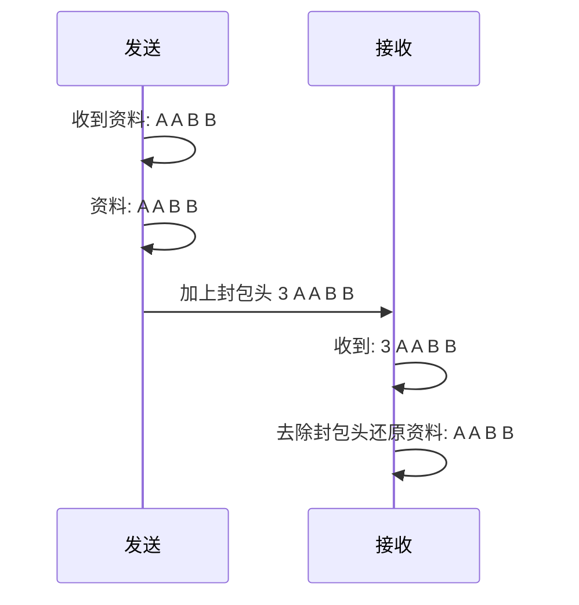
```mermaid
sequenceDiagram
发送->>发送: 收到资料: A A B B
发送->>发送: 资料: A A B B
发送->>接收: 加上封包头 3 A A B B
接收->>接收: 收到: 3 A A B B
接收->>接收: 去除封包头还原资料: A A B B
```

發送:

    1. 收到資料 : A A B B
    2. 資料 : A A B B
    3. 加上封包頭 : 3 A A B B

接收:

    4. 收到 : 3 A A B B
    5. 去除封包頭還原資料 : A A B B

#### 2.2 中明文封包

資料: A A A A B B B B

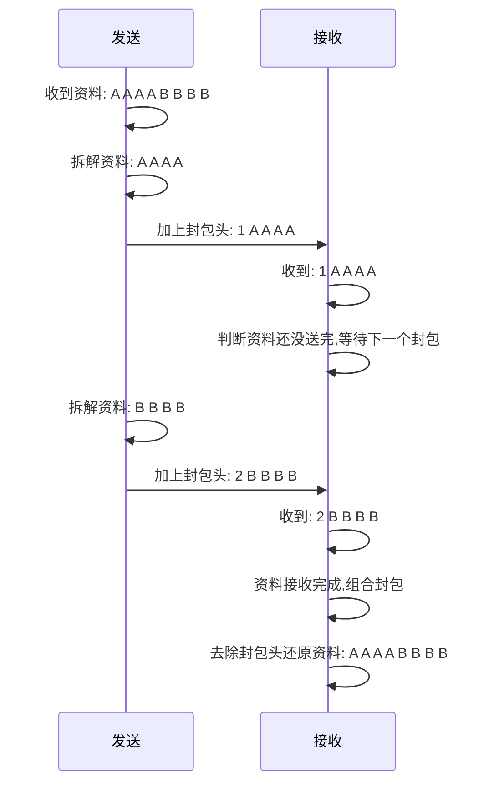
```mermaid
sequenceDiagram
发送->>发送: 收到资料: A A A A B B B B

发送->>发送: 拆解资料: A A A A
发送->>接收: 加上封包头: 1 A A A A
接收->>接收: 收到: 1 A A A A
接收->>接收: 判断资料还没送完,等待下一个封包

发送->>发送: 拆解资料: B B B B
发送->>接收: 加上封包头: 2 B B B B
接收->>接收: 收到: 2 B B B B
接收->>接收: 资料接收完成,组合封包
接收->>接收: 去除封包头还原资料: A A A A B B B B
```


發送:

    1. 收到資料 : A A A A B B B B
    2. 拆解資料 : A A A A
    3. 加上封包頭 : 1 A A A A
    6. 拆解資料 : B B B B
    7. 加上封包頭 : 2 B B B B

接收:

    4. 收到 : 1 A A A A
    5. 判斷資料還沒送完，等下一個封包
    8. 收到 : 2 B B B B
    9. 資料接收完成，組合封包
    10. 去除封包頭還原資料 : A A A A B B B B

#### 2.3 長明文封包

資料 : A A A A B B B B C C C C
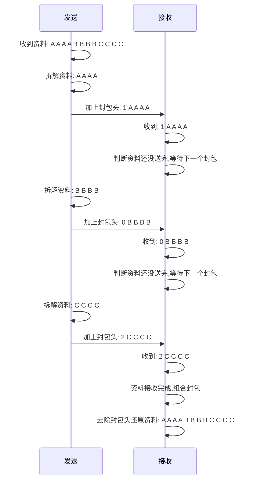
```mermaid
sequenceDiagram
发送->>发送: 收到资料: A A A A B B B B C C C C

发送->>发送: 拆解资料: A A A A
发送->>接收: 加上封包头: 1 A A A A
接收->>接收: 收到: 1 A A A A
接收->>接收: 判断资料还没送完,等待下一个封包

发送->>发送: 拆解资料: B B B B
发送->>接收: 加上封包头: 0 B B B B
接收->>接收: 收到: 0 B B B B
接收->>接收: 判断资料还没送完,等待下一个封包

发送->>发送: 拆解资料: C C C C
发送->>接收: 加上封包头: 2 C C C C
接收->>接收: 收到: 2 C C C C
接收->>接收: 资料接收完成,组合封包
接收->>接收: 去除封包头还原资料: A A A A B B B B C C C C
```


發送:

    1. 收到資料 : A A A A B B B B C C C C
    2. 拆解資料 : A A A A
    3. 加上封包頭 : 1 A A A A
    6. 拆解資料 : B B B B
    7. 加上封包頭 : 0 B B B B
    10. 拆解資料 : C C C C
    11. 加上封包頭 : 2 C C C C

接收:

    4. 收到 : 1 A A A A
    5. 判斷資料還沒送完，等下一個封包
    8. 收到 : 0 B B B B
    9. 判斷資料還沒送完，等下一個封包
    12. 收到 : 2 C C C C
    13. 資料接收完成，組合封包
    14. 去除封包頭還原資料 : A A A A B B B B C C C C

#### 2.4 短密文封包

資料 : A A B B

資料加密後 : X X Y Y


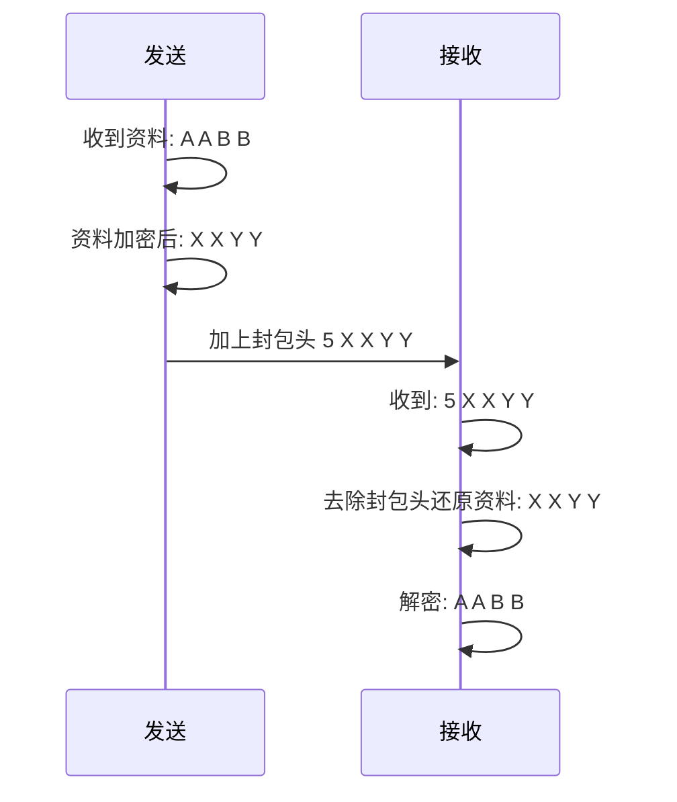
```mermaid
sequenceDiagram
发送->>发送: 收到资料: A A B B
发送->>发送: 资料加密后: X X Y Y
发送->>接收: 加上封包头 5 X X Y Y
接收->>接收: 收到: 5 X X Y Y
接收->>接收: 去除封包头还原资料: X X Y Y
接收->>接收: 解密: A A B B
```


發送:

    1. 收到資料 : A A B B
    2. 資料加密後 : X X Y Y
    3. 加上封包頭 : 5 X X Y Y

接收:

    4. 收到 : 5 X X Y Y
    5. 去除封包頭還原資料 : X X Y Y
    6. 解密 : A A B B

#### 2.5 中密文封包

資料: A A A A B B B B

資料加密後 : X X X X Y Y Y Y


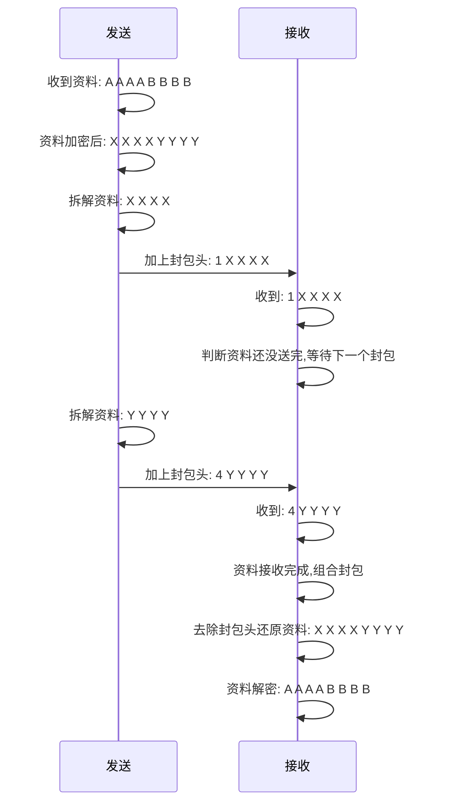
```mermaid
sequenceDiagram
发送->>发送: 收到资料: A A A A B B B B
发送->>发送: 资料加密后: X X X X Y Y Y Y
发送->>发送: 拆解资料: X X X X
发送->>接收: 加上封包头: 1 X X X X
接收->>接收: 收到: 1 X X X X
接收->>接收: 判断资料还没送完,等待下一个封包

发送->>发送: 拆解资料: Y Y Y Y
发送->>接收: 加上封包头: 4 Y Y Y Y
接收->>接收: 收到: 4 Y Y Y Y
接收->>接收: 资料接收完成,组合封包
接收->>接收: 去除封包头还原资料: X X X X Y Y Y Y
接收->>接收: 资料解密: A A A A B B B B
```


發送:

    1. 收到資料 : A A A A B B B B
    2. 資料加密後 : X X X X Y Y Y Y
    3. 拆解資料 : X X X X
    4. 加上封包頭 : 1 X X X X
    7. 拆解資料 : Y Y Y Y
    8. 加上封包頭 : 4 Y Y Y Y

接收:

    5. 收到 : 1 X X X X
    6. 判斷資料還沒送完，等下一個封包
    9. 收到 : 4 Y Y Y Y
    10. 資料接收完成，組合封包
    11. 去除封包頭還原資料 : X X X X Y Y Y Y
    12. 資料解密 : A A A A B B B B

#### 2.6 長密文封包

資料 : A A A A B B B B C C C C

資料加密後 : X X X X Y Y Y Y Z Z Z Z


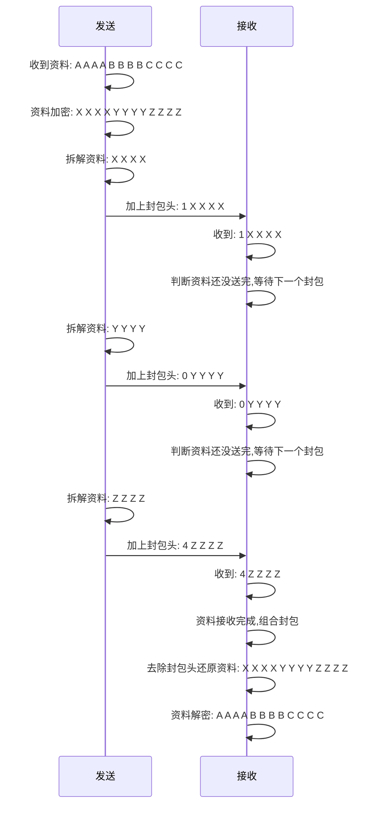
```mermaid
sequenceDiagram
发送->>发送: 收到资料: A A A A B B B B C C C C
发送->>发送: 资料加密: X X X X Y Y Y Y Z Z Z Z

发送->>发送: 拆解资料: X X X X
发送->>接收: 加上封包头: 1 X X X X
接收->>接收: 收到: 1 X X X X
接收->>接收: 判断资料还没送完,等待下一个封包

发送->>发送: 拆解资料: Y Y Y Y
发送->>接收: 加上封包头: 0 Y Y Y Y
接收->>接收: 收到: 0 Y Y Y Y
接收->>接收: 判断资料还没送完,等待下一个封包

发送->>发送: 拆解资料: Z Z Z Z
发送->>接收: 加上封包头: 4 Z Z Z Z
接收->>接收: 收到: 4 Z Z Z Z
接收->>接收: 资料接收完成,组合封包
接收->>接收: 去除封包头还原资料: X X X X Y Y Y Y Z Z Z Z
接收->>接收: 资料解密: A A A A B B B B C C C C
```


發送:

    1. 收到資料 : A A A A B B B B C C C C
    2. 資料加密後 : X X X X Y Y Y Y Z Z Z Z
    3. 拆解資料 : X X X X
    4. 加上封包頭 : 1 X X X X
    7. 拆解資料 : Y Y Y Y
    8. 加上封包頭 : 0 Y Y Y Y
    11. 拆解資料 : Z Z Z Z
    12. 加上封包頭 : 4 Z Z Z Z

接收:

    5. 收到 : 1 X X X X
    6. 判斷資料還沒送完，等下一個封包
    9. 收到 : 0 Y Y Y Y
    10. 判斷資料還沒送完，等下一個封包
    13. 收到 : 4 Z Z Z Z
    14. 資料接收完成，組合封包
    15. 去除封包頭還原資料 : X X X X Y Y Y Y Z Z Z Z
    16. 資料解密 : A A A A B B B B C C C C

:::info{title=注意}
資料經過 AES_CCM 加密後除了密文外還會產生 4Bytes 的 ccm_tag 用於解密，密文及 ccm_tag 需要一起傳給接收端，因此加密後的資料會增加 4Bytes，詳見 `security_Layer` 說明。
:::

<!--

### 3. 對外封裝後的手機 SesameSDK 狀態機 State Machine

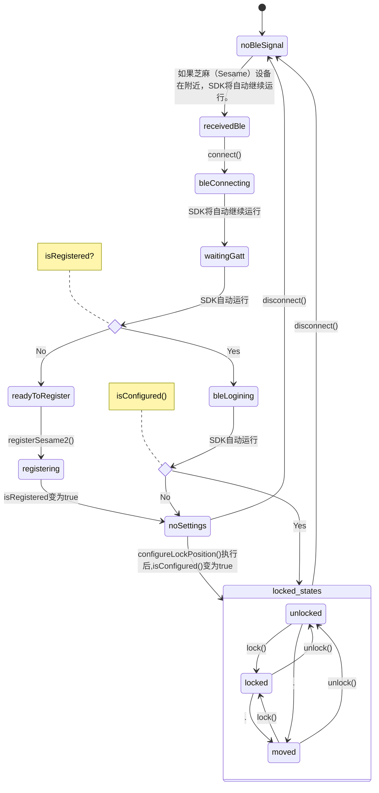
```mermaid
stateDiagram-v2
[*] --> noBleSignal

noBleSignal --> receivedBle: 如果芝麻（Sesame）设备在附近，SDK将自动继续运行。
receivedBle --> bleConnecting: connect()
bleConnecting --> waitingGatt: SDK将自动继续运行


state isRegistered <<choice>>
note left of isRegistered: isRegistered?
waitingGatt --> isRegistered: SDK自动运行
    isRegistered --> readyToRegister: No
		readyToRegister --> registering: registerSesame2()
        registering --> noSettings: isRegistered变为true
    isRegistered --> bleLogining : Yes	
        state isConfigured() <<choice>>
        note left of isConfigured(): isConfigured()	
		bleLogining --> isConfigured(): SDK自动运行
			isConfigured()-->noSettings:No
				noSettings --> locked_states: configureLockPosition()执行后,isConfigured()变为true
			isConfigured()-->locked_states:Yes

%%waitingGatt --> bleLogining: isRegistered/Yes/SDK が自動的に判断
%%waitingGatt --> readyToRegister: isRegistered/No/SDK が自動的に判断


%%bleLogining --> locked: isConfigured/Yes/SDK が自動的に判断

state locked_states {
	unlocked --> locked: lock()
	locked --> unlocked: unlock()
	
	locked --> moved: .
    moved --> unlocked: unlock()
    
    unlocked --> moved: .
    moved --> locked: lock()
}

noSettings --> noBleSignal: disconnect()
locked_states --> noBleSignal: disconnect()
```


#### 1.手機 app 透過 WiFiModule2 轉交指令給 Sesame

```mermaid
sequenceDiagram
    participant App as 手機app
    participant S5 as Sesame5
    participant W2 as WiFiModule2
box rgba(212,140,100,0.1) AWS IoT
    participant WS as WiFiModule2 Shadow
    participant SS as Sesame5 Shadow
end

Note over S5,W2 : 已建立BLE連線並已完成BLE_login且已建立AESCCM加密通道
App->>WS: (command, key_idx, 手機app_publickey, timestamp, SIG)
WS->>W2: (command, key_idx, 手機app_publickey, timestamp, SIG)
W2->>S5: (command, key_idx, 手機app_publickey, timestamp, SIG)
%%Note over App,SS: 透過 AWS IoT + WiFiModule2 傳送指令給 Sesame5
Note over S5: SIG=AESCMAC(user_key, command+ key_idx+手機app_publickey+timestamp +ECDH_sharedSecret)<br/>ECDH_sharedSecret = ECDH(Sesame5_keypairs, 手機app_keypairs)

S5->>S5: 開鎖
S5->>W2: Sesame狀態<br/>(是否鎖上?, 電池, 角度)
W2->>SS: 同步 Sesame狀態<br/>(是否鎖上?, 電池, 角度)
SS->>App: 同步 Sesame狀態<br/>(是否鎖上?, 電池, 角度)
```


#### 2.AWS IoT Shadow

```mermaid
block-beta
  columns 4
  
  i01["Sesame2 
  shadow"] space:2 i02["WiFiModule2 
  shadow"] 
  
  %%i10["i10"] i11["i11"] i12["i12"] i13["i13"]
  space:4
  space:4
  
  i20["phone"] i21["phone"] space i23["WiFiModule2"]
  space:4
  space:4
  space space i32["Sesame2"] space
  
  i21--"1.WiFi Password"-->i23
  
  i21-->i32 i32-->i21
  i23--"4.Lock/Unlock"-->i32 i32-->i23
  
  i01--"Get Sesame2 status
  by Subscription"-->i20
  
  i21--"Publish 
  Sesame2 status"-->i01
  
  i23--"Publish Sesame2 status"-->i01
  
  i21--"2.Publish the 
  Sesame2 List 
  and Sesame keys 
  to the shadow"-->i02
  
  i02--"3. Get the 
  Sesame2 List 
  by Subscription"-->i23
  
  commentcloud>"表示运行在AWS IoT中"]

    classDef cloudDef fill:#f9cb9c
    class i01,i02,commentcloud cloudDef
```


#### 3.註冊 WiFiModule2

```mermaid
sequenceDiagram
    participant App as 手機app
    participant WiFi as WiFiModule2  
    participant S as Server
    participant AWS as AWS_IoT

    Note over App,WiFi: 已建立BLE連線<br/>並已完成BLE_login<br/>且已建立AESCCM加密通道
    
    WiFi->>App: 返回掃到的2.4GHz的WiFi清單
    App->>WiFi: 选择WiFi的SSID 並給 該密碼
    App->>AWS: 訂閱這個WiFiModule2的Shadow

    WiFi->>S: https_request
    S-->>WiFi: server_token
    
    Note over WiFi,S: SIG=ECC( WiFiModule2_private_key, server_token )<br/>Server 用 WiFiModule2_public_key 校验請求的SIG
    
    WiFi->>S: https_request(IR, SIG, server_token)
    S->>S: 認證請求
    S->>AWS: 申請證書
    AWS-->>S: 返回证书
    AWS->>S: 附加 thing & Policy
    S->>S: 保存證書信息
    
    S-->>WiFi: 返回证书
    
    WiFi->>AWS: 持有該證書去連結 AWS_IoT 網絡
    AWS-->>WiFi: MQTT Connected
    WiFi->>AWS: 訂閱自己的Shadow
    WiFi->>AWS: 回報MQTT Connected狀態<br/>(並寫在LWT, Last Will and Testament)

    AWS-->>App: 收到 WiFiModule2網絡設定 成功
```

#### 4.藍芽登入 WiFiModule2

```mermaid
sequenceDiagram
title WiFiModule2 BLE login
participant App as 手機app
participant Module as WiFiModule2

critical login
    Note over App: 有 WiFiModule_public_key,<br/>持手機app_key_pair

    Module->>App: ADV(registered status)
    App->>Module: BLE connect, connected, discover & enable notification
    Module->>App: publish(WiFiModule_token)
    App->>Module: (plaintext) key_idx, 手機app_public_key, 手機app_session_token, session_auth

    Note over App,Module: session_token = 手機app_session_token+WiFiModule_session_token<br/>session_auth計算SIG = AES-CMAC(user_key, key_idx+手機app_public_key+session_token)<br/>session_key = AES-CMAC(ECDH_shared_secret, session_token)

    Note over Module: WiFiModule2 will directly disconnect on any error

    Module-->>App: (encrypted) login info

end
```


#### 5.設定 WiFiModule2
```mermaid
sequenceDiagram
	title 设定WiFiModule2
    participant App as 手機app
    participant WiFi as WiFiModule2
    participant S as Server
    participant AWS as AWS_IoT
    
    Note over App,WiFi: 已建立BLE連線<br/>並已完成BLE_login<br/>且已建立AESCCM加密通道
    
    WiFi->>App: 返回掃到的2.4GHz的WiFi清單
    App->>WiFi: 選擇WiFi的SSID 並給 該密碼
    App->>AWS: 訂閱這個WiFiModule2的Shadow
    
    WiFi->>S: https_request
    S-->>WiFi: server_token
    
    Note over WiFi,S: SIG=ECC( WiFiModule2_private_key, server_token )<br/>Server 用 WiFiModule2_public_key 校驗請求的SIG
    
    WiFi->>S: https_request(IR, SIG, server_token)
    S->>S: 校驗請求
    S->>AWS: 申請證書
    AWS-->>S: 返回證書
    S->>AWS: 附加thing & Policy
    S->>S: 保存證書信息
    
    S-->>WiFi: 返回結果
    WiFi->>AWS: 持有該證書去連結 AWS_IoT 網絡
    AWS-->>WiFi: MQTT Connected
    WiFi->>AWS: 訂閱自己的Shadow
    WiFi->>AWS: 回覆MQTT Connected狀態<br/>(並更新LWT, Last Will and Testament)
    
    AWS-->>App: 收到 WiFiModule2網絡設定 成功
```

#### 6.配對 WiFiModule2 與 Sesame


```mermaid
sequenceDiagram

title 配对WiFiModule2
	participant App as 手機app
box rgba(212,140,100,0.1) AWS IoT
    participant WM2S as WiFiModule2 Shadow
    participant S2S as Sesame2 Shadow
end
    participant WM2 as WiFiModule2
    participant S2 as Sesame2

    App->>WM2S: 同步 Sesame清單<br/>同步 低耗限user_key
    WM2S->>WM2: 同步 Sesame清單<br/>同步 低耗限user_key

    Note over WM2,S2: 建立 BLE連線<br/>進行 BLE_login<br/>建立 AESCCH加密通道

    S2->>WM2: Sesame狀態<br/>(是否鎖上?, 電池, 角度)
    WM2->>S2S: 同步 Sesame狀態<br/>(是否鎖上?, 電池, 角度)
    
    S2S->>App: 同步 Sesame狀態<br/>(是否鎖上?, 電池, 角度)
```


#### 7.無需用戶介入 全自動更新 Firmware


```mermaid
sequenceDiagram
	title 配对WiFiModule2与Sesame2
    participant App as 手機app
box rgba(212,140,100,0.1) AWS IoT
    participant WM2S as WiFiModule2 Shadow
    participant S2S as Sesame2 Shadow
end
    participant WM2 as WiFiModule2
    participant S2 as Sesame2

    Note over WM2: 初始狀態是藍芽中心設備

    App->>WM2S: 同步 Sesame清單<br/>同步 低耗限user_key
    WM2S->>WM2: 同步 Sesame清單<br/>同步 低耗限user_key
    Note over WM2,S2: 建立 BLE連線<br/>進行 BLE_login<br/>建立 AESCCH加密通道
    
    S2->>WM2: Sesame狀態<br/>(是否鎖上?, 電池, 角度)
    WM2->>S2S: 同步 Sesame狀態<br/>(是否鎖上?, 電池, 角度)
    S2S->>App: 同步 Sesame狀態<br/>(是否鎖上?, 電池, 角度)
```


-->
