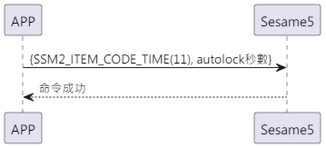

# Item: Version detail

手機主動送出更新時間(item_code:11)指令及 autolock 秒數，ssm5開啟autolock定時器並回傳成功。

## 循序圖

<p align="left" >
  
</p>

## 手機送出資料

| Byte |    2 ~ 1    |     0     |
|------|:-----------:|:---------:|
| Data | autolock 秒數 | item code |

item code : SSM2_ITEM_CODE_AUTOLOCK (11)

## ssm5 回傳內容

| Byte |   2    |     1     |  0   |
|------|:------:|:---------:|:----:|
| Data |  res   | item_code | type |
| 說明   | 命令處裡狀態 |   指令編號    | 推送類型 |

type : SSM2_OP_CODE_RESPONSE (0x07)

item code : SSM2_ITEM_CODE_AUTOLOCK (11)

res : CMD_RESULT_SUCCESS (0x00)

## android 範例

``` java
    override fun autolock(delay: Int, result: CHResult<Int>) {
        if (checkBle(result)) return
        sendCommand(SesameOS3Payload(SesameItemCode.autolock.value, delay.toShort().toReverseBytes()), DeviceSegmentType.cipher) { res ->
            mechSetting?.autoLockSecond = delay.toShort()
            result.invoke(Result.success(CHResultState.CHResultStateBLE(delay)))
        }
    }
```
