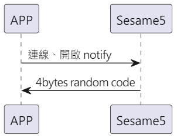

# Item: Inital

手機與 Sesame5 建立連線後並開啟 notify，Sesame5 回傳 4Bytes random code

## 循序圖

<p align="left" >
  
</p>

## ssm5 回傳內容

| Byte |  N ~ 2  |     1     |  0   |
|------|:-------:|:---------:|:----:|
| Data | payload | item_code | type |
| 說明   | 送給手機的資料 |   指令編號    | 推送類型 |

type : SSM2_OP_CODE_PUBLISH (0x08)

item code : SSM2_ITEM_CODE_INITIAL (14)

### payload

| Byte |        3 ~ 0        |
|------|:-------------------:|
| Data | 4 bytes random code |

## android 範例

``` java
    override fun onGattSesamePublish(receivePayload: SSM3PublishPayload) {
        if (receivePayload.cmdItCode == SesameItemCode.initial.value) {
            mSesameToken = receivePayload.payload
            L.d("hcia", "isNeedAuthFromServer:" + isNeedAuthFromServer)
            if (isRegistered) {
                if (isNeedAuthFromServer == true) {
                    CHAccountManager.signGuestKey(CHRemoveSignKeyRequest(deviceId.toString().uppercase(), mSesameToken.toHexString(), sesame2KeyData!!.secretKey)) {
                        it.onSuccess {
                            (this as CHDeviceUtil).login(it.data)
                        }
                    }
                } else {
                    (this as CHDeviceUtil).login()
                }
            } else {
                deviceStatus = CHDeviceStatus.ReadyToRegister
            }
        }
    }

```
