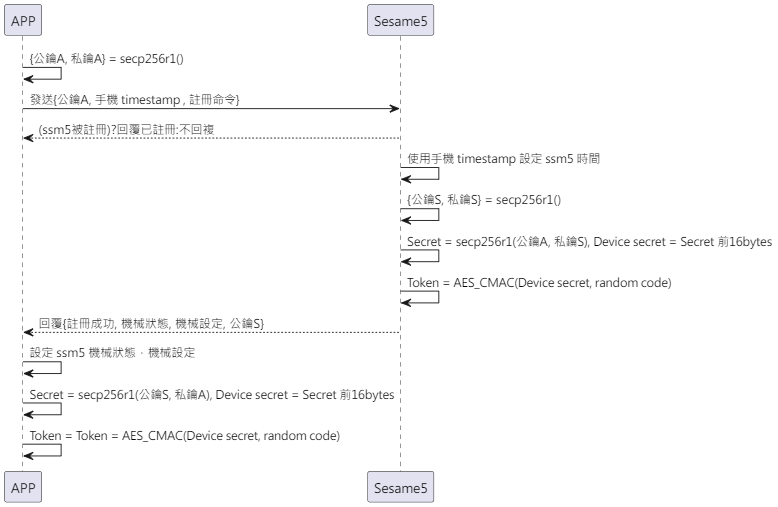
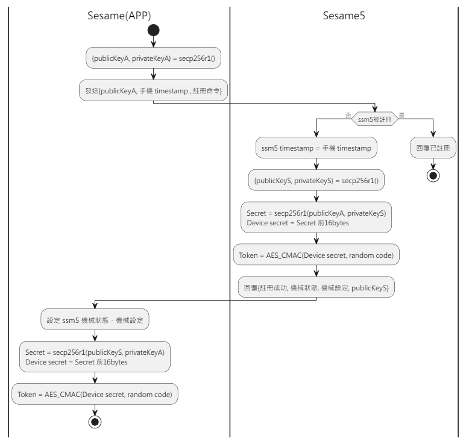

# Item: Register

Register(註冊)是 APP 跟 Sesame5 配對的動作，只有配對過的 APP 才能控制該 Sesame5。

加密實作詳見 `security layer`。

## Sesame(APP) 註冊 Sesame5 的循序圖

<p align="left" >
  
</p>

## 手機傳送資料

| Byte |   68 ~ 65   |   64 ~ 1   |     0     |
|------|:-----------:|:----------:|:---------:|
| Data | 手機timestamp | publicKeyA | item_code |

## Sesame5 回傳資料(已註冊)

| Byte |   2    |     1     |  0   |
|------|:------:|:---------:|:----:|
| Data |  res   | item_code | type |
| 說明   | 命令處裡狀態 |   指令編號    | 推送類型 |

type : SSM2_OP_CODE_RESPONSE (0x07)

item code : SSM2_ITEM_CODE_LOGIN (1)

res : CMD_RESULT_INVALID_ACTION (0x09)

## Sesame5 回傳資料(未註冊)

| Byte |  N ~ 3  |   2    |     1     |  0   |
|------|:-------:|:------:|:---------:|:----:|
| Data | payload |  res   | item_code | type |
| 說明   | 送給手機的資料 | 命令處裡狀態 |   指令編號    | 推送類型 |

type : SSM2_OP_CODE_RESPONSE (0x07)

item code : SSM2_ITEM_CODE_LOGIN (1)

res : CMD_RESULT_SUCCESS (0x00)

payload : 詳見以下表格

### Payload

| Byte |  76 ~ 13   |   12 ~ 7    |   6 ~ 0    |
|------|:----------:|:-----------:|:----------:|
| Data | publicKeyS | mechSetting | mechStatus |

## android 範例

```java
    override fun register(result: CHResult<CHEmpty>) {
        if (deviceStatus != CHDeviceStatus.ReadyToRegister) {
            result.invoke(Result.failure(NSError("Busy", "CBCentralManager", 7)))
            return
        }
        deviceStatus = CHDeviceStatus.Registering

        L.d("hcia", "register:!!")
        makeApiCall(result) {
            val serverSecret = mSesameToken.toHexString()
            CHAccountManager.jpAPIclient.myDevicesRegisterSesame5Post(deviceId.toString(), CHOS3RegisterReq(advertisement!!.productModel!!.productType().toString(), serverSecret))
            sendCommand(SesameOS3Payload(SesameItemCode.registration.value, EccKey.getPubK().hexStringToByteArray() + System.currentTimeMillis().toUInt32ByteArray()), DeviceSegmentType.plain) { IRRes ->
                mechStatus = CHSesame5MechStatus(IRRes.payload.toHexString().hexStringToByteArray().sliceArray(0..6))
                mechSetting = CHSesame5MechSettings(IRRes.payload.toHexString().hexStringToByteArray().sliceArray(7..12))

                val eccPublicKeyFromSS5 = IRRes.payload.toHexString().hexStringToByteArray().sliceArray(13..76)
                val ecdhSecret = EccKey.ecdh(eccPublicKeyFromSS5)
                val ecdhSecretPre16 = ecdhSecret.sliceArray(0..15)
                val deviceSecret = ecdhSecretPre16.toHexString()
                val candyDevice = CHDevice(deviceId.toString(), advertisement!!.productModel!!.deviceModel(), null, "0000", deviceSecret, serverSecret)
                sesame2KeyData = candyDevice
                val sessionAuth = AesCmac(ecdhSecretPre16, 16).computeMac(mSesameToken)
                cipher = SesameOS3BleCipher("customDeviceName", sessionAuth!!, ("00" + mSesameToken.toHexString()).hexStringToByteArray())
                CHDB.CHSS2Model.insert(candyDevice) {
                    result.invoke(Result.success(CHResultState.CHResultStateBLE(CHEmpty())))
                }

                deviceStatus = if (mechStatus?.isInLockRange == true) CHDeviceStatus.Locked else CHDeviceStatus.Unlocked

            }
        }
    }
```

## Sesame(APP) 註冊 Sesame5 的活動圖

<p align="left" >
  
</p>

