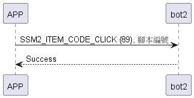

# Item: Click

手機發送Click指令及腳本編號給bot2，bot2執行指定腳本。
手機發送Click指令時沒有帶腳本編號，bot2執行上次選擇的腳本。

## 循序圖

<p align="left" >
  
</p>

## 手機傳送資料(不選腳本)

| Byte |     0     |
|------|:---------:|
| Data | item_code |

## 手機傳送資料(選擇腳本)

有效編號(0~9)

| Byte |     1     |     0     |
|------|:---------:|:---------:|
| Data | script id | item_code |

## bot2 回傳資料

| Byte |   2    |     1     |  0   |
|------|:------:|:---------:|:----:|
| Data |  res   | item_code | type |
| 說明   | 命令處裡狀態 |   指令編號    | 推送類型 |

type : SSM2_OP_CODE_RESPONSE (0x07)

item code : SSM2_ITEM_CODE_CLICK (89)

res : CMD_RESULT_INVALID_ACTION (0x09)

## android 範例

```java
    override fun click(index: UShort?, result: CHResult<CHEmpty>) {
        L.d("hcia", "[bot2]click[index:$index]")
        if (deviceStatus.value == CHDeviceLoginStatus.UnLogin && isConnectedByWM2) {
            CHAccountManager.cmdSesame(SesameItemCode.click, this, byteArrayOf(index?.toByte()
                    ?: 0), result)
        } else {
            if (index == null) {
                sendCommand(SesameOS3Payload(SesameItemCode.click.value, byteArrayOf()), DeviceSegmentType.cipher) {
                    result.invoke(Result.success(CHResultState.CHResultStateBLE(CHEmpty())))
                }
            } else {
                sendCommand(SesameOS3Payload(SesameItemCode.click.value, byteArrayOf(index.toByte())), DeviceSegmentType.cipher) {
                    result.invoke(Result.success(CHResultState.CHResultStateBLE(CHEmpty())))
                }
            }
        }

    }
```
