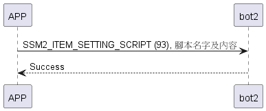

# Item: Setting Script

使用SSM2_ITEM_SELECT_SCRIPT選腳本後，使用SSM2_ITEM_SETTING_SCRIPT設定該腳本名稱及動作。
(一組腳本名稱最多20bytes，最多20個動作)

## bot2動作腳本內容

```c
#pragma pack(1)
typedef struct {
    uint8_t action;   //2
    uint8_t go_time;  //6 uint8_max 無限
} motor_action_t;
#pragma pack()

#pragma pack(1)
typedef struct {
    uint8_t len;
    uint8_t data[MAX_SCRIPT_NAME_LEN];//20 bytes
} script_name_t;
#pragma pack()

#pragma pack(1)
typedef struct {
    script_name_t script_name;
    uint8_t action_count;   //0~20
    motor_action_t motor_action[MAX_MOTOR_ACTION_COUNT];//20 bytes
} click_script_t;
#pragma pack()
```

## 循序圖

<p align="left" >
  
</p>

## 手機傳送資料

| Byte | (23 + action_count * 2 - 1) ~ 23 |      22      | 21 ~ 2 |    1     |     0     |
|------|:--------------------------------:|:------------:|:------:|:--------:|:---------:|
| Data |              action              | action count |  name  | name_len | item_code |

## Sesame5 回傳資料

| Byte |   2    |     1     |  0   |
|------|:------:|:---------:|:----:|
| Data |  res   | item_code | type |
| 說明   | 命令處裡狀態 |   指令編號    | 推送類型 |

type : SSM2_OP_CODE_RESPONSE (0x07)

item code : SSM2_ITEM_SETTING_SCRIPT (94)

res : CMD_RESULT_INVALID_ACTION (0x09)

## android 範例

```java
    override fun sendClickScript(script: ByteArray?, scriptNameLen: Int?, scriptName: ByteArray?, result: CHResult<CHEmpty>) {
        L.d("hcia", "[bot2]script:" + script?.toHexString())
        if (checkBle(result)) return
        val nameLength = scriptNameLen?.coerceAtLeast(0) ?: 0 // 確保 scriptNameLen 不為負數
        val combinedData = ByteArrayOutputStream().apply {
            write(byteArrayOf(nameLength.toByte())) // 第一個字節使用 scriptNameLen
            if (scriptName != null) {
                val nameLength = minOf(scriptName.size, 20)
                write(scriptName, 0, nameLength) // 寫入 scriptName
                if (nameLength < 20) {
                    write(ByteArray(20 - nameLength) { 0 }) // 填充剩余部分
                }
            } else {
                write(ByteArray(20) { 0 }) // 若 scriptName 為 null，填充 20 個 0
            }
            write(script ?: byteArrayOf()) // 寫入 script 數據
        }.toByteArray()
        L.d("hcia", "[bot2]combinedData:" + combinedData.toHexString())
        sendCommand(SesameOS3Payload(SesameItemCode.SCRIPT_SETTING.value, combinedData), DeviceSegmentType.cipher) {
            result.invoke(Result.success(CHResultState.CHResultStateBLE(CHEmpty())))
        }
    }
```
