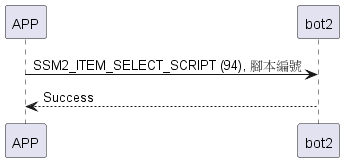

# Item: Select Script

選擇bot2要執行指定腳本。

## 循序圖

<p align="left" >
  
</p>

## 手機傳送資料

- 有效編號(0~9)

| Byte |     1     |     0     |
|------|:---------:|:---------:|
| Data | script id | item_code |

## Sesame5 回傳資料

| Byte |   2    |     1     |  0   |
|------|:------:|:---------:|:----:|
| Data |  res   | item_code | type |
| 說明   | 命令處裡狀態 |   指令編號    | 推送類型 |

type : SSM2_OP_CODE_RESPONSE (0x07)

item code : SSM2_ITEM_SELECT_SCRIPT (94)

res : CMD_RESULT_INVALID_ACTION (0x09)

## android 範例

```java
    override fun selectScript(index: UShort, result: CHResult<CHEmpty>) {
        if (checkBle(result)) return
        L.d("hcia", "[send]selectScript:" + index)
        sendCommand(SesameOS3Payload(SesameItemCode.SCRIPT_SELECT.value, byteArrayOf(index.toByte())), DeviceSegmentType.cipher) { res ->
            result.invoke(Result.success(CHResultState.CHResultStateBLE(CHEmpty())))
        }
    }
```
