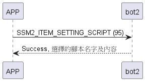

# Item: now Script

取得當前選擇的腳本內容。

## 循序圖

<p align="left" >
  
</p>

## 手機傳送資料

| Byte |     0     |
|------|:---------:|
| Data | item_code |

## bot2 回傳資料

| Byte |  N ~ 3  |   2    |     1     |  0   |
|------|:-------:|:------:|:---------:|:----:|
| Data | payload |  res   | item_code | type |
| 說明   |  腳本內容   | 命令處裡狀態 |   指令編號    | 推送類型 |

type : SSM2_OP_CODE_RESPONSE (0x07)

item code : SSM2_ITEM_NOW_SCRIPT (95)

res : CMD_RESULT_INVALID_ACTION (0x09)

payload : 腳本內容如以下表格

### payload(腳本內容)

| Byte | (22 + action_count * 2 - 1) ~ 22 |      21      | 20 ~ 1 |    0     |
|------|:--------------------------------:|:------------:|:------:|:--------:|
| Data |              action              | action count |  name  | name_len |

## bot2動作腳本結構

```c
#pragma pack(1)
typedef struct {
    uint8_t action;   //2
    uint8_t go_time;  //6 uint8_max 無限
} motor_action_t;
#pragma pack()

#pragma pack(1)
typedef struct {
    uint8_t len;
    uint8_t data[MAX_SCRIPT_NAME_LEN];//20 bytes
} script_name_t;
#pragma pack()

#pragma pack(1)
typedef struct {
    script_name_t script_name;
    uint8_t action_count;   //0~20
    motor_action_t motor_action[MAX_MOTOR_ACTION_COUNT];//20 bytes
} click_script_t;
#pragma pack()
```

## android 範例

```java
    override fun getCurrentScript(result: CHResult<Int>) {
        if (checkBle(result)) return
        L.d("hcia", "[send]getNowScript")
        sendCommand(SesameOS3Payload(SesameItemCode.SCRIPT_CURRENT.value, byteArrayOf()), DeviceSegmentType.cipher) { res ->
            L.d("hcia", "[!]now_script:" + res.payload.toHexString())
            L.d("hcia", "[1]now_script_name_len:" + res.payload[0].toInt())
            L.d("hcia", "[2]now_script_name:" + res.payload.sliceArray(1 until 20).toHexString())
            L.d("hcia", "[3]now_script_len:" + res.payload[21].toInt())
            L.d("hcia", "[4]now_script_action:" + res.payload.sliceArray(22 until res.payload.size).toHexString())
            (delegate as? CHSesameBot2Delegate)?.onScriptReceive(this, res.payload[0].toInt(), res.payload.sliceArray(1 until 20), res.payload[21].toInt(), res.payload.sliceArray(22 until res.payload.size))
        }
    }
```
